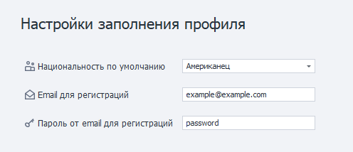
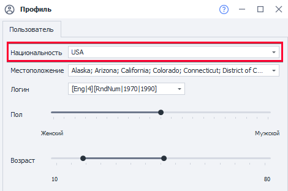

---
sidebar_position: 12
sidebar_label: Профиль
title: Профиль | Документация ZennoDroid | ZennoLab
description: Профиль - раздел официальной документации ZennoDroid от ZennoLab. Подробные инструкции, примеры использования и руководство по настройке
---  
# Профиль
:::info **Пожалуйста, ознакомьтесь с [*Правилами использования материалов на данном ресурсе*](../Disclaimer).**
:::

## Настройки заполнения профиля.  
   

Позволяют указать характеристики, который будет генерироваться по умолчанию при старте проекта.  
_______________________________________________
### Национальность по умолчанию.  
  
   
Национальность для генерации профиля. Её также можно изменить и на уровне шаблона, в настройках профиля проекта.  
_______________________________________________
### E-mail для регистраций.  
Указанный в этой настройке *e-mail* будет использоваться для всех новых профилей.  
Его также можно изменить через переназначение полей в **Операциях над профилем**.  
Значение хранится в переменной окружения `{-Profile.Email-}`.  

   
_______________________________________________
### Пароль от e-mail для регистраций.  
Этот *пароль от e-mail* будет использоваться для всех новых профилей. Его также можно изменить в  
**Операциях над профилем**. Значение хранится в переменной окружения `{-Profile.EmailPassword-}`.
_______________________________________________  
## Полезные ссылки.   
- [**Генерация профиля для проекта**](../project-editor/static-block-panel/Profile).  
- [**Окно профиля**](../pm/Interface/Work_with_Profile).   
- [**Операции над профилем**](../Data/WorkWithProfile).
