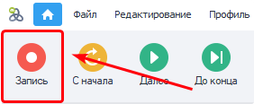
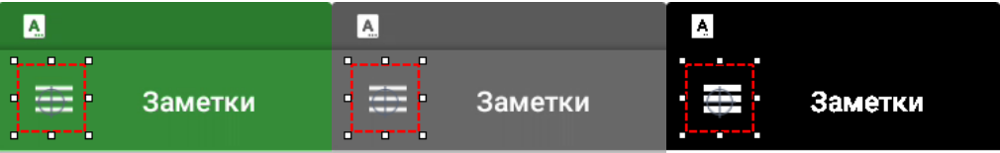

---
sidebar_position: 4
title: Запись проекта
description: Запись проекта. 
---  
:::info **Пожалуйста, ознакомьтесь с [*Правилами использования материалов на данном ресурсе*](../Disclaimer).**
:::
_______________________________________________
## Запись проекта.  
  

Данная вкладка содержит настройки, которые активируются при включенной записи проекта.  

 
_______________________________________________
## Автоматически вставлять макрос директории.  
:::tip **Эта настройка работает даже *при выключенной записи* проекта.**
:::   

В ZennoDroid существуют [**переменные окружения**](../pm/Creating/Variables). Например, `{-Project.Directory-}`, в которой хранится путь к директории, где сохранён файл проекта.  
:::info **Если проект не сохранён на диске, то переменная содержит пустую строку.**
::: 

При включении данной настройки во время создания проекта ProjectMaker будет подставлять макрос **директории проекта** туда, куда это возможно. Например, в другие настройки и экшены. Указываемый путь должен находиться в той же папке, что и файл проекта, либо в одной из подпапок.  
_______________________________________________
## Запись действий по координатам.  
Эта настройка отвечает за то, что при записи проекта все клики внутри [**Окна эмулятора**](../pm/Interface/DeviceWindow) будут записываться вместе с координатами. В проект добавятся экшены [**эмуляции touch**](../Android/ProLite/Touch_Emulation), в которые автоматически внесутся координаты нажатия.  
:::warning **Разрешение эмулятора должно быть одинаковым во время создания и выполнения проекта!**
:::
_______________________________________________ 
## Запись нажатий через поиск по картинкам.  
После включения параметра при каждом клике внутри [**Окна эмулятора**](../pm/Interface/DeviceWindow) в проект будет добавлен [**экшен touch**](../Android/ProLite/RunEvent) через [**Поиск по картинке**](../pm/Creating/SearchByPic).  
### Цветовой режим.  
Поиск по картинке будет по умолчанию производиться в одном из режимов:    
- **RGB**. Поиск по цветному изображению.        
- **Gray**. Картинка только с оттенками серого.      
- **Black**. Черно-белый режим.  
 
:::tip **Советуем.**
*Для ускорения поиска производите поиск в режиме **Gray** или **Black***
:::   
 
### Область поиска.  
Выбор области, которая будет выставляться по умолчанию:  
- По всему экрану.  
- По выделенной области экрана. 
:::info **В целях снижения нагрузки на CPU лучше производить поиск по области экрана.**
::: 
_______________________________________________
## Задержка при вводе символов 
Используется в экшенах [**Эмуляция клавиатуры**](../Android/ProLite/Keyboard) и [**Установка значения**](../Android/ProLite/SetValue) в качестве *значения по умолчанию*.  
_______________________________________________
## Время ожидания элемента.  
Применяется в действиях [**Установка значения**](../Android/ProLite/SetValue), [**Взятие значения**](../Android/ProLite/GetValue) и [**Выполнить событие**](../Android/ProLite/RunEvent)  в качестве *значения по умолчанию* для поля ***«Ждать элемент не более (сек)»***.  
_______________________________________________
## Время поиска элемента.  
Используется в экшене [**Поиск по картинке**](../pm/Creating/SearchByPic) в качестве *значения по умолчанию* для поля  
***«Ждать элемент не более (сек)»***.  
_______________________________________________
