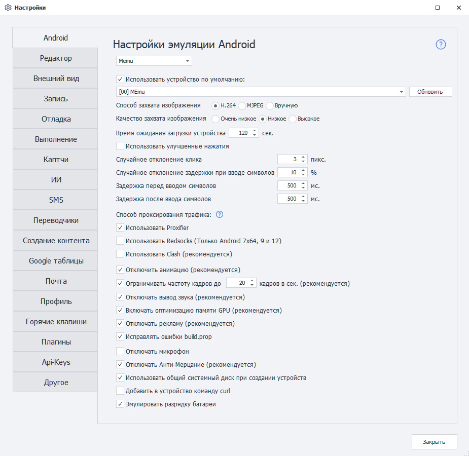
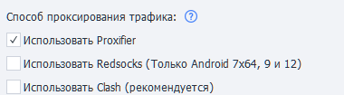

# Настройки Android (Lite/Pro)
:::info **Пожалуйста, ознакомьтесь с [*Правилами использования материалов на данном ресурсе*](../Disclaimer).**
:::

## Описание.
На этой вкладке находятся различные параметры для настройки Android на эмуляторах Memu и LDPlayer.  

  
_______________________________________________     
### Тип эмулятора.  
В списке над настройками выбирается эмулятор, с которым работает ZennoDroid: **Memu**, **LDPlayer9** или **LDPlayer14**. В списке показаны только установленные на компьютере эмуляторы, а часть настроек ниже зависит от выбранного типа.  
:::info **Пока запущено хотя бы одно устройство, список заблокирован — рядом появляется подсказка *«Необходимо остановить все запущенные устройства»*.**
::: 
_______________________________________________ 
### Использовать устройство по умолчанию.  
Эта настройка позволяет выбрать устройство, которое будет использоваться по умолчанию в Project Maker — при условии, что не выбрано другое устройство. При этом данное устройство будет игнорироваться ZennoDroid'ом при случайном выборе из списка доступных.  

Если вы хотите использовать выбранное устройство при выполнении проектов в ZennoDroid, то необходимо отключить эту настройку, чтобы не возникало ошибки ***Устройство занято в Project Maker***.
:::info **Кнопка «Обновить» позволяет обновить список доступных устройств**
::: 
  
### Способ захвата изображения.    
Определяет, как ZennoDroid получает изображение с эмулятора:  
- **H.264**. Способ по умолчанию, изображение передаётся видеопотоком.  
- **MJPEG**. Альтернативный способ. Его стоит включать только в том случае, если при запуске устройства через ZennoDroid процесс всегда завершается ошибкой, а в логе появляется запись ***Не удалось захватить изображение***.  
- **Вручную**. Постоянного захвата нет, изображение обновляется только по запросу - кнопкой обновления экрана в [**Окне эмулятора**](../pm/Interface/DeviceWindow) или методом [**RefreshScreen**](../API/Screen#refreshscreen). Подходит, когда картинка нужна не всё время: экономит ресурсы компьютера.  
:::info **Способ захвата можно задать и при запуске устройства - методом [Start](../API/Action#start).**
::: 
_______________________________________________ 
### Качество захвата изображения.  
Три уровня: **Очень низкое**, **Низкое** и **Высокое**. Чем ниже качество, тем меньше нагрузка на процессор - это заметно при работе с большим количеством потоков.  
Настройка недоступна, если выбран способ захвата **Вручную**. В коде качество меняется методом [**SetCaptureScreenQuality**](../API/Screen#setcapturescreenquality).  
_______________________________________________ 
### Время ожидания загрузки устройства.  
Это время, отведённое на загрузку эмулятора. Если не удалось загрузить устройство за отведённое здесь время, то выполнение завершится с ошибкой.  
_______________________________________________ 
### Использовать улучшенные нажатия.  
Включает эмуляцию реальных нажатий на экран: касания вводятся через уровень ввода ядра, поэтому они видны через `getevent`, имеют размер и работают на защищённых страницах.  
В коде режим включается методом [**SetNativeEventMode**](../API/Input#setnativeeventmode) - до подключения к устройству.  
_______________________________________________ 
### Случайное отклонение клика.  
Позволяет делать клики с небольшим отклонением от заданных параметров. Используется в экшенах:  
- [**Поиск по картинке**](../pm/Creating/SearchByPic). Нажатие на экран будет осуществляться не в точное место, а с небольшим смещением.  
- [**Выполнить событие**](../Android/pro-lite/RunEvent). Если для координат нажатия выбран **Центр**, то нажатие на элемент будет произведено не точно, а с небольшим отклонением.  
_______________________________________________ 
### Случайное отклонение при вводе символов.  
Используется в экшенах [**Эмуляция клавиатуры**](../Android/pro-lite/Keyboard) и [**Установка значения**](../Android/pro-lite/SetValue). Позволяет настроить отклонение задержки от заданного значения.  

Например, если задана задержка 150 мс, а отклонение 10%, то реальная задержка при вводе каждого символа составит от 135 мс до 165 мс.  
_______________________________________________ 
### Задержка перед и после ввода символов.  
Как и прошлый параметр, используется в действиях [**Эмуляция клавиатуры**](../Android/pro-lite/Keyboard) и [**Установка значения**](../Android/pro-lite/SetValue) для установки задержки.  
_______________________________________________ 
### Способ проксирования трафика.  
ZennoDroid позволяет выбрать способ проксирования трафика для выполнения экшена [**Установка прокси**](../Android/pro-lite/setting#как-поставить-прокси). По умолчанию используется Proxifier.  

 
- **Proxifier**. Трафик с эмулятора заворачивается на компьютер и проксируется там.  
- **Redsocks**. Прозрачный редиректор TCP/UDP-соединений в прокси на самом устройстве. Работает только на Android 7x64, 9 и 12.  
- **Clash**. Проксирование по правилам, полностью заворачивает UDP-трафик.  
Подробное описание каждого способа - в статье [**Проксирование трафика**](./Proxy_Traffic).  
_______________________________________________ 
### Отключить анимацию.  
Этот пункт позволяет выключить все анимации системы. Мы рекомендуем поставить здесь галочку, так как плавные переходы сильно замедляют работу устройства.  
_______________________________________________ 
### Ограничивать частоту кадров.  
Эта настройка влияет на FPS запускаемых эмуляторов. Если она включена, то всем эмуляторам будет принудительно установлено указанное количество кадров.  
_______________________________________________ 
### Отключать вывод звука и микрофон.  
Возможность выключать у эмуляторов звук, а также использование микрофона. Отключение звука снижает нагрузку на процессор.  
_______________________________________________ 
### Включить оптимизацию памяти GPU.
Лучше всегда держать включенной, так как позволяет снизить нагрузку на видеокарту.  
_______________________________________________ 
### Отключить Анти-Мерцание.  
Эта функция позволяет решить проблему мерцания экрана, что позволяет улучшить отображение картинки.  
:::info **Советуем.**
*При запуске одновременно нескольких эмуляторов **лучше отключайте** Анти-Мерцание для снижения нагрузки на систему.*
::: 
_______________________________________________ 
### Отключить рекламу.  
В лаунчер Memu вшит показ рекламы. Это может сломать работу шаблона, так как реклама отображается поверх всех окон. Рекомендуется всегда её отключать.  
_______________________________________________
### Исправлять ошибки build.prop.  
В эмуляторах часть свойств устройства остаётся со значением `unknown`. При включённой настройке ZennoDroid ещё до окончания первой загрузки берёт из конфигурации эмулятора производителя, бренд, модель, плату, `hardware`, baseband и fingerprint и записывает их в `build.prop`, поэтому приложения и сайты не видят `unknown` в свойствах устройства.  
_______________________________________________
### Использовать общий системный диск.  
При создании нового эмулятора будет использоваться общий системный диск. Его можно использовать вообще для всех эмуляторов, тем самым значительно экономя память. Например, один системный диск Android 9 занимает ~ 2ГБ.  

Общий диск работает в режиме только для чтения, то есть на него нельзя записать информацию (как правило, это и не требуется).  

Способ подключения диска для уже созданных эмуляторов, можно изменить с помощью специального экшена.  
_______________________________________________
### Добавить в устройство команду cURL.   
В новых версиях Memu эта утилита добавлена по умолчанию, но только для Android 7.1. Этот параметр позволяет добавить cURL в более старые версии эмулятора, а также в эмуляторы на базе Android 5.1.  
_______________________________________________
### Эмулировать разрядку батареи.  
По умолчанию батарея всегда находится в состоянии ***Заряжается*** и её заряд равен 100%. При включении этой настройки батарея будет разряжаться (~ до 20%), а затем заряжаться (~ до 70%).  
_______________________________________________  
## Полезные ссылки.   
- [**Установка Memu**](../pro-lite/Memu_Install).     
- [**Настройки устройства**](../Android/pro-lite/setting).
- [**Проксирование трафика**](./Proxy_Traffic).

