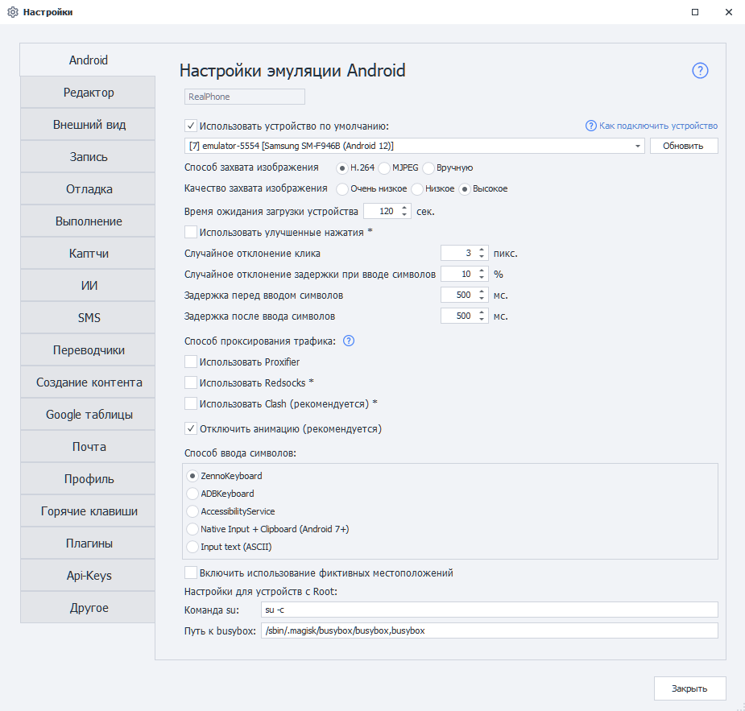
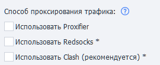

# Настройки Android (Enterprise)
:::info **Пожалуйста, ознакомьтесь с [*Правилами использования материалов на данном ресурсе*](../Disclaimer).**
:::

## Описание.  
На этой вкладке находятся различные параметры для настройки реального устройства на базе Android. Они также подходят, если вы работаете с эмулятором Bluestacks.  

:::info **Звёздочка `*` у настройки означает, что она работает только на устройствах с Root.**
::: 
_______________________________________________     
### Использовать устройство по умолчанию.  
Эта настройка позволяет выбрать устройство, которое будет использоваться по умолчанию в Project Maker — при условии, что не выбрано другое устройство. При этом данное устройство будет игнорироваться ZennoDroid'ом при случайном выборе из списка доступных.  

Если вы хотите использовать выбранное устройство при выполнении проектов в ZennoDroid, то необходимо отключить эту настройку, чтобы не возникало ошибки ***Устройство занято в Project Maker***.
:::info **Кнопка «Обновить» позволяет обновить список доступных устройств**
::: 
  
### Способ захвата изображения.    
Определяет, как ZennoDroid получает изображение с устройства:  
- **H.264**. Способ по умолчанию, изображение передаётся видеопотоком.  
- **MJPEG**. Альтернативный способ. Его стоит включать только в том случае, если при запуске устройства через ZennoDroid процесс всегда завершается ошибкой, а в логе появляется запись ***Не удалось захватить изображение***.  
- **Вручную**. Постоянного захвата нет, изображение обновляется только по запросу - кнопкой обновления экрана в [**Окне эмулятора**](../pm/Interface/DeviceWindow) или методом [**RefreshScreen**](../API/Screen#refreshscreen). Подходит, когда картинка нужна не всё время: экономит ресурсы компьютера и канал связи.  
:::info **Способ захвата можно задать и при запуске устройства - методом [Start](../API/Action#start).**
::: 
_______________________________________________ 
### Качество захвата изображения.  
Три уровня: **Очень низкое**, **Низкое** и **Высокое**. Чем ниже качество, тем меньше нагрузка на процессор и канал связи - это заметно при работе с большим количеством потоков.  
Настройка недоступна, если выбран способ захвата **Вручную**. В коде качество меняется методом [**SetCaptureScreenQuality**](../API/Screen#setcapturescreenquality).  
_______________________________________________ 
### Время ожидания загрузки устройства.  
С помощью этой настройки можно задать тайм-аут ожидания подключения к устройству. 
_______________________________________________ 
### Использовать улучшенные нажатия.  
Включает эмуляцию реальных нажатий на экран: касания вводятся через уровень ввода ядра, поэтому они видны через `getevent`, имеют размер и работают на защищённых страницах. Работает и на устройствах без дисплея (тачпада).  
В коде режим включается методом [**SetNativeEventMode**](../API/Input#setnativeeventmode) - до подключения к устройству.  
:::warning **Работает только на устройствах с Root.**
::: 
_______________________________________________ 
### Случайное отклонение клика.  
Позволяет делать клики с небольшим отклонением от заданных параметров. Используется в экшенах:  
- [**Поиск по картинке**](../pm/Creating/SearchByPic). Нажатие на экран будет осуществляться не в точное место, а с небольшим смещением.  
- [**Выполнить событие**](../Android/pro-lite/RunEvent). Если для координат нажатия выбран **Центр**, то нажатие на элемент будет произведено не точно, а с небольшим отклонением.  
_______________________________________________
### Случайное отклонение при вводе символов.  
Используется в экшенах [**Эмуляция клавиатуры**](../Android/pro-lite/Keyboard) и [**Установка значения**](../Android/pro-lite/SetValue). Позволяет настроить отклонение задержки от заданного значения.  

Например, если задана задержка 150 мс, а отклонение 10%, то реальная задержка при вводе каждого символа составит от 135 мс до 165 мс.  
_______________________________________________ 
### Задержка перед и после ввода символов.  
Как и прошлый параметр, используется в действиях [**Эмуляция клавиатуры**](../Android/pro-lite/Keyboard) и [**Установка значения**](../Android/pro-lite/SetValue) для установки задержки.  
_______________________________________________ 
### Способ проксирования трафика.  
ZennoDroid позволяет выбрать способ проксирования трафика для выполнения экшена [**Установка прокси**](../Android/Enterprise/setting#как-поставить-прокси). По умолчанию используется Proxifier.  

 
- **Proxifier**. Трафик с устройства заворачивается на компьютер и проксируется там.  
- **Redsocks**. Прозрачный редиректор TCP/UDP-соединений в прокси на самом устройстве.  
- **Clash**. Проксирование по правилам, полностью заворачивает UDP-трафик.  
Подробное описание каждого способа - в статье [**Проксирование трафика (Enterprise)**](./Proxy_Traffic_Ent).  
_______________________________________________ 
### Отключение анимации.
Этот пункт позволяет вам выключить все анимации системы. Мы рекомендуем поставить здесь галочку, так как плавные переходы сильно замедляют работу устройства.  
_______________________________________________ 
### Способ ввода символов.  
Настройка позволяет выбрать наиболее подходящий способ эмуляции ввода символов:  
- **ZennoKeyboard**. Способ по умолчанию начиная с версии 2.6.1.0.  
- **ADBKeyboard**.  
- **AccessibilityService**.  
- **Native input + Clipboard**.  
- **Input text**.  
:::info **Первые четыре способа выводят любые символы, включая кириллицу и эмодзи. Последний же только ASCII символы.**
:::   
Подробное описание каждого способа - в статье [**Способы ввода**](./InputMethods).  
_______________________________________________
### Использование фиктивных местоположений.  
Данный параметр нужен для подмены местоположения устройства через экшен [**Установка Geo-позиции**](../Android/Enterprise/Utilities_Ent#установка-geo-позиции).  
_______________________________________________
### Настройки для устройств с Root.  
Эти настройки необходимы для экшенов [**Сохранить/восстановить данные приложения**](../Android/Enterprise/App#сохранить-данные-приложения). Мы не рекомендуем менять эти параметры без необходимости.  

Команда `su` позволяет указать путь и параметры для запуска команд с привилегиями суперпользователя. По умолчанию: `su -c`.  

Настройка **Путь к busybox** позволяет указать путь к файлу busybox.  
По умолчанию: `/sbin/.magisk/busybox/busybox`.  
_______________________________________________  
## Полезные ссылки.
- [**Подключение реального устройства (ZDE)**](../Enterprise/Connection).
- [**Способы ввода (Enterprise)**](./InputMethods).
- [**Проксирование трафика (Enterprise)**](./Proxy_Traffic_Ent).