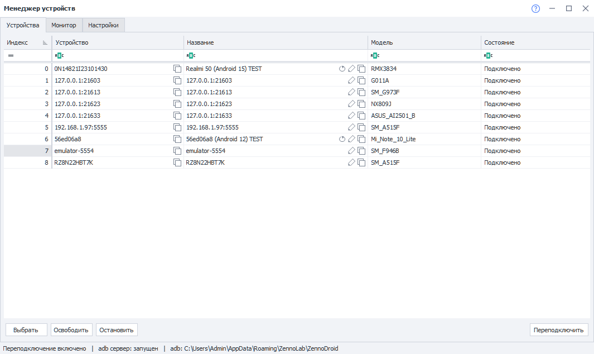
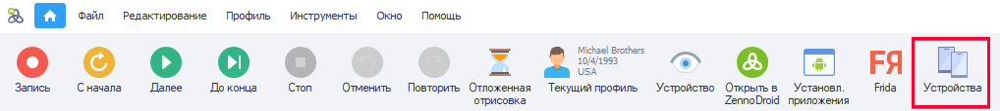
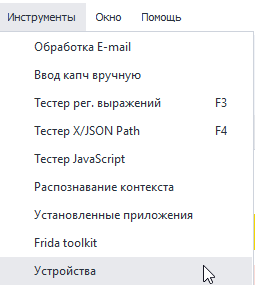
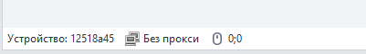
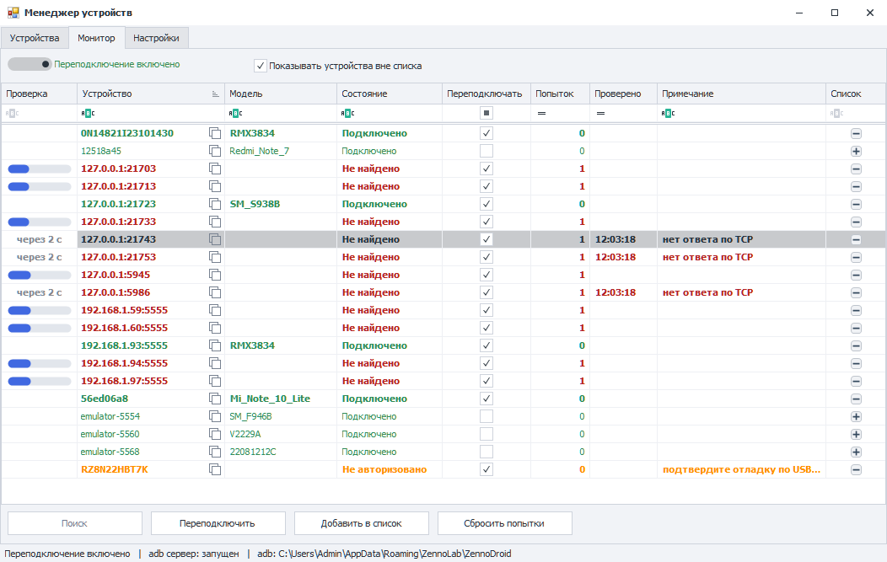
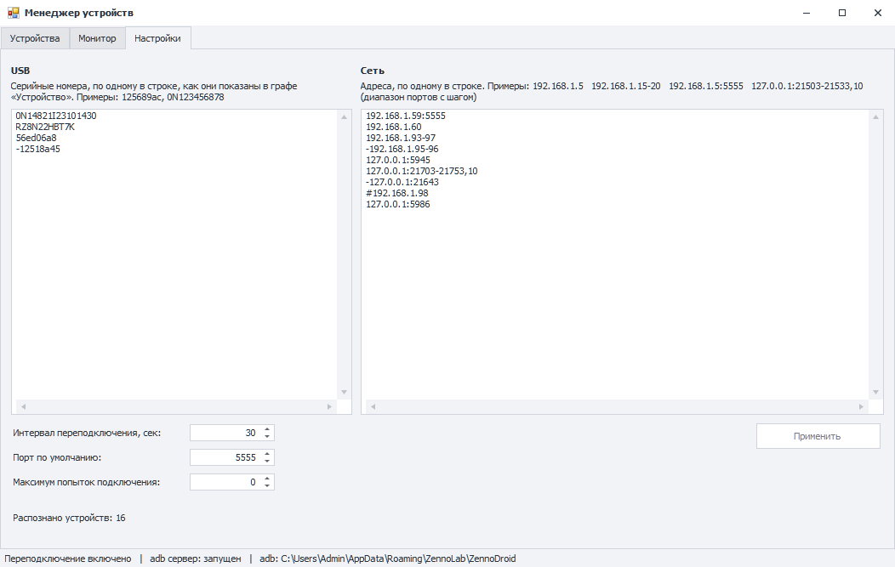

# Менеджер устройств (Enterprise)
:::info **Пожалуйста, ознакомьтесь с [*Правилами использования материалов на данном ресурсе*](../Disclaimer).**
:::

## Описание.
  

В этом окне перечислены все реальные устройства, подключенные к компьютеру, а также запущенные эмуляторы. Здесь можно получить краткую информацию о них и быстро переключиться между ними.  

Окно разделено на три вкладки:  
- **Устройства** — список доступных устройств и переключение между ними.  
- **Монитор** — наблюдение за устройствами и автоматическое переподключение отвалившихся.  
- **Настройки** — список устройств, за которыми следит монитор.  
:::info **Вкладки «Монитор» и «Настройки» появились в версии ZennoDroid 2.6.1.0.**
:::

### Как его открыть?  
Есть два способа.  
#### Через Панель инструментов.  
  

#### В выпадающем списке раздела «Инструменты».  
  

_______________________________________________  
## Вкладка «Устройства».  
### Описание доступных элементов.    
#### Колонки:  
- **Индекс**. Порядковый номер устройства. Индексы присваиваются в алфавитном порядке, основываясь на идентификаторе устройства.  
- **Устройство**. Идентификатор устройства, его серийный номер или IP адрес в локальной сети.    
- **Название**. По умолчанию совпадает с идентификатором устройства. Но для удобства распознавания вы можете задать более конкретное имя. Сделать это можно:  
    - нажав на нужную ячейку + F2,  
    - через экшен [**Переименовать**](../Android/Enterprise/action#как-переименовать-устройство).  
- **Модель**. Тут указывается модель телефона. Информация отображается только для подключённых в данный момент устройств.  
- **Состояние**. Статус подключения устройства к компьютеру.  
    - *Подключено*. Всё в порядке, с устройством можно работать.  
    - *Отключено*. Компьютер видит устройство, но не может с ним взаимодействовать.    
    Возможные пути решения:  
        - *нажать кнопку переподключить*,  
        - *вытащить кабель из устройства и вставить заново*,  
        - *перезагрузить устройство*.  
    - *Не авторизовано*. Необходимо в телефоне разрешить взаимодействие с компьютером, подтвердив всплывающий запрос.  

#### Кнопки в ячейках:  
При наведении курсора на ячейку в её правой части появляются кнопки:  
- **Скопировать в буфер обмена** — в графах «Устройство» и «Название». После нажатия рядом с курсором появляется подсказка *Скопировано*.  
- **Редактировать (F2)** — в графе «Название».  
- **Восстановить название** — в графе «Название», левее кнопки редактирования. Появляется только у переименованных устройств, поэтому сама кнопка отвечает на вопрос «менялось ли название». Возвращает в графу идентификатор устройства.  

#### Кнопки:  
- **Выбрать**. Сделает активным устройство, которое выбрано в таблице.  
Используется для быстрого переключения между подключенными устройствами.  
Название выбранного устройства также отображается в панели состояния ProjectMaker:  
  
- **Освободить**. Останавливает активное устройство и полностью отключает его от использования.  
Строка в панели состояния при этом становится пустой.  
Используется для устранения ошибки **Устройство занято в ProjectMaker**, когда нет возможности переключиться на другое.  
- **Остановить**. Останавливает активное устройство, которое при этом продолжает считаться выбранным.  
Используется в качестве альтернативы для экшена [**Остановить**](../Android/Enterprise/action#как-остановить-устройство).  
- **Переподключить**. Осуществляет попытку переподключения устройств, которые отображаются в списке, но имеют статус **Отключено**.  

:::info **Кнопка «Поиск» переехала на вкладку «Монитор».**  
Сканирование сети теперь выполняется по списку адресов из вкладки «Настройки», а не по одному диапазону, который задавался в момент поиска.
:::

_______________________________________________  
## Вкладка «Монитор».  
  

Монитор с заданным интервалом опрашивает устройства из списка и сам переподключает те, что отвалились. Это основной инструмент для работы с пулом устройств по сети: адреса перечисляются один раз во вкладке «Настройки», а дальше монитор держит их подключенными без ручного вмешательства.  

Каждое устройство отсчитывает интервал от своей последней попытки, а не от общего такта, поэтому строки в таблице обновляются независимо друг от друга.  

### Как пользоваться.  
1. Во вкладке **Настройки** перечислите устройства: серийные номера в графу **USB**, адреса в графу **Сеть**. Нажмите **Применить**.  
2. Вернитесь на **Монитор** и включите тумблер **Переподключение**.  
3. Убедитесь, что у нужных устройств стоит галочка **Переподключать** — она отвечает за то, будет ли монитор поднимать именно это устройство.  

### Описание доступных элементов.  
#### Колонки:  
- **Проверка**. Что происходит с устройством прямо сейчас. Пока попытка выполняется, в ячейке рисуется полоса прогресса, а между попытками — отсчёт до следующей: *через 13 с*, а если ждать больше минуты — *через 2:05*.  
- **Устройство**. Серийный номер устройства (USB) или его адрес с портом (сеть). В ячейке есть кнопка копирования.  
- **Модель**. Модель телефона. Заполняется только у подключенных устройств: у ненайденного узнать модель не у кого.  
- **Состояние**. *Подключено*, *Не найдено*, *Не авторизовано*, *Проверяется…*  
- **Переподключать**. Галочка включает автоматическое переподключение конкретного устройства. У всех новых устройств она стоит по умолчанию. Снятая галочка запоминается, но только пока устройство есть в списке: если убрать его из списка и добавить снова, галочка вернётся.  
- **Попыток**. Сколько попыток подряд не привело к подключению. Обнуляется, как только устройство подключилось.  
- **Проверено**. Время, когда закончилась последняя попытка. Пустая ячейка означает, что попытка идёт прямо сейчас либо не потребовалась ни разу.  
- **Примечание**. Причина, по которой попытка не удалась:  
    - *нет ответа по TCP* — по адресу никто не отвечает: устройство выключено, ушло из сети или на нём не включена отладка по сети;  
    - *подтвердите отладку по USB на устройстве* — на телефоне ждёт подтверждения запрос на отладку;  
    - *adb connect не удался*, *adb reconnect не удался* — adb ответил отказом;  
    - *устройство не подключено* — переподключать нечего.  
- **Список**. Кнопка **+** добавляет устройство в список из вкладки «Настройки», **−** убирает его оттуда. Кнопка **+** есть только у тех устройств, которые в список можно записать: адрес попадёт в графу «Сеть», серийный номер — в графу «USB».  

#### Цвет и начертание строки:  
- **зелёная** — устройство подключено,  
- **красная** — не найдено,  
- **оранжевая** — не авторизовано,  
- **жирная** — устройство, которое монитор действительно держит подключенным (стоит галочка «Переподключать»). Обычным шрифтом показываются, в том числе, устройства вне списка: поднимать их пока нечем.  

#### Переключатели:  
- **Переподключение**. Главный тумблер. Продолжает работать после закрытия окна, пока запущено приложение, а его состояние сохраняется: при следующем запуске переподключение будет включено, если тумблер оставлен включённым. Тумблер общий для ZennoDroid и ProjectMaker — устройства в пуле одни и те же, поэтому переключение в одном окне действует на оба.  
- **Показывать устройства вне списка**. Показывает устройства, о которых знает adb, но которых нет ни в графе «USB», ни в графе «Сеть». Включено по умолчанию: устройство нужно сначала увидеть, чтобы добавить его в список.  

#### Кнопки:  
- **Поиск**. Разовое сканирование диапазонов из вкладки «Настройки». Заодно включает показ устройств вне списка. Доступно, когда переподключение выключено, — иначе сканированием занят сам монитор.  
- **Переподключить**. Переподключает все отключенные устройства, не дожидаясь их интервалов.  
- **Добавить в список**. Записывает в список все найденные устройства сразу, чтобы не нажимать **+** в каждой строке.  

_______________________________________________  
## Вкладка «Настройки».  
  

Здесь задаётся список устройств, за которыми следит монитор. Список сохраняется между запусками программы в том виде, в котором вы его написали.  

#### Графа «USB»:  
Серийные номера, по одному в строке, — ровно так, как они показаны в графе «Устройство». Например: `125689ac`, `0N123456878`.  

Регистр важен: adb сравнивает серийный номер посимвольно, поэтому `56ED06A8` и `56ed06a8` для него — два разных устройства. Адрес с портом в эту графу не принимается, его место в графе «Сеть». В списке допускается не больше 512 устройств.  

#### Графа «Сеть»:  
Адреса, по одному в строке. Поддерживаются:  

| Запись | Что означает |
| :--------: | :------- |
| `192.168.1.5` | один адрес, порт берётся из поля «Порт по умолчанию» |
| `192.168.1.5:5555` | адрес с явно указанным портом |
| `192.168.1.15-20` | диапазон по последнему октету: с `192.168.1.15` по `192.168.1.20` |
| `192.168.1.15-192.168.1.20` | тот же диапазон в полной записи |
| `127.0.0.1:21503-21533` | диапазон портов на одном адресе |
| `127.0.0.1:21503-21533,10` | диапазон портов с шагом: 21503, 21513, 21523, 21533 |  

Диапазон допустим только по последнему октету. Диапазон адресов и диапазон портов в одной строке одновременно не поддерживаются. Порт должен быть в пределах 1000–65535: adb не подключается к портам короче четырёх цифр. Одна строка может задать не больше 1024 адресов, весь список — не больше 4096.  

#### Синтаксис строки (общий для обеих граф):  
- `-` в начале строки исключает устройство: после `192.168.1.1-20` строка `-192.168.1.5` оставит под наблюдением девятнадцать адресов.  
- `#` или `//` в начале строки — комментарий, строка не читается.  
- Если устройство упомянуто в нескольких строках, действует нижняя. Поэтому обычная строка, написанная ниже исключающей, возвращает устройство в список.  

Строки с ошибками не ломают разбор: программа читает остальные, а под полем сообщает, что именно не понято и в какой строке.  

#### Остальные элементы:  
- **Интервал переподключения, сек**. Через сколько секунд после неудачной попытки монитор попробует снова. По умолчанию 30, допустимо от 1 до 3600.  
- **Порт по умолчанию**. Подставляется к адресам, записанным без порта. По умолчанию 5555.  
- **Распознано устройств**. Сколько устройств получилось из обеих граф после разбора — по этому числу удобно проверять, что диапазон записан так, как вы задумали.  
- **Применить**. Сохраняет списки и настройки и передаёт их монитору.  

_______________________________________________  
## Строка состояния окна.  
Внизу окна показано:  
- включено ли **переподключение**,  
- запущен ли **adb сервер**,  
- путь к используемому **adb**.  

_______________________________________________  
## Полезные ссылки.   
- [**Действия с устройством**](../Android/Enterprise/action).  
- [**Окно устройства**](../pm/Interface/DeviceWindow).   
- [**Подключение реального устройства (ZDE)**](../Enterprise/Connection).