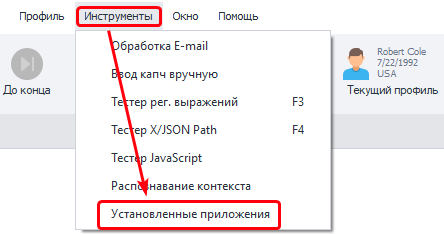
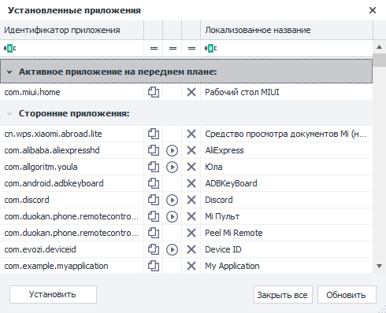

# Установленные приложения
:::info **Пожалуйста, ознакомьтесь с [*Правилами использования материалов на данном ресурсе*](../Disclaimer).**
:::

Открыть окно можно через верхнее меню **Инструменты → Установленные приложения**.  

   
  
В нем отобразятся все установленные в системе приложения вместе с их понятными названиями, которые обычно написаны на иконке.  

   

Идентификатор приложения можно скопировать в буфер обмена и использовать в экшене [**Действия с приложениями**](../Android/ProLite/App) для их запуска, остановки и удаления. А также для сохранения и восстановления данных. При этом все действия будут записаны в проект.

:::tip **Список приложений можно получить с помощью [adb shell](../Android/ProLite/ADB_Shell#adb-shell).**
Команда - `pm list packages`
:::
_______________________________________________  
## Полезные ссылки.   
- [**Действия с приложением**](../Android/ProLite/App).  
- [**Автоматизация работы в приложениях**](../get-started/apps).   
