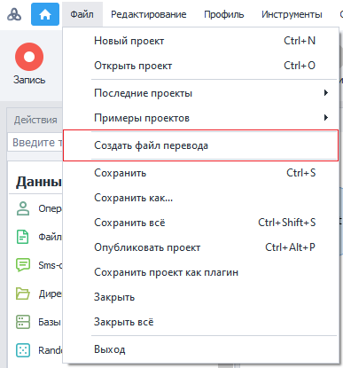
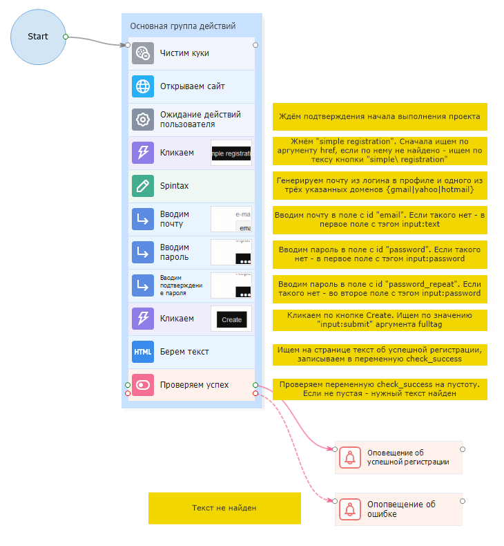
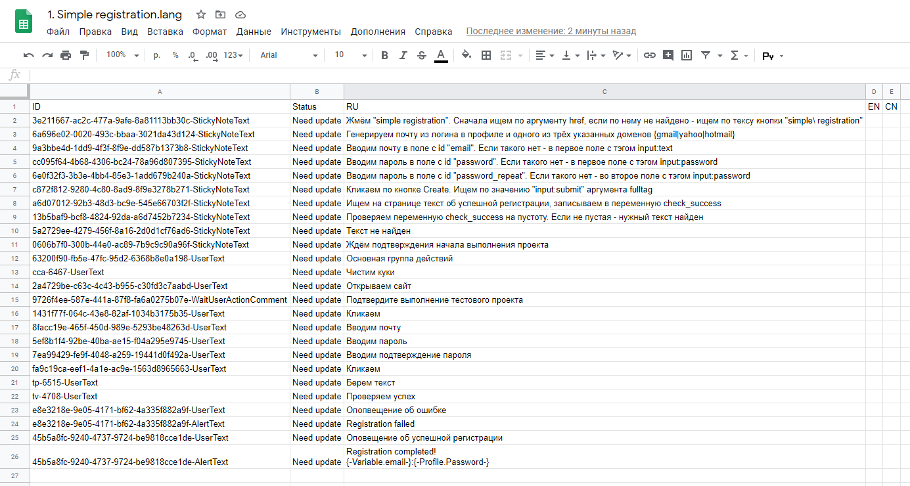
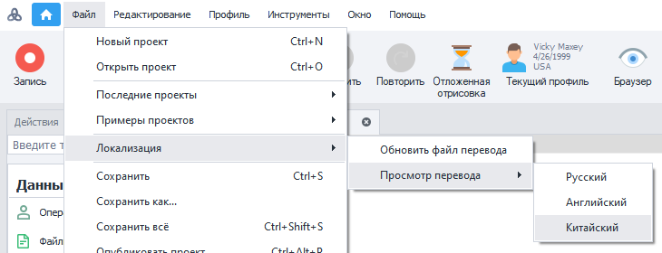
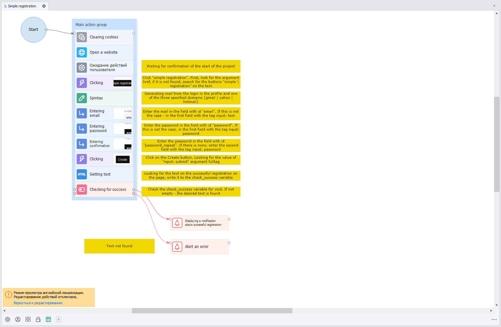

:::info **Пожалуйста, ознакомьтесь с [*Правилами использования материалов на данном ресурсе*](../Disclaimer).**
:::
_______________________________________________ 
## Описание.  
Функция локализации позволяет адаптировать ваши проекты для использования иностранной аудиторией. Происходит это через замену текстовых полей с информацией проекта на заданные в специальном файле переводы.   

### Что такое файл перевода?
Он представляет из себя таблицу в формате `.csv` с запятой в качестве разделителя. Его можно открыть любым текстовым редактором.  

Файл перевода можно добавить в проект как статический блок [**Таблица**](../Project%20Editor/Lists%20and%20Google%20Sheets/Tables) или [**Google Таблица**](../Project%20Editor/Lists%20and%20Google%20Sheets/Google_Sheet), выполнив предварительный импорт в документы Google.  

:::tip **Альтернативный вариант перевода проекта.**
Выполнить автоматический **перевод текста таблицы** можно также через экшен **Обработка текста → [Перевод текста](../Data/Text#перевод)**.
:::

### Как его создать?  
Создать таблицу можно с помощью верхнего меню ProjectMaker → Файл → Создать файл перевода:  

  

После нажатия на эту кнопку **будет выполнен сбор и запись** в файл следующих текстовых полей проекта:  
- **Записи в заметках**;  
- **Сообщения из экшена «Ожидание действий пользователя»**;  
- **Содержание оповещений**;  
- **Комментарии к экшенам**;  
- **Комментарии для групп действий**.  
:::info **Локализованные оповещения и сообщения.**
Они также будут переведены в ходе выполнения проекта ZennoDroid.
:::

| Так выглядит проект    | А это его таблица переводов |
| -------- | ------- |
|   |     |  

:::tip **Текущие значения проекта будут записаны в столбец.**
Который соответствует актуальной локализации программы.
:::  
_______________________________________________ 
## Изменение таблицы.
### Структура таблицы.  
Сама таблица состоит из пяти столбцов:  

| Имя столбца    | Описание |
| :--------: | :------- |
| **ID**  | **ID элемента**, который переводим. Используется для применения перевода.    |
| **Status** | **Статус перевода**. Позволяет контролировать актуальность данных конкретного элемента.     |
| **RU**    | Текст **русской** локализации элемента.    |
| **EN**    | Текст **английской** локализации элемента.    |
| **CN**    | Текст **китайской** локализации элемента.    |  

Для свободного редактирования доступны только столбцы с текстом сторонних локализаций проекта, а также столбец статуса элемента.  

:::tip **Изменения файла применяются моментально без необходимости перезагрузки проекта или программы.**
::: 

#### Возможные статусы:  
- **Need update**. Устанавливается:    
    - По умолчанию для всех элементов.  
    - При отсутствии текстов сторонних локализаций;  
    - При первом обновлении файла после изменения текста в проекте;  
- **Ok**.  
Используется при наличии хотя бы одного текста сторонней локализации;  
- **Not found**.  
Ставится при отсутствии в проекте элемента с заданным id.  

#### Примечания.  
- Если изменить столбец **ID**, то элемент не будет найден в проекте и получит статус **Not found**, как и при его удалении. Поэтому **менять этот параметр не рекомендуется**.
- При изменении **текущей локализации** в таблице, а не в самом проекте, файл станет неактуальным, и элемент не будет считаться переведённым. Затем при попытке просмотра перевода для другой локализации **будет предложено обновить файл**.  

:::warning **Во избежание ошибок загрузки файла переводов.**
Мы рекомендуем выполнять все изменения таблицы с помощью специальных редакторов.
:::  
_______________________________________________ 
## Работа с переводом.  
### Обновление файла перевода.  
Эта функция необходима для записи в файл новых значений, а также для обновления текста текущей локализации элементов.  

При наличии файла перевода рядом с проектом в меню будет доступен раздел **Локализация**, который содержит кнопки обновления файла и просмотра других локализаций проекта:  

  

При нажатии кнопки **Обновить файл перевод** текущие значения текстовых полей проекта будут собраны и сопоставлены с полями в файле. У существующих элементов будет обновлен текст и статус локализации. А новые элементы добавятся в статусе **Need update**. Элементы же, которые присутствуют в файле, но не будут найдены, получат статус **Not found**.  
_______________________________________________ 
### Перевод проекта.
Перевод осуществляется путём замены текста переведённых элементов на значения, которые заданы в файле локализации текста. При замене выполняется сравнение id элементов и их текущих значений в проекте и файле.  

Когда текст в проекте был изменён, а файл при этом не обновлялся, то элемент считается неактуальным. Поэтому он не будет переведён при открытии проекта. Однако при просмотре локализации вам всё же предложат обновить файл, потому что иначе просмотр будет недоступен.  

Данная логика позволяет предотвратить разногласия исходного текста с локализацией файла. И в то же время переводить максимальное количество элементов при открытии проекта.  

:::info **Если у элемента отсутствует текст перевода для просматриваемой локализации.**
То он не будет изменен и останется в том виде, в котором представлен в исходной локализации проекта. 
:::  
_______________________________________________ 
### Просмотр перевода.
Данная функция выполняет перевод проекта в точном соответствии с переводом при открытии проекта в программе с другой локализацией.  

:::warning **В режиме просмотра перевода недоступно выполнение и запись проекта, а также его сохранение и изменение.**
:::   

 

Чтобы выйти из режима просмотра локализации необходимо нажать кнопку **Вернуться к редактированию** на информационной панели. Либо же выбрать в меню **Просмотр перевода** текущую локализацию программы.  

Если во время просмотра перевода файл таблицы был повреждён или удалён, то проект вернётся в исходное состояние и выведет сообщение об ошибке.  

Обратите внимание, что в отличии от групп действий и комментариев к ним, заметки не адаптируют свой размер в зависимости от текста.  
_______________________________________________  
## Полезные ссылки.   
- [**Заметки**](../Project%20Editor/Project/Notes).  
- [**Выполнить событие**](../Android/ProLite/RunEvent).   
- [**Обработка текста**](../Data/Text). 