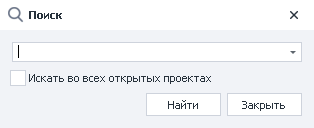
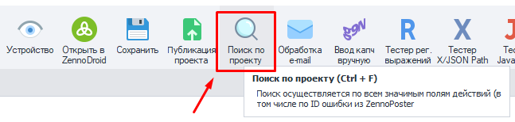
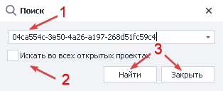
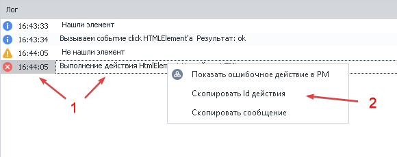

:::info **Пожалуйста, ознакомьтесь с [*Правилами использования материалов на данном ресурсе*](../Disclaimer).**
:::
_______________________________________________   
## Описание.  
Этот инструмент помогает найти в проекте экшен по его id или через переменную, которую он использует.  

  

Может пригодиться для:  
- *отладки проекта*;  
- *поиска ошибок, переменных и экшенов*;  
- *быстрого перехода к определенному элементу проекта*.

### Как начать поиск?  
**Есть два способа:**  
- С помощью комбинации горячих клавиш **`CTRL+F`**.  
- Через Панель инструментов, если туда вынесена соответствующая кнопка.  

_______________________________________________
## Работа с поиском.  
### Последовательность действий.  
  

**1**. Вводим в соответствующее поле id экшена или название переменной.  
**2**. Устанавливаем чек-бокс, если открыто больше одного проекта, а нам нужен поиск сразу во всех.  
**3**. Запускаем процесс поиска или же закрываем окно, если передумали.  

:::tip **В нашем примере мы указываем id ошибки.**
Как его получить, расскажем далее.
:::  

### Как получить id экшена.
:::info **Откуда берутся ошибки?**
Они появляются в [**Логе**](../pm/Interface/Log_window) при работе шаблона, если что-то идёт не так.
:::  

  

**1**. Нажимаем ПКМ по интересующей нас ошибке.  
**2**. Кликаем **Скопировать Id действия**.  

:::tip **Скопировать id можно из любого сообщения в логе.**
Не только из ошибки.
::: 
_______________________________________________
## Пример использования.  
Представим, что после создания проекта в ProjectMaker мы решили запустить его в ZennoDroid. В ходе выполнения нами была получена ошибка, которую нужно найти и исправить. Сделаем вот так:  
1. Скопируем код ошибки.  
2. Откроем **Поиск по проекту**.  
3. Вставим id ошибки, который получили ранее.  
4. Нас перенесёт к экшену, на выполнении которого возникла эта ошибка.  
5. Теперь мы можем исправить ошибку или изменить логику определённого потока.  

Этот способ можно использоваться также и для покупных шаблонов. Так как часто авторы продают свои продукты в закрытом виде. Вы не сможете просто посмотреть и самостоятельно исправить возникшую проблему. Придётся копировать код ошибки и передавать его разработчику.  
_______________________________________________  
## Полезные ссылки.   
- [**Окно Лога**](../pm/Interface/Log_window).  
- [**Вкладка «Лог» в ZD**](../Execution/Log).   
- [**Поиск элементов**](../pm/Creating/ElementSearch). 
