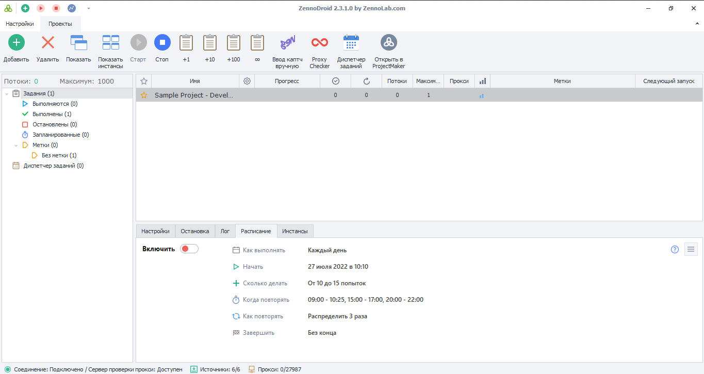

---
sidebar_position: 1
title: Что такое ZennoDroid?
description: Знакомство с программой.
---  
:::info **Пожалуйста, ознакомьтесь с [*Правилами использования материалов на данном ресурсе*](../Disclaimer).**
:::

export const VideoSample = ({source}) => (
  <video controls playsInline muted preload="auto" className='docsVideo'>
    <source src={source} type="video/mp4" />
</video>
);

_______________________________________________  
## Описание.  
Это программный комплекс для автоматизации задач и выполнения действий на устройствах с Android (виртуальным или реальным).  

Вы совершаете действия на устройстве, а программа записывает их в проект. Затем его можно редактировать идополнить новыми шагами.  

<VideoSample source={require("@site/static/video/Screen-2-ru.mp4").default}/>  
_______________________________________________
## Основные возможности.  
### Повторение действий.  
Легко записывайте и воспроизводите действия в Android-приложениях.  

- **Полная автоматизация Android**    
Заполняйте формы, собирайте данные, исследуйте приложения в специальном окне устройства.  
- **Многопоточность**   
Запускайте проекты в несколько потоков одновременно (параллельная работа нескольких Android-устройств) .  
- **Интерфейс бота**   
Проектируйте красивые и удобные интерфейсы для своих ботов.  
_______________________________________________
### Заполнение форм.  
Автоматически заполняйте формы нужными данными.  

- **Запуск по расписанию**    
Настройте запуск своих задач тогда, когда они вам необходимы.  
-  **Генерация пользовательских данных**   
Автоматически генерируйте пользовательские данные: от имени до адреса.  
-  **Поддержка прокси**   
Поддерживается установка прокси для виртуальной машины Android.
_______________________________________________
### Нажатие на кнопки.  
Автоматизируйте нажатия на кнопки и ссылки.  

-  **Система эмуляции пользователя**   
Взаимодействуйте с экраном через клавиатуру: Tap, Long Tap и Swipe. Действия будут выглядеть так, будто их выполняет человек.  
-  **Управление виртуальными машинами**   
От создания виртуальной Android-машины до полного сброса устройства.
_______________________________________________
### Сбор информации.  
Извлекайте данные из любых приложений.  

-  **Анализ структуры приложений**   
Используйте инструменты для анализа XML-кода приложений.  
-  **Инструменты парсинга**   
Собирайте, обрабатывайте и сохраняйте данные в удобном для вас формате. 
-  **Почта**   
Работайте с почтовыми ящиками. Находите, анализируйте и извлекайте данные из писем.
_______________________________________________
### Эмуляция устройств.  
Эмулируйте любое устройство и его параметры: модель, IMEI и т.д.  

-  **Эмуляция параметров**   
Эмулируйте любые настройки и отпечатки Android-устройства: от модели устройства до сотового оператора.    
-  **Режим супер-пользователя (root)**   
Получите неограниченные права на эмулируемом устройстве, включив режим с root доступом.  
-  **Работа с приложениями**   
Установка приложений из APK, получение списка приложений, их удаление.
_______________________________________________
### Обработка любых данных.  
Работайте с текстами, таблицами, изображениями, БД и другими данными.  

-  **Управление данными**   
Взаимодействуйте с любыми типами данных: от текста и изображений до Google-таблиц с базами данных.  
-  **Работа с HTTP и FTP**   
Ускорьте свои проекты с помощью HTTP и FTP запросов.  
-  **Интеграция с 35 сервисами**   
Подключайте в один клик сервисы распознавания капч, SMS-активаций, создания контента и прокси.
_______________________________________________
### Дополнительные возможности.  
-  **Свой код**   
Расширяйте возможности программы, используя C#, JavaScript и командную строку.  
-  **Логические операции**   
Выполняйте различные действия в зависимости от условий.  
-  **Прокси-чекер**   
Проанализируйте прокси на работоспособность, скорость, анонимность, страну, тип и еще 10+ других параметров.  
_______________________________________________
## Полезные ссылки.  
- [**Установка ZennoDroid**](../Installation/ZD_Install).  
- [**Демоверсия ZennoDroid**](../Installation/ZD_Demo).  
- [**Основные понятия**](./BasicTerms).