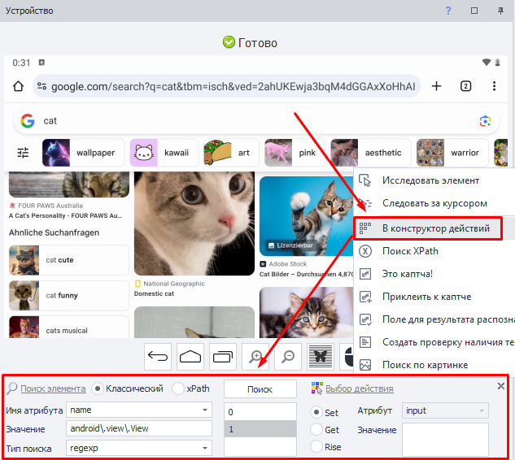
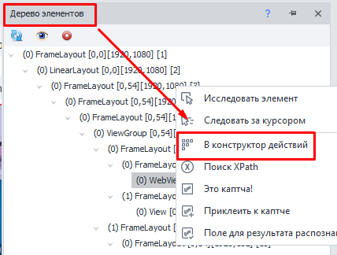
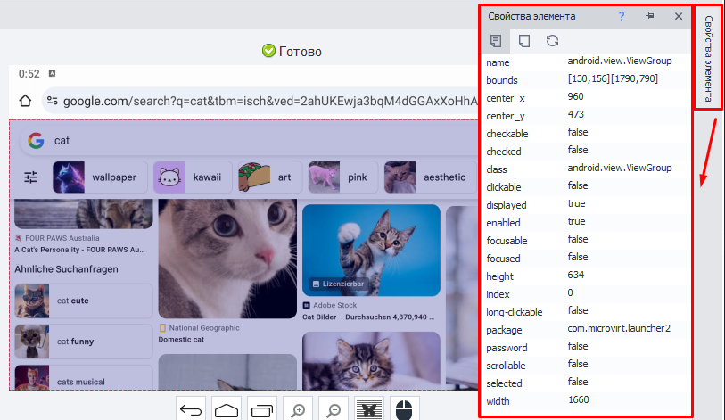
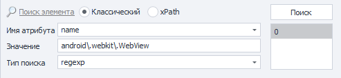
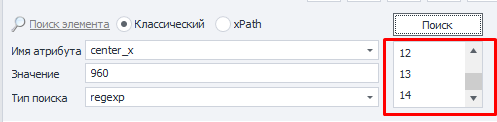
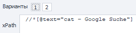
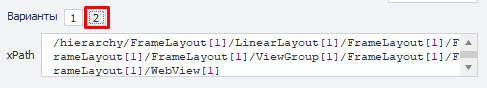
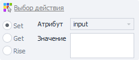
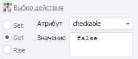
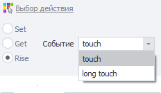

---
sidebar_position: 5
title: Конструктор действий
description: Работа с элементами в окне эмулятора.
---  
:::info **Пожалуйста, ознакомьтесь с [*Правилами использования материалов на данном ресурсе*](../../Disclaimer).**
:::
_______________________________________________

Это универсальный инструмент для работы с элементами в [Окне устройства](./DeviceWindow), который позволяет подобрать оптимальные критерии для поиска.  
_______________________________________________ 
## Как вызвать?
#### Есть два способа:  
- ПКМ по нужному элементу в **Окне устройства** → **В конструктор действий** из контекстного меню.  

 
_______________________________________________ 
- Из окна [**Древо элементов**](./ElementTree) → ПКМ по интересующему элементу → **В конструктор действий**.  

  
_______________________________________________ 
:::info **Полезно.**
При добавлении элемента в **Конструктор действий** все его свойства и атрибуты автоматически попадают в окно [**Свойства элемента**](./ElementProp).  

 
:::  
_______________________________________________ 
## Параметры поиска  
  
### Виды поиска:  
- **Классический**. Быстрый и простой. Для нахождения элемента используются различные атрибуты.  
- **xPath**. Мощный и гибкий. Позволяет выполнять сложные запросы и детальную навигацию по структуре страницы.  
### Классический поиск.  
  

#### Имя атрибута.  
Атрибут элемента, по которому будет производиться поиск. Доступные атрибуты для выбранного элемента можно найти в [**Окне свойства элемента**](./ElementProp).  
:::info **Возможные атрибуты.**
`id`, `name`, `text`, `content-desc`, `bounds`, `center X/Y`, `checkable`, `checked`, `class`, `clickable`, `focusable`, `focused`, `height`, `index`, `long-clickable`, `packadge`, `password`, `resource-id`, `scrollable`, `selected`, `width`.            
:::  
#### Значение.  
То значение, которое в данный момент есть у выбранного атрибута.  
#### Тип поиска.
- **text**. Поиск по полному или частичному совпадению текста;  
- **notext**. Ищет элементы, в которых не будет указанного текста.  
- **regexp**. Поиск с помощью [**Регулярных выражений**](../../Tools/RegEx_Tester);  
:::tip **Что такое RegExp (Regular Expression)?**
Это мощный инструмент для работы с текстом, который позволяет находить, проверять, заменять и извлекать определенные паттерны в строках. Эти выражения состоят из символов и метасимволов, которые образуют шаблон для поиска.  
:::

:::warning **Будьте внимательны.**
  

Если указать слишком общие параметры для поиска, то им будут соответствовать сразу несколько элементов. Это не очень хорошо, поэтому всегда подбирайте более узкие значения.
:::  
_______________________________________________ 
### Поиск по xPath.  
**XPath (XML Path Language)** - это язык запросов, используемый для навигации и поиска информации в XML-документах. Он позволяет точно указать путь к элементам, атрибутам и текстовым данным, которые нужно найти в структуре XML файлов и получить данные при необходимости.

XPath предлагает набор выражений, операторов и функций для указания конкретных путей обхода XML-деревьев и фильтрации данных с помощью различных критериев. Эти выражения состоят из элементов и операторов, которые можно комбинировать, чтобы получить нужные результаты.  

Доступно два варианта для формата данных:  
**1.** В виде выражения.  

  

**2.** В виде древа пути (иерархии).  

  
_______________________________________________  
## Выбор действия.  
Можно выбрать одно из трёх возможных действий:  
- **Set (Установка значения)**.  
  
    - *Атрибут*. Доступен только атрибут “input”. Для него можно установить новое значение.  
    - *Значение*. Текст, который необходимо вставить. Можно использовать как простой текст, так и переменные проекта: `{-Variable.someVar-}`, `{-Profile.Name-}`, а также их комбинации: `Привет. Меня зовут {-Profile.Name-}`.  

- **Get (Получение значения)**.  
   
    - *Атрибут*. Атрибут, значение которого надо получить.  
    - *Значение*. Здесь отобразится значение найденного атрибута.  

- **Rise (Выполнить действие)**.  
   
    С помощью данного действия можно выполнить события *touch (нажатие)* и *long touch (долгое нажатие)* для элемента.  
_______________________________________________   
## Завершающие действия.  
   
### Тестировать.  
После подбора оптимальных параметров поиска и нужного действия можно протестировать их, нажав на эту кнопку.  
### Добавить в проект.  
Нажимаем эту кнопку в самом конце, когда результат поиска нас полностью устраивает.  
### Комментарий.  
Здесь можно оставить комментарий для создаваемого экшена, так как автоматические подписи содержат мало информации.  

_______________________________________________
## Полезные ссылки.  
- [**Установить значение**](../../Android/ProLite/SetValue).
- [**Взять значение**](../../Android/ProLite/GetValue).  
- [**Тестер X/JSON Path**](../../Tools/JSON_Tester)