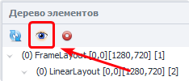
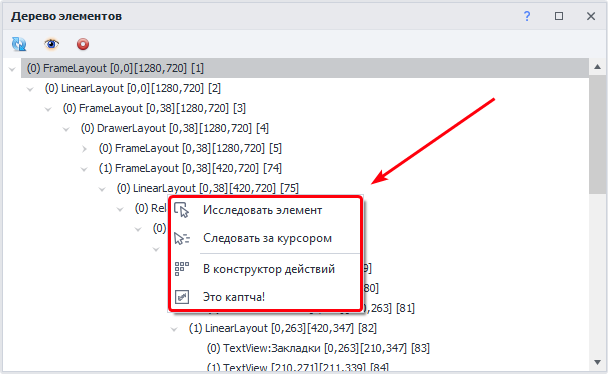
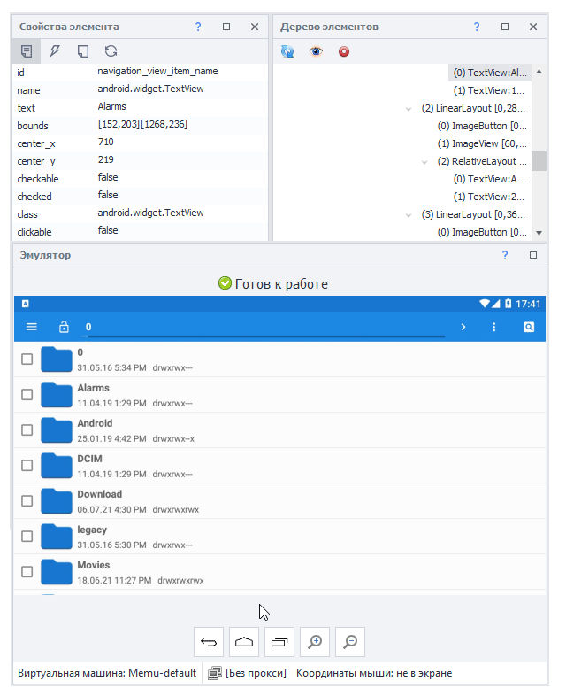

:::info **Пожалуйста, ознакомьтесь с [*Правилами использования материалов на данном ресурсе*](../../Disclaimer).**
:::
_______________________________________________  
## Описание.

  
В этой статье мы детально рассмотрим окно под названием «Дерево элементов». В нем отображается структура страницы, которая находится на главном экране эмулятора, в виде древа. То есть все элементы выходят друг из друга в порядке взаимосвязи.  

Структуру страницы можно вывести в виде XML строки с помощью действия  
[**Получить структуру элементов (XML)**](../../Android/ProLite/Utilities#получить-структуру-элементов-xml), которое вы найдете в Утилитах.  

:::info **При выделении элемента в Древе он также будет подсвечен в Окне эмулятора**  
  
::: 

## Функции.  
### Обновить содержимое.  
   
Эта кнопка обновляет структуру элементов. Нажимать ее нужно каждый раз при открытии новой страницы приложения, чтобы подгрузить актуальную структуру.  
_______________________________________________ 
### WebView.
:::tip **Что это?**
***WebView** — это компонент пользовательского интерфейса, который используется в мобильных приложений для отображения веб-содержимого (HTML, CSS, JavaScript) прямо внутри приложения. Он позволяет интегрировать веб-страниц без перенаправления в отдельный веб-браузер.* 
:::     
Если в древе присутствует подобный элемент, то после первого клика по кнопке «Обновить» его содержимое не будет отображено, нужно нажать повторно. Причем отобразится не HTML-структура web-страницы, а именно стандартная разметка Android.   

_______________________________________________ 
### Только видимые элементы.  
  

Включает отображение только тех элементов, которые находятся в области видимости.  
_______________________________________________   
### Автообновление.  
:::warning **При включении данной функции перестает работать свайп мышкой в окне эмулятора.** 
Но свайп через колесо мыши по-прежнему будет работать.  
:::   

  

Эта функция всегда работает, когда включена автозапись действий. То есть перед каждой записью экшена в проекте структура будет обновляться до актуальной.  
:::warning **Надо убедиться.**
Для корректной работы Автообновления надо убедиться, что отключена настройка  
[**Запись нажатий через поиск по картинкам**](../../Settings/Record_and_InputMethods#запись-нажатий-через-поиск-по-картинкам) на вкладке Запись.  
:::   
_______________________________________________  
### Сворачивание.  
  
Для удобства работы вы можете сворачивать любые элементы в древе.  
_______________________________________________  
## Контекстное меню.  
   
Выберете элемент и нажмите по нему правой кнопкой мыши, чтобы открыть Контекстное меню.
_______________________________________________    
### Исследовать элемент.  
Позволяет детально изучить элемент, открыв его **Свойства**.  

  
_______________________________________________    
### Следовать за курсором.  
После включения данной опции элемент под курсором будет подсвечен, выделен в древе, а также отобразятся его свойства.  
  
_______________________________________________  
### В конструктор действий.  
Отправляет элемент в конструктор, чтобы взаимодействовать с ним в рамках проекта.  
_______________________________________________   
### Это капча!   
При нажатии создается экшен [**Распознавание капчи**](../../Android/ProLite/CaptchaSolving). Параметры для поиска подбираются автоматически. После выбора пункта **Это капча!** появляется два дополнительных параметра.  
  
#### Приклеить к каптче.  
Этот параметр позволяет соединить несколько отдельных картинок в одну и отправить цельное изображение на сервис распознавания каптчи. Удобно использовать, когда каптча состоит из нескольких отдельных элементов.  
#### Поле для результата распознавания каптчи.  
Вводит результат распознавания в поле ввода и, если включена **Запись**, добавляет экшен [**Установка значения**](../../Android/ProLite/SetValue).  
_______________________________________________
## Полезные ссылки.  
- [**Конструктор действий**](./ActionBuilder).  
- [**Установить значение**](../../Android/ProLite/SetValue).  
- [**Запись и Ввод**](../../Settings/Record_and_InputMethods).