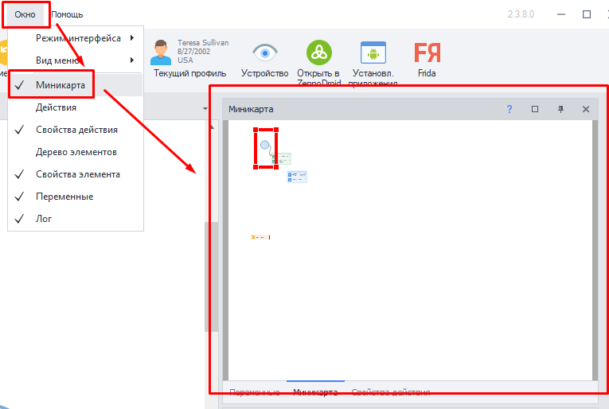
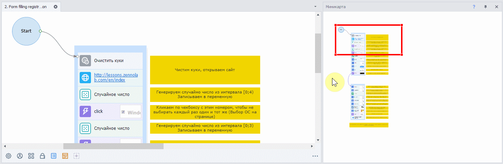
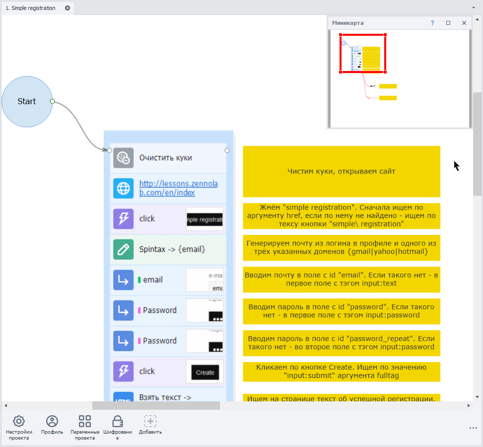
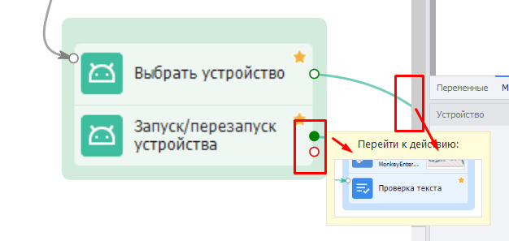
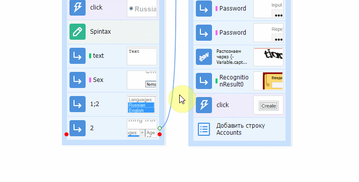
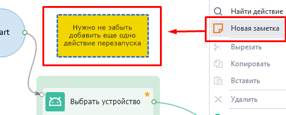
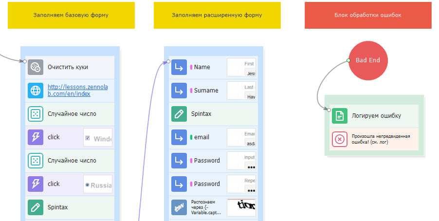
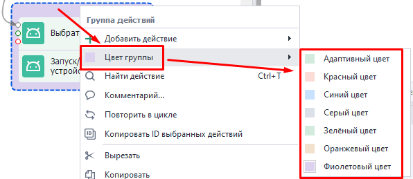

---
sidebar_position: 8
title: Ориентация по холсту
description: Как быстро ориентироваться в проекте?
---  
:::info **Пожалуйста, ознакомьтесь с [*Правилами использования материалов на данном ресурсе*](../../Disclaimer).**
:::
_______________________________________________

## Миникарта.
Добавить это окно можно через верхнюю панель → Окно → Миникарта:  

  
### Для чего она нужна?  
Когда на рабочем пространстве шаблона появляется много действий, Миникарта позволит быстро ориентироваться и перемещаться по проекту. Достаточно просто кликнуть на любую точку карты, чтобы отобразить нужный участок проекта.  

   
_______________________________________________ 
## Функции для ориентации.  
### Изменение масштаба.  
Окно проекта можно увеличивать и уменьшать, чтобы видеть ту часть, которая вам нужна. Для этого нажмите `Ctrl`+`Покрутите колесико` или используйте сочетание `Ctrl`+`-/+`  

  
### Интерактивные подсказки.  
  

Если навести курсор на точку крепления кубика, путь которого выходит за пределы холста, то появится предложение перейти к действию, к которому ведет эта линия.  
Это особенно удобно, если в шаблоне много стрелок или действия находятся далеко друг от друга.  

 
_______________________________________________ 
### Заметки.  
Нажав ПКМ по пустому месту на холсте, можно добавить **Заметку**. Это такое полотно, на котором можно оставить многострочный комментарий.  

 

С помощью заметок можно прокомментировать определенный набор действий и сгруппировать их по цветовому признаку.  

 
_______________________________________________ 
### Цвет группы.  
Можно логически маркировать свои группы по цветам. ПКМ по Группе действий → Цвет группы → выбрать цвет.   

 

Например, блок с настройками можно сделать серым, группу авторизации оранжевой, а регистрации красной. Также есть *Адаптивный* цвет, который окрашивает группу в цвет экшенов, которых больше по количеству.    
_______________________________________________
## Полезные ссылки.   
- [**Основные понятия**](../../basicterms). 
- [**Заметки**](../../Project%20Editor/Project/Notes).