:::info **Пожалуйста, ознакомьтесь с [*Правилами использования материалов на данном ресурсе*](../../Disclaimer).**
:::
_______________________________________________  

## Для чего нужно это окно?  
Оно позволяет производить различные манипуляции с переменными. Такие как создание, удаление и переименование, а также редактирование их значений.  
Также это окно полезно при отладке, так как в нем можно отслеживать изменения происходящие с переменными.  
_______________________________________________
## Как его открыть?  
### Первый способ.  
Нажмите на кнопку с четырьмя квадратиками на [**Панели статических блоков**](../../category/панель-статических-блоков):  

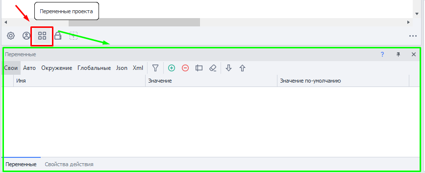 
  
:::info **Я не вижу у себя эту панель.**
Кликните ПКМ по пустому пространству и установите соответствующую галочку:  

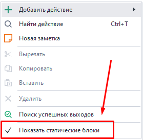
:::  
_______________________________________________   
### Второй способ.  
Верхнее меню **Окно → Переменные → ✓**:  

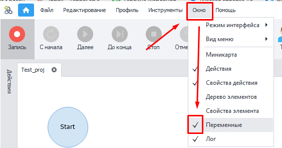 
_______________________________________________ 
## Элементы управления.
Рассмотрим каждый элемент **Окна переменных**.  

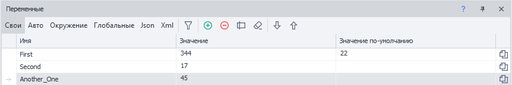
_______________________________________________ 
### Типы переменных.  
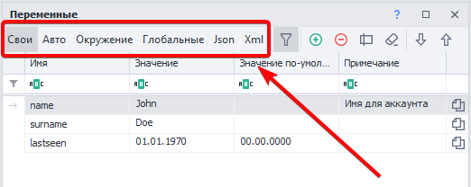

Позволяет выбрать тип переменных, которые будут отображаться в нижней таблице.  
_______________________________________________ 
#### Доступные варианты:
- **Свои**.  
Это переменные, которые пользователь сам создаёт в процессе написания шаблона.  
:::info **Правила создания переменных.**
Обязательно должны быть написаны английскими буквами. Цифры не должны стоять в начале слова. Не допускается использование пробелов и символов кроме `_` 
:::  
_______________________________________________   
- **Авто**.  
Генерируются автоматически в режиме **Записи проекта**, а также при добавлении некоторых кубиков (например, [**Android → Взятие значения**](../../Android/ProLite/GetValue)).   
Имеют примерно такие названия: `Variable1`, `RecognitionResult0`. Однако вы всегда можете переместить их в **Свои** и задать любое имя.  
:::tip **Кнопка «Переместить в Свои».**
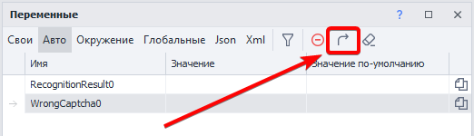
:::  
_______________________________________________ 
- **Окружение**.  
Переменные окружения проекта. Сюда входят: 
    - параметры страницы инстанса (URL, DOM, текст, домен, текст нотификаций и алертов и т. д.),  
    - переменные времени и даты,  
    - переменные проекта (имя, папка, правила прокси, id последней ошибки и т. д.),  
    - многочисленные переменные профиля (почта, пол, имя, юзерагент и т. д.)  
    _______________________________________________  
- **Глобальные**.  
Эти переменные доступны для всех проектов и их потоков в ZennoDroid. Тогда как обычные существуют только в пределах лишь одного проекта.  
Их отличительной особенностью является наличие дополнительного свойства — ***Пространство имен***.  
:::info **Будьте внимательны.**
У **ProjectMaker** и **ZennoDroid** *раздельные глобальные переменные*. Так что изменения внесённые в глобальную переменную в PM не будут видны в ZD, и наоборот.
:::  
_______________________________________________ 
- **Json**.  
Эти переменные генерируются автоматически в процессе парсинга JSON.  
В режиме **Парсинг** экшена [**Обработка JSON/XML**](../../Data/JSON_XML) можно прямо из текста сразу разложить значения по автоматически созданным переменным с соответствующими узлами.  

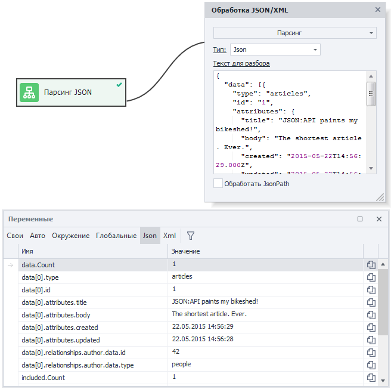 

Далее в проекте можно использовать эти переменные через префикс `{-Json….-}`, либо в **C#** посредством объекта `project.Json;`  

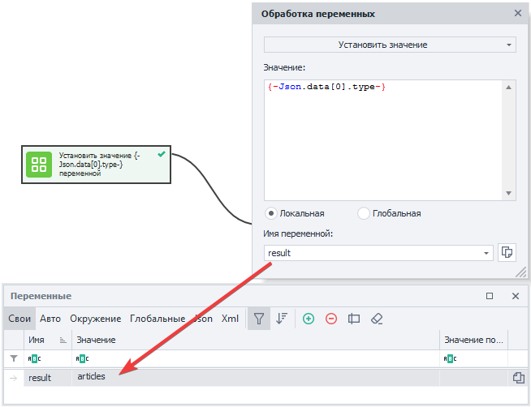
_______________________________________________ 
- **Xml**.  
Как и в случае с JSON, переменные этого типа автоматически создаются после парсинга XML-документа.  

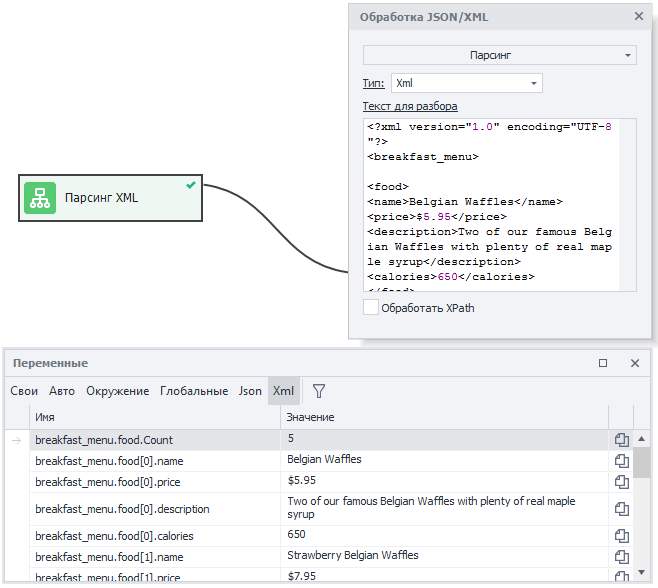

Их также можно использовать через префикс `{-XML….-}`, либо в C# через свойства объекта `project.XML;`  

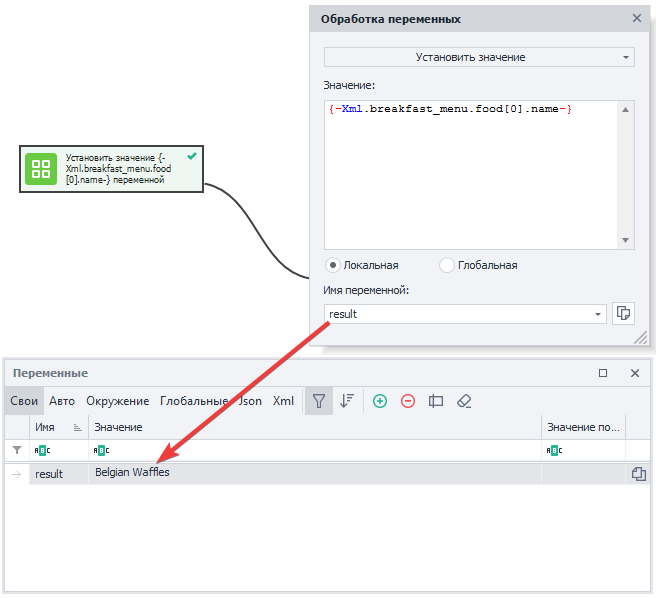
_______________________________________________ 
### Доступные кнопки в правой части панели.  
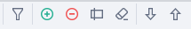 
#### Фильтр. 
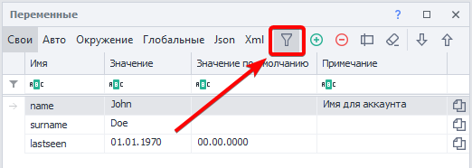 

Открывает либо закрывает поле фильтрации. Если проект имеет большое количество переменных, то поиск нужной может занять много времени. Поэтому доступна многофункциональная фильтрация, каждый столбец которой можно отфильтровать по разному одним из 12-ти способов.  

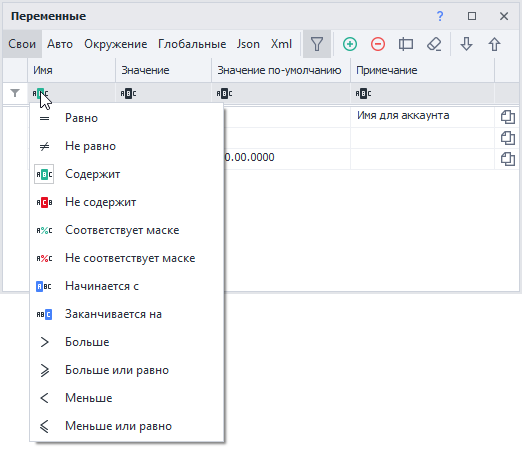
_______________________________________________ 
#### Очистка сортировки.  
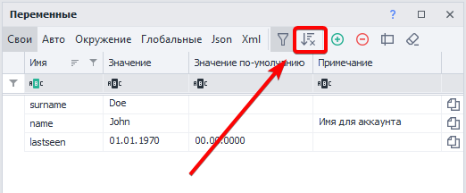

Кнопка доступна только в том случае, если ранее выполнялась сортировка. При нажатии она ее сбросит.  
_______________________________________________ 
#### Добавить.  
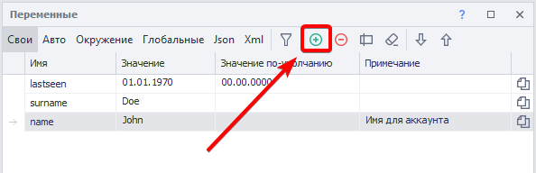

Открывает диалоговое окно, в котором можно задать имя создаваемой переменной.  
_______________________________________________ 
#### Удалить.  
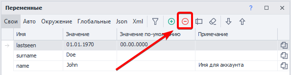 

Удаляет выделенную переменную, предварительно показав подтверждающее окно.  
_______________________________________________ 
#### Переименовать.  
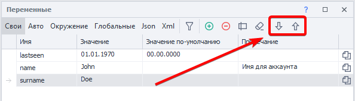  

Выводит диалоговое окно с возможностью отредактировать имя переменной.   
Доступно только для типов **Свои** и **Глобальные**.  
Быстро переименовать также можно, если дважды нажать на переменную в столбце **Имя**.  
:::warning **Имя переменной изменится так же во всех экшенах, где она используется.**
:::  
_______________________________________________ 
#### Очистка неиспользуемых переменных.  
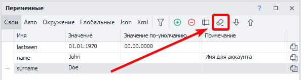

Часто в больших проектах создаются переменные, которые позднее никак не участвуют в работе шаблона. Их можно удалять, чтобы не занимать место в памяти и визуально не засорять рабочее пространство.  
При нажатии на эту кнопку ZennoDroid найдет все неиспользуемые переменные и выведет их список с предложением удалить.   
Для каждого типа переменных нужно выполнять отдельную очистку.  
_______________________________________________ 
#### Ручная сортировка.  
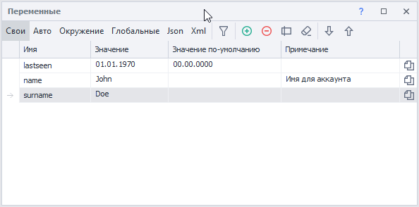   

Можно расположить переменные так как вам удобно с помощью кнопок **Вверх** и **Вниз**. Также можно перетаскивать их мышкой.  
Свой порядок работает только тогда, когда выключена сортировка по столбцам.  
_______________________________________________ 
### Заголовки столбцов.  
Они нужны как для фильтрации переменных, так и для их сортировки. Достаточно кликнуть по заголовку столбца, чтобы отсортировать его по возрастанию или убыванию.  
Кликнув ПКМ по заголовку любого столбца, можно настроить отображаемые колонки.  

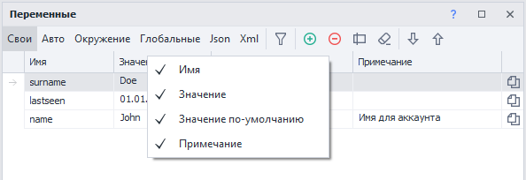  
_______________________________________________ 
#### Доступные колонки.  
- **Имя.**  
Имена переменных используемых в проекте. Если дважды кликнуть по ним, то можно переименовать.  
:::warning **Имена переменных чувствительны к регистру.**
 `Name`, `NAME` и `name` — это три разные переменные.
:::   
- **Значение.**  
Показывает текущие значения переменных. Кликнув по значению, можно прямо в поле ввода его отредактировать.  
- **Значение по-умолчанию.**  
При запуске проекта все переменные пустые. Но если в это поле ввести нужное значение, то оно станет отображаться по умолчанию сразу со старта.  
:::info **У переменных окружения, JSON и XML не бывает значений по умолчанию.**
::: 
- **Примечание.**  
По умолчанию эта колонка скрыта. Можно использовать для заметок к переменным. Например, указать цель или назначение для себя, чтобы не забыть.  
_______________________________________________ 
### Копирование и Контекстное меню.  
#### Скопировать макрос переменной в буфер обмена.  
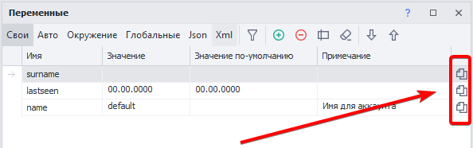 

Быстрый способ скопировать макрос типа `{-Variable.value-}` — это кликнуть по такой иконке в строке переменной.  
_______________________________________________ 
#### Контекстное меню.  
Вызвать его можно, кликнув ПКМ по переменной. Доступно для вкладок **Свои**, **Авто** и **Глобальные**.  

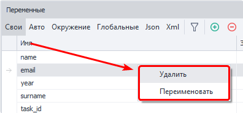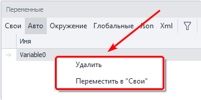  
_______________________________________________ 
### Копирование переменных из одного проекта в другой.  
Нередко требуется создать новый проект, используя переменные из старого шаблона. Копировать по одной крайне неэффективно, поэтому можно скопировать сразу все переменные из одного проекта и вставить их в другой.  

**1.** Открываем существующий проект.  
**2.** Кликаем ПКМ на кнопке **Переменные** (это четыре квадратика в Панели статических блоков) и нажимаем **Скопировать переменные**.  

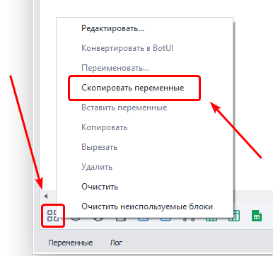 

**3.** Затем открываем новый проект и снова кликаем ПКМ по иконке переменных, но теперь выбираем **Вставить переменные**.  
**4.** В появившемся окне ставим галочки напротив тех типов переменных, которые хотим вставить в проект. Все переменные копируются вместе с их значениями по умолчанию.  

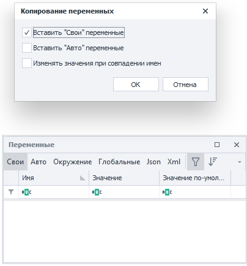  
_______________________________________________ 
## Работа с переменными.  
### Макросы  
В ProjectMaker можно использовать переменные через макросы. Например, макрос `{-Variable.myVariable-}` нужен для передачи значения `myVariable` при выполнении проекта.  
Достаточно вставить макрос в любое поле свойств экшена (там где это возможно), чтобы переменная была использована при выполнении этого экшена.  
:::info **Знайте.**
У глобальных переменных нужно указать в макросе область видимости `{-GlobalVariable.someNamespace.text-}`.  
:::  

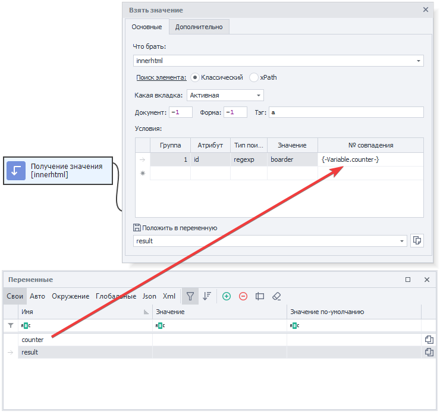 

**Операции с переменными с помощью экшенов C# и JS**

<!--All you need is a blank line-->

    Переменные в ZennoDroid бывают трёх типов:  
    - **Числовые/ int и float** (`0`, `1`, `12.652`, `12507`).  
    - **Строковые/ string** (`“Hello World“`, `
Hello World
`).  
    - **Логические/ boolean** (`True`, `False`)  

    Использовать переменные можно в обоих кубиках **C#** и **JavaScript**. Однако в C# все переменные попадают в *текстовом (string)* значении, поэтому для использования *чисел (int или float)* и *логики (boolean)* потребуется конвертация.  
    На скриншоте ниже изображен способ конвертации через сложение и возврат:  

    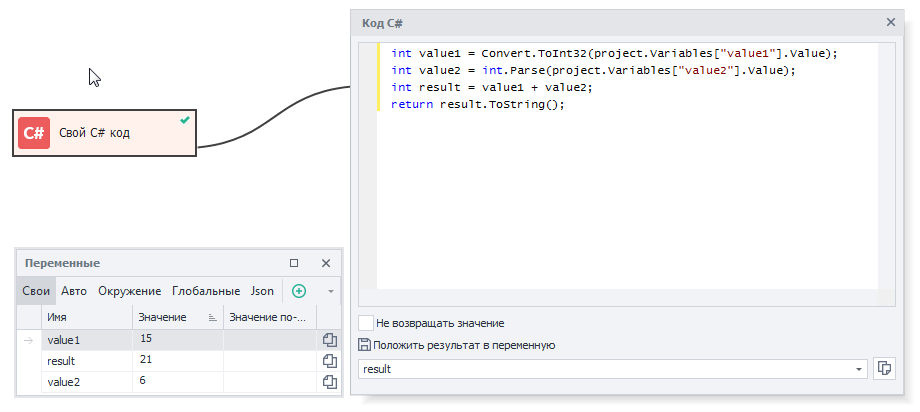 

    Для операций со строками в кубике JavaScript ***необходимо текстовые переменные обернуть в кавычки***. 

   
_______________________________________________ 
### Рекомендации по именам.  
Старайтесь давать переменным такие имена, по которым сразу будет понятно их назначение. Не стоит называть переменные коротко и бессмысленно — `f1`, `123`, `sdgtg`, так как этим вы усложните исправление и контроль за проектом себе и другим разработчикам, которые будут иметь доступ к шаблону.  
Если переменная часто используется в проекте, то желательно назвать её коротко, но понятно — `counter`, `username`, `proxy`.  
Старайтесь разделять названия, у которых в основе два и более слова, заглавными буквами `MySecondPassword` или символом нижнего подчеркивания `page_html`  

Это общепринятые практики, которые значительно улучшат читабельность и эффективность работы с вашим проектом.  
_______________________________________________ 
### Присвоение значения.  
Классический пример использования переменных заключается в комбинации статического текста + своих переменных + переменных окружения с помощью экшена [**Обработка переменных**](../../Data/WorkWithVariables).  

 

В данном примере имя берется из переменной окружения `{-Profile.Name-}`, день недели из `{-TimeNow.DayOfWeek-}`, а возраст из своей переменной `count`. После запуска кубика результат сохраняется в переменной `result`.  
_______________________________________________ 
### Арифметические операции над числами.  
Используя синтаксис языка JavaScript и соответствующий кубик можно производить различные математические операции над числами.  

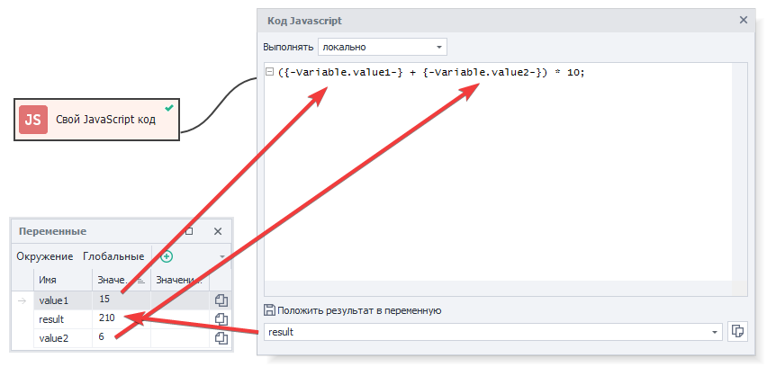  

В данном случае в переменных `value1` и `value2` находятся целые числа, которые нужно сложить и потом умножить на 10. Результат вычислений попадает в переменную `result`.  
_______________________________________________ 
### Использование переменных.  
Старайтесь использовать переменные вместо жёстко прописанного текста в тех местах, где значение может изменяться.  

Например, пути файлов — у вас на компьютере он один, у клиента другой. И если необходимый файл находится в одной директории с проектом (или в одной из его поддиректорий), то правильным решением станет использование макроса   
`{-Project.Directory-}`. Это путь к директории, где сохранен проект.  
_______________________________________________
## Полезные ссылки.  
- [**Обработка JSON и XML**](../../Data/JSON_XML).  
- [**Написание кода в ZD**](../../category/свой-код).  
- [**Панель статических блоков**](../../Project%20Editor/Static%20Block%20Panel/CommonPrinciples). 