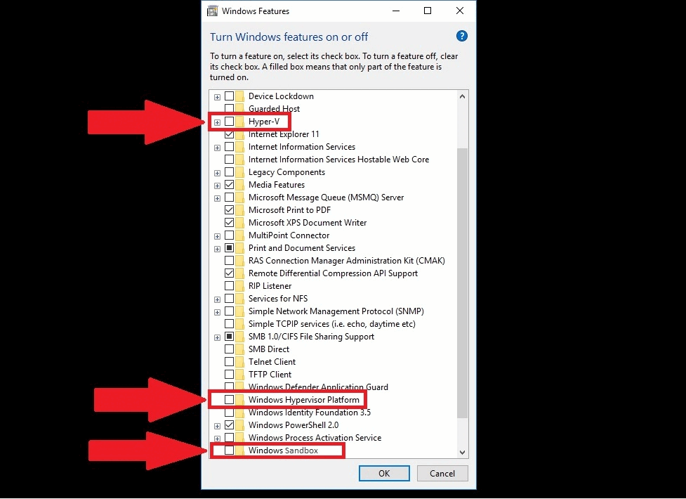
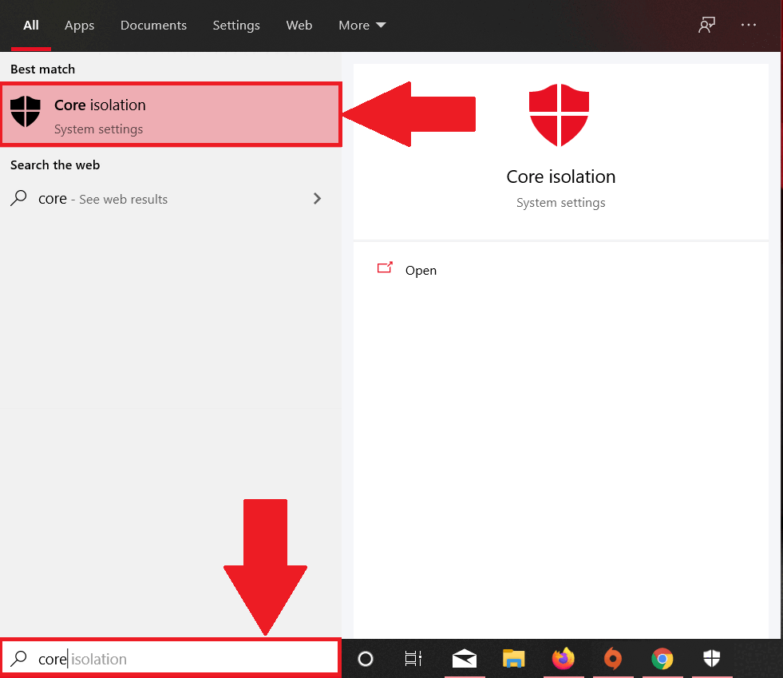

import DisclaimerNotice from '@site/src/components/DisclaimerNotice';

# Выключение Hyper-V
<DisclaimerNotice />

Hyper-V позволяет запускать несколько операционных систем в виде виртуальных машин в Windows. Также он  предоставляет возможность выполнять виртуализацию оборудования. Но при работе с ZennoDroid и эмуляторами Hyper-V может мешать, поэтому в этой статье мы расскажем, как его отключить.  
_________________
## Включен ли Hyper-V? 
Сначала проверим, запущена ли эта низкоуровневая оболочка:  
**1.** В поиске приложений введите ***msinfo32.exe***  
**2.** Выберите Сведения о системе.  
**3.** В окне сведений найдите эту запись:  
*«Обнаружена низкоуровневая оболочка. Функции, необходимые для Hyper-V, отображены не будут»*.  

  
_________________  
## Отключение через командную строку.
**1.** Нажмите на строку поиска и введите **Командная строка**. 
> *Или нажмите Win+R, введите ***cmd***, затем нажмите **Ok** или **Enter**.*

**2.** В командной строке введите эту команду и нажмите Enter:  
`bcdedit /set hypervisorlaunchtype off`  
**3.** Готово, Hyper-V отключен 😎  

  
_________________ 
## Отключение через Панель управления.  
**1.** Заходим в Панель управления → Программы → Программы и компоненты → нажимаем на  
**Включение или отключение компонентов Windows**.  

  

**2.** Теперь нам нужно снять галочки со следующих строк:
    - *Hyper V*
    - *Платформа низкоуровневой оболочки Windows*
    - *Песочница Windows*
    - *Платформа виртуальной машины*
    - *Подсистема Windows для Linux*  

  

**3.** После этого нажмите **Ок** и <mark>перезагрузите компьютер</mark>.  

  
_________________ 
## Альтернативный способ отключения.
:::warning **Опробовано на Windows 11 Home 24H2.**
Этот вариант может помочь, если другие не сработали.
:::

***Разберём его по шагам:***  
#### 1. Откройте Редактор реестра (Regedit) и перейдите по пути:  
`HKEY_LOCAL_MACHINE\SYSTEM\CurrentControlSet\Control\DeviceGuard\Scenarios\HypervisorEnforcedCodeIntegrity`  

Измените значение параметра **Enabled** на `0`.

#### 2. теперь перейдём к следующему разделу:
`HKEY_LOCAL_MACHINE\SYSTEM\CurrentControlSet\Control\DeviceGuard\Scenarios\WindowsHello`
  
И снова измените значение **Enabled** на `0`.  

#### 3. Перезагрузите компьютер.  
После этого система может сообщить о проблеме с входом по PIN-коду — просто создайте новый PIN.  

### Дополнительно. 
:::warning **Опробовано на Windows 11 Pro.**
::: 
Если вышеуказанное не помогло, можно попробовать воспользоваться официальным инструментом от Microsoft:  
[Device Guard and Credential Guard Hardware Readiness Tool](https://www.microsoft.com/en-us/download/details.aspx?id=53337)  

Обычно используется утилита (PowerShell-скрипт) с параметром `-Disable` для отключения Device Guard/Credential Guard, после чего требуется перезагрузка и подтверждение изменений (например, F3) на этапе загрузки.
_________________
## Отключение целостности памяти.  
Для корректной работы без Hyper-V нам также нужно отключить целостность памяти.  
1. В поиске Windows введите **Изоляция ядра** и нажмите **Enter**.  
2. В настройках изоляции ядра отключите **Целостность памяти**.  

  
_______________________________________________
## Полезные ссылки.  
- [**Обзор технологии Hyper-V**](https://learn.microsoft.com/ru-ru/windows-server/virtualization/hyper-v/hyper-v-overview). 
- [**Включение виртуализации**](./Virtualization).
