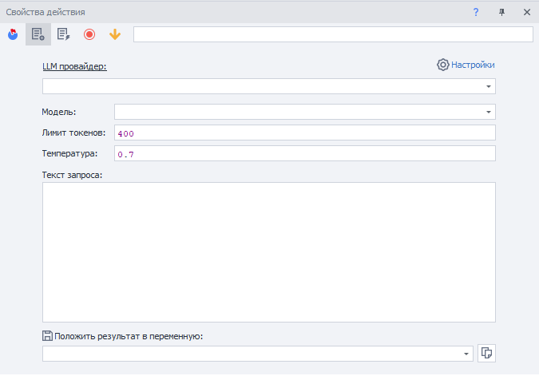
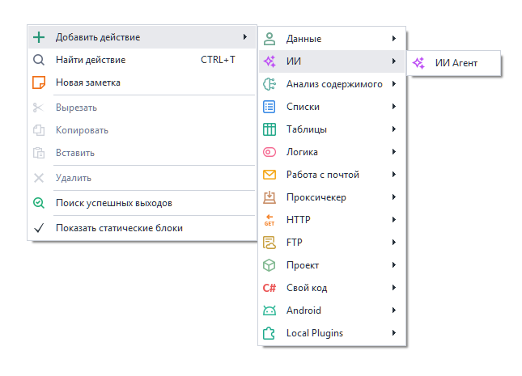
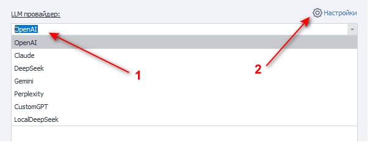

---
sidebar_position: 5
sidebar_label: ИИ Агент
title: ИИ Агент | Документация ZennoDroid | ZennoLab
description: ИИ Агент - раздел официальной документации ZennoDroid от ZennoLab. Подробные инструкции, примеры использования и руководство по настройке
---  
# ИИ Агент
:::info **Пожалуйста, ознакомьтесь с [*Правилами использования материалов на данном ресурсе*](../Disclaimer).**
:::  

## Описание.  
Данный экшен используется для работы с LLM-провайдерами (*OpenAI, Anthropic, DeepSeek, Gemini, OpenRouter, Perplexity*). Он позволяет отправить текстовый промпт из поля запроса или переменной и получить ответ в переменную.  

  

### Как добавить в проект?  
Через контекстное меню: **Добавить действие → ИИ → ИИ Агент**.  

  

### Для чего это используется?  
- Поддерживать диалог с ИИ;  
- Писать и генерировать статьи, посты, тексты;  
- Создавать и применять промпты;  
- Анализировать и классифицировать данные;  
- Автоматизировать создание контента.  

:::warning **Перед первым запуском необходимо указать API-ключ сервиса.**  
Это делается один раз в [**Настройках → ИИ**](../Settings/AI).
:::
_______________________________________________
## Принцип работы.  
### Основные настройки.  
  

**1.** Выбор модуля LLM из выпадающего списка. Кроме встроенных сервисов, здесь появятся и добавленные вами [**пользовательские модули**](../Settings/AI).  
**2.** Быстрый переход в настройки ИИ-сервисов, где указывается API-ключ.  
_______________________________________________
### Модель.  
  

**Модель** — название LLM-модели, которая будет использоваться для генерации текста.  

После выбора провайдера список моделей автоматически подгружается в выпадающий список. Если вы используете собственный LLM-сервис, укажите название модели вручную.  

**От выбранной модели зависят:**  
- качество ответов;  
- скорость генерации;  
- стоимость запросов.  
_______________________________________________
### Лимит токенов.  
**Лимит токенов** — параметр, который ограничивает максимальное количество токенов, которое модель может сгенерировать в ответе.  

**Подходит для:**  
- контроля длины ответа;  
- снижения стоимости API-запросов;  
- уменьшения задержки генерации;  
- предотвращения «слишком длинных» ответов.  

**Особенности:**  
- учитываются именно выходные токены (*output*), а не входной промпт *(его контролируйте в поле «Текст запроса»)*;  
- если лимит достигнут, генерация останавливается;  
- слишком маленькое значение может обрезать ответ на полуслове.  

По умолчанию стоит **400**, увеличьте значение, если вам нужны длинные ответы *(также можете добавить дополнительное ограничение в тексте промпта, например — `«Комментарий длиной в 300 символов»`)*.  

:::info **Токен — не слово и не символ.**  
Токен — это кусок текста, поэтому его длина сильно зависит от языка и содержимого.
:::

Примерные оценки для современных LLM:  

| Язык        | 1 токен ≈                        | 100 токенов ≈                              |
|-------------|----------------------------------|--------------------------------------------|
| Английский  | 3–4 символа / ~0.75 слова        | ~70–80 слов                                |
| Русский     | 2–3 символа / ~0.4–0.6 слова     | ~40–60 слов                                |
| Немецкий    | 2–4 символа                      | ~50–70 слов                                |
| Китайский   | 1–2 иероглифа                    | ~100–150 иероглифов                        |
| Японский    | 1–2 символа                      | ~80–120 символов                           |
| Код         | очень зависит от синтаксиса      | часто токенов больше, чем в обычном тексте |

:::warning **Русский текст обычно «дороже» по токенам, чем английский той же длины.**
:::
_______________________________________________
### Температура.  
**Температура** — параметр, который управляет степенью случайности и креативности генерации текста.  

**Как работает:**  
- низкие значения → ответы более точные, предсказуемые и стабильные;  
- высокие значения → ответы более разнообразные, творческие и неожиданные.  

Типичный диапазон: от `0` до `2` *(в зависимости от LLM)*.  

**Практика использования:**  
- `0.0–0.3` → код, SQL, документация, точные ответы;  
- `0.4–0.7` → обычный чат и большинство задач *(по умолчанию)*;  
- `0.8–1.2+` → креатив, идеи, сторителлинг.  

**Особенности:**  
- температура `0` не гарантирует 100% одинаковый результат, но делает ответы максимально детерминированными;  
- высокая температура повышает вероятность нестандартных формулировок и ошибок.  
_______________________________________________
### Текст запроса.  
  

**Текст запроса** (или *промпт*) — это инструкция и входные данные, которые передаются модели для генерации ответа.  

:::tip **Можно использовать макросы переменной или проекта.**
:::

**Именно промпт определяет:**  
- что должна сделать модель;  
- в каком формате отвечать;  
- какой стиль использовать;  
- какие данные анализировать.  

**Хороший промпт обычно включает:**  
- задачу;  
- контекст;  
- ограничения;  
- желаемый формат ответа.  

#### Пример хорошего промпта для x.com.  

```
Ты активный пользователь Crypto Twitter.

Напиши reply к посту в стиле опытного crypto/AI пользователя.

Тон:
- умный, но не слишком официальный
- коротко и по делу
- допускаются мемные фразы
- максимум 280 символов
- без хэштегов
- без эмодзи-spam

Пост:
{-POST_TEXT-}

Верни только reply.
```
_______________________________________________
### Положить результат в переменную.  
Выбираем переменную, в которую будет возвращён результат работы.  
_______________________________________________
## Полезные ссылки.  
- [**Настройки ИИ-сервисов**](../Settings/AI).  
- [**Окно переменных**](../pm/Interface/Variables).  
- [**Переменные окружения**](../pm/Creating/Variables).  
- [**Создание контента**](../Data/ContentCreator).  
- [**ИИ-помощник в ZennoDroid**](../introduction/ai-assistant).  
