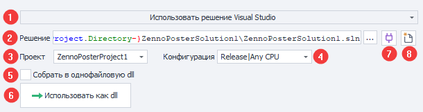
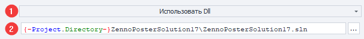
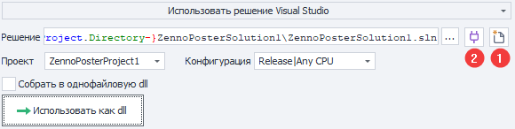
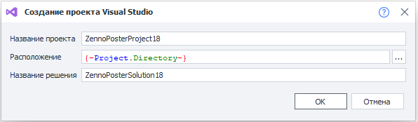
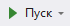
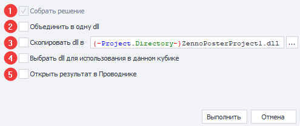
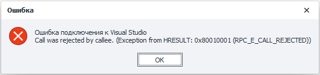

---
sidebar_position: 6
sidebar_label: Проект Visual Studio
title: Проект Visual Studio | Документация ZennoDroid | ZennoLab
description: Проект Visual Studio - раздел официальной документации ZennoDroid от ZennoLab. Подробные инструкции, примеры использования и руководство по настройке
---  
# Проект Visual Studio
:::info **Пожалуйста, ознакомьтесь с [*Правилами использования материалов на данном ресурсе*](../../Disclaimer).**
:::  

## Описание.  
Экшен **Проект Visual Studio** позволяет использовать в проекте ZennoDroid проект, созданный в Microsoft Visual Studio. Это открывает неограниченные возможности для написания и отладки кода, а также для подключения внешних библиотек.  

В отличие от кубика [**C# код**](./С), где код хранится в самом проекте, здесь код живёт в обычном решении Visual Studio: с классами, наследованием, NuGet-пакетами, точками останова и полноценной отладкой.  

#### Где можно применить:  
- Удобная интеграция сторонних библиотек и применение их в коде.  
- Создание собственных библиотек для многократного использования в разных проектах.  
- Отладка кода в Visual Studio с доступом к устройству и проекту.  
_______________________________________________ 
## Как добавить в проект?  
Через контекстное меню: **Добавить действие → Свой код → Проект Visual Studio**.  
_______________________________________________ 
## Как работать с экшеном?  
Кубик может работать в двух режимах: с решением Visual Studio или с уже собранной dll.  
### Использовать решение Visual Studio.  
  

1. Выбор режима работы кубика.  
2. Путь к решению, в котором находится проект.  
3. Проект, который будет запускаться при выполнении кубика.  
4. Конфигурация проекта.  
5. Флаг объединения выходной dll и зависимостей в один файл с помощью **ILRepack**.  
6. Кнопка перехода к режиму **Использовать Dll**.  
7. Кнопка **Подключиться к Visual Studio**.  
8. Кнопка **Создать новый проект Visual Studio**.  
### Использовать Dll.  
  

1. Выбор режима работы кубика.  
2. Путь к dll, которая будет запускаться при выполнении кубика.  
_______________________________________________ 
## Создание проекта и подключение к Visual Studio.  
:::warning **Что должно быть установлено.**
- *Visual Studio 2019, 2022 или 2026. Бесплатную версию Community можно скачать на [официальном сайте](https://visualstudio.microsoft.com/ru/vs/community/). Если установлено несколько версий, используется самая новая.*  
- *Пакет разработчика для .NET Framework 4.6.2 — конечной платформы проекта ([Download .NET SDKs for Visual Studio](https://dotnet.microsoft.com/download/visual-studio-sdks)).*  
:::  

1. Добавьте экшен и выберите режим **Использовать решение Visual Studio**.  
2. Нажмите кнопку **Создать новый проект Visual Studio (1)**.  
  
:::info **Если проект уже создан, эти шаги можно пропустить.**
*Укажите решение, проект и конфигурацию в свойствах кубика и нажмите **Подключиться к Visual Studio (2)**.*
:::  
3. В открывшемся окне заполните название проекта, расположение и название решения, затем нажмите **ОК**.  
  
4. Дождитесь, пока ZennoDroid создаст решение и подключится к Visual Studio.  

Подключение обеспечивает взаимодействие между ProjectMaker и Visual Studio: [**Окно устройства**](../../pm/Interface/DeviceWindow) переносится в Visual Studio, поэтому код можно отлаживать с доступом к устройству и проекту. В ProjectMaker на месте окна появляется надпись **Браузер находится в решении Visual Studio** со ссылкой **Показать браузер здесь**, а на панели инструментов окна в Visual Studio есть кнопка **Return to ProjectMaker** — и то, и другое возвращает окно обратно.  

Если окно устройства не открылось в Visual Studio автоматически, его можно вызвать: **Вид → Другие окна → ZennoDroidToolWindow**.  
:::info **Для подключения нужно расширение ZennoDroid для Visual Studio.**
*Если расширение не установлено или его версия не совпадает с версией ProjectMaker, программа предложит установить нужную. После установки подключитесь к Visual Studio ещё раз.*
:::  
:::warning **Пункта меню ZennoDroidToolWindow нет?**
*Значит расширение не установлено или отключено. В Visual Studio откройте **Расширения → Управление расширениями**, перейдите в раздел **Установленные** и проверьте состояние расширения **ZennoDroid VisualStudio Extension**. Если его нет в списке, перезапустите ProjectMaker и подключитесь к Visual Studio ещё раз. Если проблема сохранится, обратитесь в техническую поддержку.*
:::  
_______________________________________________ 
## Структура проекта.  
Чтобы проект можно было использовать в экшене, он должен:  
- содержать ссылки на библиотеки ZennoDroid: `Global.dll`, `ZennoLab.CommandCenter.dll`, `ZennoLab.Emulation.dll`, `ZennoLab.InterfacesLibrary.dll`, `ZennoLab.Macros.dll` и `ZennoDroid.Interface.dll`. Они находятся в папке установленного ZennoDroid — путь к ней шаблон берёт из переменной окружения `ZennoDroidDllPath`, которая выставляется при запуске ProjectMaker или ZennoDroid;  
- содержать класс, реализующий интерфейс `IZennoExternalCode`. При выполнении кубика будет вызван метод `public int Execute(Instance instance, IZennoPosterProjectModel project)`, который должен вернуть `0` при успехе и любое другое значение при ошибке.  

Проект, созданный из ProjectMaker, уже соответствует этим требованиям. Он содержит один файл **Program.cs** с готовой реализацией метода `Execute`:  
```csharp
public class Program : IZennoExternalCode
{
    public int Execute(Instance instance, IZennoPosterProjectModel project)
    {
        // API устройства ZennoDroid
        IDroidInstanceAPI droid = instance.DroidInstance;

        int executionResult = 0;

        return executionResult;
    }
}
```  
Объекты `instance` и `project` работают так же, как в кубике [**C# код**](./С): через `instance.DroidInstance` доступен [**API устройства**](../../API/DroidInstance), а через `project` — переменные и настройки проекта.  

Для отладки кода воспользуйтесь стандартной кнопкой **Пуск** в Visual Studio.  
  
:::tip **Запись действий устройства в код Visual Studio не ведётся.**
*Записывайте проект в ProjectMaker как обычно, а в Visual Studio пишите код руками.*
:::  
_______________________________________________ 
## Использование dll.  
:::info **В режиме «Использовать Dll» установленная Visual Studio не нужна.**
*Поэтому этот режим удобен для переноса готового проекта между компьютерами. Нужно только обеспечить доступность требуемых dll на каждом из них — например, скопировать их в папку проекта.*
:::  

После завершения разработки в Visual Studio можно быстро перейти к прямому использованию выходной dll — для этого нажмите кнопку **Использовать как dll**. Откроется окно, в котором выбираются нужные действия.  
  

1. Сборка решения (обязательный шаг).  
2. Объединение выходной dll и библиотек в один файл с помощью **ILRepack**. Позволяет уменьшить количество файлов, которые нужно переносить с проектом.  
3. Копирование dll по указанному пути. По умолчанию используется макрос папки проекта.  
4. Переключение кубика в режим **Использовать как dll** с установкой пути к dll.  
5. Показ собранной dll в Проводнике.  
:::info **Режим можно переключить и вручную.**
*Тогда путь к dll указывается в свойствах кубика. Чтобы dll могла быть выполнена, в ней должен быть класс, реализующий интерфейс `IZennoExternalCode`.*
:::  
_______________________________________________ 
## Возможные ошибки и способы их устранения.  
### Project Target Framework Not Installed.  
  

Не установлен набор разработчика для .NET Framework 4.6.2. Его нужно скачать с официального сайта и установить: [Download .NET SDKs for Visual Studio](https://dotnet.microsoft.com/download/visual-studio-sdks).  
_______________________________________________
### Call was rejected by callee (RPC_E_CALL_REJECTED).  
  

Visual Studio отклоняет запросы на взаимодействие со стороны ProjectMaker. Чаще всего это происходит, когда в Visual Studio нужно совершить какие-либо действия — например, появилось диалоговое окно. Переключитесь в Visual Studio, выполните необходимые действия, а затем подключитесь к ней ещё раз. Если ошибка сохранилась, перезапустите Visual Studio, а если и это не помогло — обратитесь в техническую поддержку.  
_______________________________________________
### После подключения к Visual Studio некорректно работает рендеринг свойств кубиков.  
Обратите внимание, что при клике на разные кубики или на пустое место диаграммы свойства кубика корректно не обновляются.  
  

Для устранения проблемы проверьте настройки Visual Studio.  
|   | | 
|:--:| :--:|
| *Средства → Параметры… → Общие* | *Tools → Options… → General* |   

Подробное описание этой настройки: [**Поддержка Per-Monitor для расширений Visual Studio**](https://learn.microsoft.com/ru-ru/visualstudio/extensibility/ux-guidelines/per-monitor-awareness-extenders).  

Если опция недоступна, обновите Windows и Visual Studio либо воспользуйтесь [**инструкцией по установке ключа в реестре**](https://learn.microsoft.com/ru-ru/visualstudio/designers/disable-dpi-awareness#add-a-registry-entry).  
_______________________________________________  
## Полезные ссылки.  
- [**C# код**](./С).  
- [**Директивы using и общий код**](./Directives_Using).  
- [**API ZennoDroid**](../../API/DroidInstance).  
- [**Официальное руководство по программированию на C#**](https://learn.microsoft.com/ru-ru/dotnet/csharp/).  
- [**Утилита ILRepack**](https://github.com/gluck/il-repack).  
