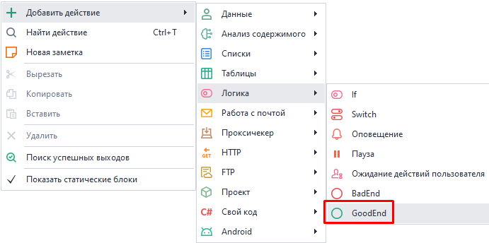
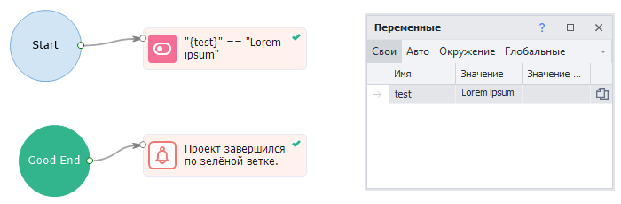
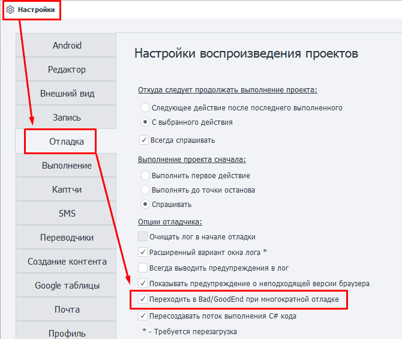

---
sidebar_position: 6
sidebar_label: GoodEnd
title: GoodEnd | Документация ZennoDroid | ZennoLab
description: GoodEnd - раздел официальной документации ZennoDroid от ZennoLab. Подробные инструкции, примеры использования и руководство по настройке
---  
# GoodEnd
:::info **Пожалуйста, ознакомьтесь с [*Правилами использования материалов на данном ресурсе*](../../Disclaimer).**
:::  

Данное действие предназначено для выполнения каких-либо дополнительных действий после удачного выполнения проекта.  
Может работать в связке с экшеном [**Bad End**](./BadEnd).  

_______________________________________________ 
### Как добавить в проект?  
Через контекстное меню: **Добавить действие → Логика → GoodEnd**.  

  
_______________________________________________ 
### Как работать с экшеном?  
Если последний кубик проекта завершится по зеленой ветке, то выполнение перейдет к действию, связанному с **GoodEnd**.  

   

### Многократный переход в GoodEnd.  
При отладке проект переходит в *GoodEnd* по умолчанию только один раз. Затем нужно перезапустить проект кнопкой **С начала**.  
Для возможности переходить в *GoodEnd* несколько раз подряд нужно включить в *Настройках* опцию [**Переходить в Bad/GoodEnd при многократной отладке**](../../Settings/Debugging).  

_______________________________________________
## Полезные ссылки.  
- [**Отладка проектов**](../../pm/Debugging).
- [**Окно лога**](../../pm/Interface/Log_window).  
- [**Настройки воспроизведения проектов**](../../Settings/Debugging). 