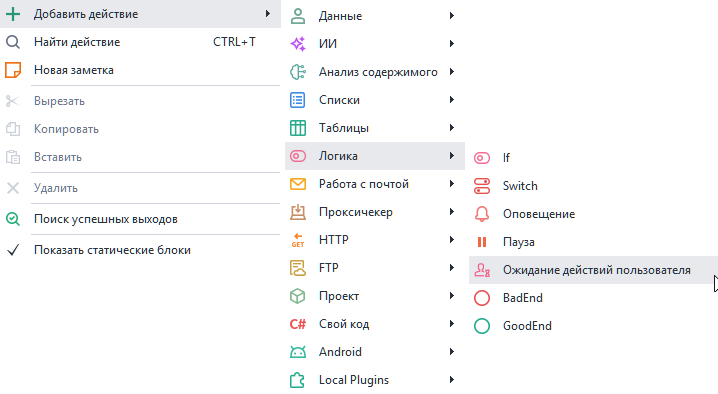
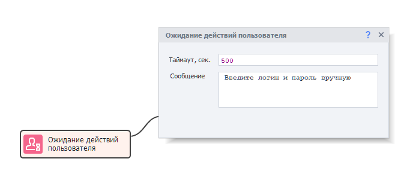
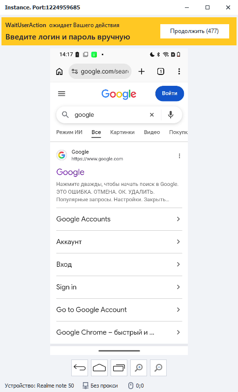

---
sidebar_position: 4
sidebar_label: Ожидание действий пользователя
title: Ожидание действий пользователя | Документация ZennoDroid | ZennoLab
description: Ожидание действий пользователя - раздел официальной документации ZennoDroid от ZennoLab. Подробные инструкции, примеры использования и руководство по настройке
---  
# Ожидание действий пользователя
:::info **Пожалуйста, ознакомьтесь с [*Правилами использования материалов на данном ресурсе*](../../Disclaimer).**
:::   

Данное действие останавливает проект и передаёт управление человеку: окно устройства остаётся открытым, и в нём можно вручную сделать то, что шаблон делать не должен.  

Используется для:  
- Ввода логина и пароля, которые не хочется хранить в шаблоне;  
- Ввода данных банковской карты;  
- Прохождения проверок, которые шаблон не проходит сам;  
_______________________________________________
### Как добавить в проект?  
Через контекстное меню: **Добавить действие → Логика → Ожидание действий пользователя**.  

  
_______________________________________________
## Как работать с экшеном?  

  

### Таймаут, сек.  
Сколько секунд отводится на ручные действия. Значение можно задать вручную или через переменную — в ней должно быть число.  

Когда время выйдет, проект продолжит выполнение сам.  

:::info **Если заранее не известно, сколько времени потребуется, укажите заведомо большое значение — например `99999`.**
:::   

### Сообщение.  
Текст, который увидит человек в окне устройства. Сюда пишут, что именно нужно сделать.  
_______________________________________________
## Окно ожидания.  
Пока действие выполняется, в верхней части окна устройства появляется полоса:  

  

- Слева вверху — **название проекта**, который остановился на этом действии.  
- Под ним — **сообщение**, заданное в экшене.  
- Справа — кнопка **«Продолжить»**, в скобках сколько секунд осталось до автоматического продолжения.  

Нажатие на **Продолжить** возвращает управление шаблону сразу, не дожидаясь конца таймаута.  
_______________________________________________
## Полезные ссылки.  
- [**Пауза**](./Pause).
- [**Окно устройства**](../../pm/Interface/DeviceWindow).
