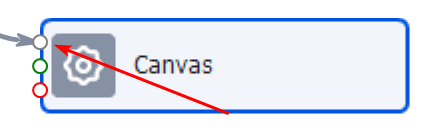
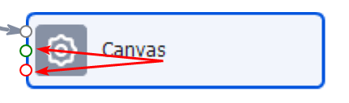

---
sidebar_position: 7
title: "Основные понятия"
description: "Конвертировано из HTML в MDX"
date: "2025-07-08"
converted: true
originalFile: "Основные понятия.txt"
targetUrl: "https://zennolab.atlassian.net/wiki/spaces/RU/pages/475693086"
slug: basic-concepts
---
import DisclaimerNotice from '@site/src/components/DisclaimerNotice';

<DisclaimerNotice />

> 🔗 **[Оригинальная страница](https://zennolab.atlassian.net/wiki/spaces/RU/pages/475693086)** — Источник данного материала

_______________________________________________  
## Описание.  
В этой статье мы разберём основные термины, с которыми вы столкнётесь при работе с ZennoPoster. Часть из них вам, скорее всего, уже знакома, а некоторые помогут закрыть пробелы и лучше разобраться в теме. Используйте эту статью как удобную памятку и возвращайтесь к ней, если какой-то термин окажется непонятным.  

## ProjectMaker (сокращённо PM или ПМ)
Так называется наша среда для разработки проектов и шаблонов. Вы совершаете действия в браузере, а программа записывает их. Затем шаблон можно отредактировать, дополнить новыми шагами и логикой.  

Мы будем часто использовать его в дальнейшем. Хоть это и отдельное приложение, но оно тесно связано с ZennoPoster.

## ZennoPoster (сокращённо ЗП или ZP)
Это основная программа, в которой запускаются и выполняются проекты. Позволяет работать с шаблонами в многопоточном режиме, а также настраивать [Расписание](../ZennoPoster/Project_delivery/Project_settings/Schedule_planner/General_Information_About_Schedule_Planner).  

## Поток (поток выполнения)
Так мы называем отдельную единицу выполнения, для которой выделяется собственный набор данных (переменные, списки, таблицы), а также отдельный браузер. Поток можно сравнить с человеком, работающим на заводе и выполняющим определённый набор действий. Если проект запускается в несколько потоков, его можно представить как полноценную производственную линию, где у каждого «работника» своя задача.
## Экшен (кубик, action)
Блок действия в ProjectMaker из которых конструируется шаблон. Так как PM имеет нодовую структуру работы, то каждое действие нужно скреплять между собой линией ("нитью"). Они выполняются по порядку, друг за другом. Если какое-то действие не присоединить к общему древу, то оно не будет участвовать в выполнении.  

Что можно делать с помощью кубика:  
- [Получить значение](../ProjectMaker/Project-editor/Actions-in-ProjectMaker-Actions-Blocks/Tabs/Getting_Value);  
- [Cовершить нажатие (touch)](../ProjectMaker/Project-editor/Actions-in-ProjectMaker-Actions-Blocks/Tabs/Touch_Event);  
- [Cохранить значение элемента](../ProjectMaker/Project-editor/Actions-in-ProjectMaker-Actions-Blocks/Tabs/Setting_Value);  
- [Записать текст в файл](../ProjectMaker/Project-editor/Actions-in-ProjectMaker-Actions-Blocks/Data/Text_Processing), список, таблицу, базу данных;  
- И много всего другого :)

## Порт экшена
С помощью портов кубик соединяется с другими действиями. Обычно у экшенов три порта (один входящий и два исходящих), но у [действия Switch](../ProjectMaker/Project-editor/Actions-in-ProjectMaker-Actions-Blocks/Logic/Switch_Multiple_Options) может быть больше двух исходящих портов.

### Входящий порт

Сюда можно подключить стрелку логики от другого экшена.
К одному входящему порту могут быть подключены сразу несколько других экшенов.

### Исходящие порты

Зелёный (для успешного выхода) и красный (неуспешный выход, выход по ошибке)

## Ветки (стрелки) логики
Все действия в проекте должны соединятся между собой стрелками. Если действие не подключить к ветке, то оно не будет работать в общей логике.

### Зелёная стрелка
По этой ветке экшены выходят в случае успешного результата:

- получили строку из списка или таблицы,
- нашли элемент и получиги его значение,
- выражение внутри экшена if вернуло истинное значение,
- прочие успешные результаты.  

### Красная стрелка
По этому пути экшен выйдет, если произошла ошибка во время работы кубика:

- не найден запрашиваемый элемент на странице сайта,
- не найден файл для считывания,
- попытка получить строку, которой нет,
- и прочие ошибки.

  

## Шаблон (проект)
Это файл, который создаётся в ProjectMaker и затем запускается в ZennoPoster. Он содержит набор инструкций, управляющих работой инстанса. Проще говоря, шаблон — это программа или сценарий, по которому выполняется автоматизация.

Шаблон формируется из экшенов, связанных между собой логическими переходами (стрелками), которые определяют порядок и условия их выполнения.  

## Инстанс
Это обособленная часть программы, содержащая в себе экземпляр браузера со своими куками, кэшем и прокси, не пересекающимися с другими инстансами. Выглядит как небольшое окно с вкладками и адресной строкой.
Если очень упростить, то Инстанс - это отдельный браузер, со своим набором данных.

  

## Куки

Небольшой объем информации, который разрешено оставить web-сервису в виде файла в строго определенном месте на жестком диске у Вас на компьютере. Обычно используется для узнавания Вас при повторном переходе на этот сервис.

  

## Кэш

Это файлы (картинки, звуки, видео), которые загружаются и хранятся у Вас на компьютере. При повторном посещении ресурса эти файлы не будут снова скачиваться, а будут загружены из кэша, для ускорения загрузки и уменьшения потребления трафика.

  

## Прокси
Прокси бывают платные и бесплатные, но последние не отличаются хорошей скоростью работы и живучестью.

В ZennoPoster установить прокси можно с помощью [❗→ специального действия](https://zennolab.atlassian.net/wiki/spaces/RU/pages/489324572#%D0%A3%D1%81%D1%82%D0%B0%D0%BD%D0%BE%D0%B2%D0%B8%D1%82%D1%8C-%D0%BF%D1%80%D0%BE%D0%BA%D1%81%D0%B8 "https://zennolab.atlassian.net/wiki/spaces/RU/pages/489324572#%D0%A3%D1%81%D1%82%D0%B0%D0%BD%D0%BE%D0%B2%D0%B8%D1%82%D1%8C-%D0%BF%D1%80%D0%BE%D0%BA%D1%81%D0%B8"). Также в программу [❗→ интегрированы некоторые сервисы](/wiki/spaces/RU/pages/809140312 "/wiki/spaces/RU/pages/809140312") по продаже прокси.

## Переменная
Это область в памяти компьютера, где хранится какое-либо значение. У переменной есть имя, по которому можно получить её значение. Значение переменной можно изменять в процессе работы шаблона.

  

## Сниппет
Кусок кода (для ZennoPoster чаще всего на языке программирования C#), который выполняет какую-то одну функцию.

  

## Баг
Ошибка из-за которой проект работает не так, как было задумано разработчиком.

  

## Диагностика
Специальная программа, которая собирает диагностическую информацию о текущем состоянии ZennoPoster. Чаще всего требуется при обращении в поддержку, когда программа работает со сбоями.

Инструкция о том как правильно делать Диагностику - [❗→ Диагностика (репорт) с подробным логом](/wiki/spaces/RU/pages/870419658 "/wiki/spaces/RU/pages/870419658") 

  

## Проксичекер
Часть программного комплекса ZennoPoster, предназначенная для сбора, хранения, фильтрации, сортировки и последовательной выдачи прокси для анонимного выполнения шаблонов.

[❗→ ProxyChecker](/wiki/spaces/RU/pages/851705960 "/wiki/spaces/RU/pages/851705960") 

  

## Планировщик
Часть приложения ZennoPoster для отложенного запуска шаблонов по расписанию, с указанной периодичностью, если нужно.

[❗→ 📆 Планировщик расписания](/wiki/spaces/RU/pages/534086320 "/wiki/spaces/RU/pages/534086320")