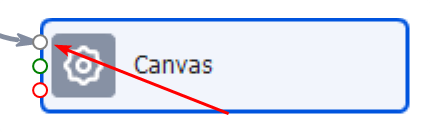
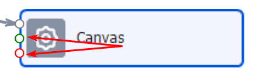

---
sidebar_position: 7
title: "Основные понятия"
description: "Конвертировано из HTML в MDX"
date: "2025-07-08"
converted: true
originalFile: "Основные понятия.txt"
targetUrl: "https://zennolab.atlassian.net/wiki/spaces/RU/pages/475693086"
---
:::info **Пожалуйста, ознакомьтесь с [*Правилами использования материалов на данном ресурсе*](../Disclaimer).**
:::

> 🔗 **[Оригинальная страница](https://zennolab.atlassian.net/wiki/spaces/RU/pages/475693086)** — Источник данного материала

_______________________________________________  
# Основные понятия

  

## ProjectMaker (PM, ПМ)

Среда разработки проектов (шаблонов).

  

## ZennoPoster (ЗП, ZP)

Среда для запуска проектов. Позволяет запускать шаблоны в многопоточном режиме, настраивать [❗→ расписание](/wiki/spaces/RU/pages/534086320 "/wiki/spaces/RU/pages/534086320") для запуска.

  

## Поток (поток выполнения)

Отдельная единица выполнения, для которой выделяется отдельный браузер, отдельное набор данных ([❗→ переменные](/wiki/spaces/RU/pages/735608872 "/wiki/spaces/RU/pages/735608872"), [❗→ списки](/wiki/spaces/RU/pages/534053375 "/wiki/spaces/RU/pages/534053375"), [❗→ таблицы](/wiki/spaces/RU/pages/735903776 "/wiki/spaces/RU/pages/735903776")) и т.п. 
Можно сравнить поток с человеком, выполняющим определенный набор действий в браузере. Выполнение в несколько потоков равносильно выполнению действий несколькими людьми.

  

## Экшен (кубик, action)

[❗→ Блок действия](https://zennolab.atlassian.net/wiki/spaces/RU/pages/486342706/ProjectMaker "https://zennolab.atlassian.net/wiki/spaces/RU/pages/486342706/ProjectMaker") в ProjectMaker из которых конструируется шаблон. Содержит типовую инструкцию для управления: 

- получить значение
- кликнуть
- сохранить значение элемента
- записать текст в файл, список, таблицу, базу данных
- и др.

  

## Порт экшена

С помощью портов экшен соединяется с другими экшенами.
Обычно у кубиков три порта.

:::note На заметку
Исключение составляет экшен Switch , у которого может быть больше двух исходящих портов.
:::

### Входящий порт

Сюда можно подключить стрелку логики от другого экшена.
К одному входящему порту могут быть подключены сразу несколько других экшенов.

### Исходящие порты

Зелёный (для успешного выхода) и красный (неуспешный выход, выход по ошибке)

  

## Ветки (стрелки) логики

Экшены между собой соединяются стрелками логики. Бывает красная и зелёная ветки.

### Зелёная стрелка

По этой ветке экшены выходит, когда завершился успешно:

- получили строку из [❗→ списка](/wiki/spaces/RU/pages/534053375 "/wiki/spaces/RU/pages/534053375") или [❗→ таблицы](/wiki/spaces/RU/pages/735903776 "/wiki/spaces/RU/pages/735903776")
- нашли и [❗→ кликнули по элементу](/wiki/spaces/RU/pages/534020211 "/wiki/spaces/RU/pages/534020211") на сайте
- выражение внутри [❗→ экшена if](/wiki/spaces/RU/pages/534315151 "/wiki/spaces/RU/pages/534315151") вернуло истинное значение
- и т.д.

### Красная стрелка

По этому пути экшен выйдет, если произошла ошибка во время работы кубика:

- не найден элемент на странице сайта
- не найден файл для считывания
- попытка получить строку, которой нет, из списка\таблицы
- и др.

  

## Шаблон (проект)

Файл, создающийся в ProjectMaker и выполняющийся в ZennoPoster. Содержит инструкции для управления инстансом. Можно сказать, что это программа или скрипт, по которой происходит работа инстанса.
Шаблон состоит из экшенов, связанных между собой стрелками логики.

  

## Инстанс

Это обособленная часть программы, содержащая в себе экземпляр браузера со своими куками, кэшем и прокси, не пересекающимися с другими инстансами. Выглядит как небольшое окно с вкладками и адресной строкой.
Если очень упростить, то Инстанс - это отдельный браузер, со своим набором данных.

  

## Куки

Небольшой объем информации, который разрешено оставить web-сервису в виде файла в строго определенном месте на жестком диске у Вас на компьютере. Обычно используется для узнавания Вас при повторном переходе на этот сервис.

  

## Кэш

Это файлы (картинки, звуки, видео), которые загружаются и хранятся у Вас на компьютере. При повторном посещении ресурса эти файлы не будут снова скачиваться, а будут загружены из кэша, для ускорения загрузки и уменьшения потребления трафика.

  

## Прокси

С помощью прокси Вы можете скрыть свой реальный IP адрес и, например, получить доступ заблокированному ресурсу. Прокси бывают платные и бесплатные, но последние не отличаются хорошей скоростью работы и живучестью.
В ZennoPoster установить прокси можно с помощью [❗→ специального действия](https://zennolab.atlassian.net/wiki/spaces/RU/pages/489324572#%D0%A3%D1%81%D1%82%D0%B0%D0%BD%D0%BE%D0%B2%D0%B8%D1%82%D1%8C-%D0%BF%D1%80%D0%BE%D0%BA%D1%81%D0%B8 "https://zennolab.atlassian.net/wiki/spaces/RU/pages/489324572#%D0%A3%D1%81%D1%82%D0%B0%D0%BD%D0%BE%D0%B2%D0%B8%D1%82%D1%8C-%D0%BF%D1%80%D0%BE%D0%BA%D1%81%D0%B8"). Так же в программу [❗→ интегрированы некоторые сервисы](/wiki/spaces/RU/pages/809140312 "/wiki/spaces/RU/pages/809140312") по продаже прокси.

  

## Переменная

Это область в памяти компьютера, где хранится какое-либо значение. У переменной есть имя, по которому можно получить её значение. Значение переменной можно изменять в процессе работы шаблона.

  

## Сниппет

Кусок кода (для ZennoPoster чаще всего на языке программирования C#), который выполняет какую-то одну функцию.

  

## Баг

Ошибка из-за которой проект работает не так, как было задумано разработчиком.

  

## Диагностика

Специальная программа, которая собирает диагностическую информацию о текущем состоянии ZennoPoster. Чаще всего требуется при обращении в поддержку, когда программа работает со сбоями.

Инструкция о том как правильно делать Диагностику - [❗→ Диагностика (репорт) с подробным логом](/wiki/spaces/RU/pages/870419658 "/wiki/spaces/RU/pages/870419658") 

  

## Проксичекер

Часть программного комплекса ZennoPoster, предназначенная для сбора, хранения, фильтрации, сортировки и последовательной выдачи прокси для анонимного выполнения шаблонов.

[❗→ ProxyChecker](/wiki/spaces/RU/pages/851705960 "/wiki/spaces/RU/pages/851705960") 

  

## Планировщик

Часть приложения ZennoPoster для отложенного запуска шаблонов по расписанию, с указанной периодичностью, если нужно.

[❗→ 📆 Планировщик расписания](/wiki/spaces/RU/pages/534086320 "/wiki/spaces/RU/pages/534086320")