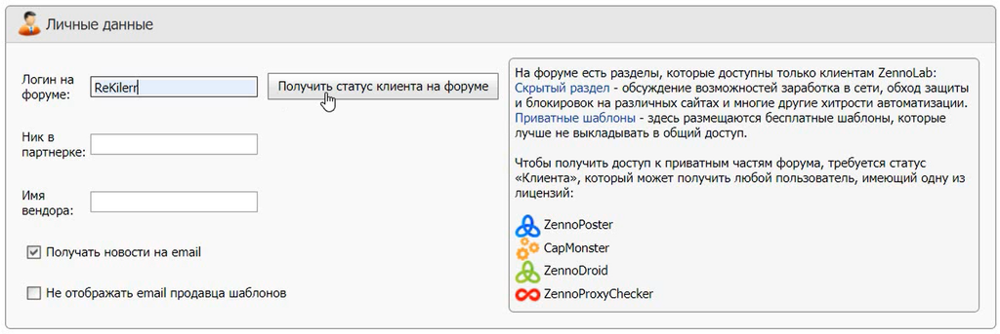

---
sidebar_position: 8
title: "Получение статуса клиента"
description: "Конвертировано из HTML в MDX"
date: "2025-07-08"
converted: true
originalFile: "Получение статуса клиента.txt"
targetUrl: "https://zennolab.atlassian.net/wiki/spaces/RU/pages/908197929"
---
:::info **Пожалуйста, ознакомьтесь с [*Правилами использования материалов на данном ресурсе*](../Disclaimer).**
:::

> 🔗 **[Оригинальная страница](https://zennolab.atlassian.net/wiki/spaces/RU/pages/908197929)** — Источник данного материала

_______________________________________________  
# Получение статуса клиента

На форуме есть разделы, которые доступны только клиентам ZennoLab:

- [Скрытый раздел](https://zennolab.com/discussion/forums/skrytyj-razdel-dlja-klientov.156/ "https://zennolab.com/discussion/forums/skrytyj-razdel-dlja-klientov.156/") - обсуждение возможностей заработка в сети, обход защиты и блокировок на различных сайтах и многие другие хитрости автоматизации.
- [Приватные шаблоны](https://zennolab.com/discussion/forums/privatnye-shablony-dlja-klientov.251/ "https://zennolab.com/discussion/forums/privatnye-shablony-dlja-klientov.251/") - здесь размещаются бесплатные шаблоны, которые лучше не выкладывать в общий доступ.

Чтобы получить доступ к приватным частям форума, требуется статус «**Клиента**», который может получить любой пользователь, имеющий одну из лицензий:

- [ZennoPoster](https://zennolab.com/ru/products/zennoposter/ "https://zennolab.com/ru/products/zennoposter/")
- [CapMonster](https://zennolab.com/ru/products/capmonster/ "https://zennolab.com/ru/products/capmonster/")
- [ZennoDroid](https://zennolab.com/ru/products/zennodroid/ "https://zennolab.com/ru/products/zennodroid/")
- [ZennoProxyChecker](https://zennolab.com/ru/products/zennoproxychecker/ "https://zennolab.com/ru/products/zennoproxychecker/")

1. Создайте аккаунт на форуме.
2. В [Личном Кабинете](https://userarea.zennolab.com/lk/login.aspx "https://userarea.zennolab.com/lk/login.aspx") перейдите в раздел [Профиль](https://userarea.zennolab.com/lk/userarea/Profile.aspx "https://userarea.zennolab.com/lk/userarea/Profile.aspx")

3. Введите логин от форума и подтвердите, что он верный. Логин от форума можно привязать только один раз!

**📹 Здесь было видео**
4. Убедитесь, что Вам был присвоен статус клиента на форуме

Если что-то пошло не так, обратитесь в [службу поддержки](https://helpdesk.zennolab.com/ru "https://helpdesk.zennolab.com/ru").