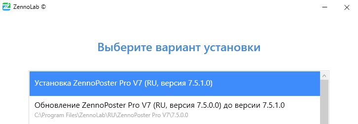
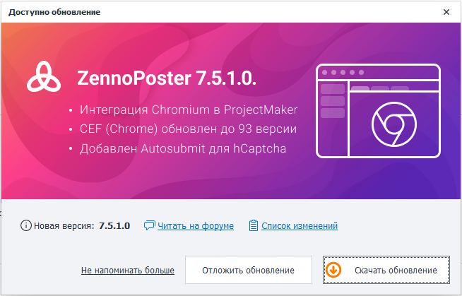
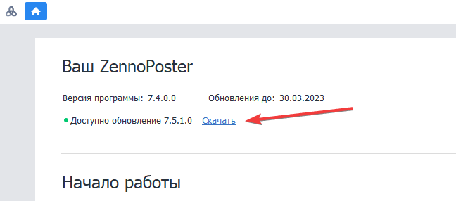
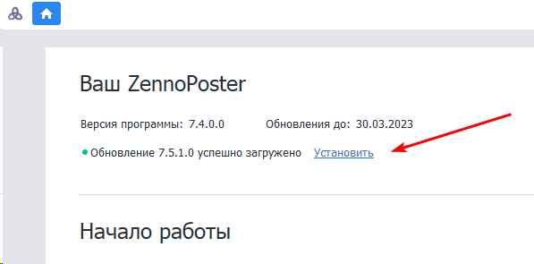
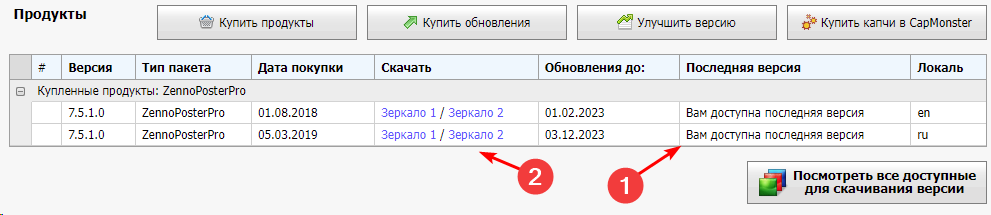
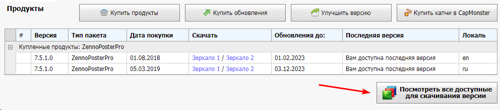

---
sidebar_position: 2
title: "Обновление ZennoPoster"
description: "Конвертировано из HTML в MDX"
date: "2025-07-19"
converted: true
originalFile: ".txt"
targetUrl: "https://zennolab.atlassian.net/wiki/spaces/RU/pages/2090893313"
---
:::info **Пожалуйста, ознакомьтесь с [*Правилами использования материалов на данном ресурсе*](../Disclaimer).**
:::

> 🔗 **[Оригинальная страница](https://zennolab.atlassian.net/wiki/spaces/RU/pages/2090893313)** — Источник данного материала

_______________________________________________  
# Обновление ZennoPoster

Процесс обновления ZennoPoster похож на процесс установки. Вы можете обновить любую предыдущую версию до последней.

- 1 Быстрое обновление
- 2 Обновление из личного кабинета
- 3 Обновление с ZennoPoster 5

<details>
<summary>Можно ли использовать несколько версий параллельно?</summary>

Да, вы можете использовать несколько версий параллельно. Для этого в [❗→ процессе установки](https://zennolab.atlassian.net/wiki/spaces/RU/pages/2062483925/ZennoPoster "https://zennolab.atlassian.net/wiki/spaces/RU/pages/2062483925/ZennoPoster") на шаге “Выбор варианта установки“ выберите “Установка“, а не “Обновление“.




</details>
## Быстрое обновление

ProjectMaker будет периодически проверять наличие новых обновлений. Если оно доступно, то при запуске программы появится всплывающее окно с предложением скачать новую версию.




Также, узнать о доступности новой версии программы можно на главном экране ProjectMaker.




После нажатия на ссылку “Скачать“ начнется процесс загрузки. По завершению статус изменится на “Успешно загружен“ и Вы сможете перейти к установке, нажав на ссылку “Установить“




Далее следуйте [❗→ инструкциям по установке](https://zennolab.atlassian.net/wiki/spaces/RU/pages/2062483925/ZennoPoster "https://zennolab.atlassian.net/wiki/spaces/RU/pages/2062483925/ZennoPoster").

## Обновление из личного кабинета

Переходим в [личный кабинет](https://userarea.zennolab.com/ "https://userarea.zennolab.com/"), находим в разделе продуктов ZennoPoster и убеждаемся, что в колонке “Последняя версия“ нам доступна самая актуальная версия программы.




Далее жмём на любое зеркало в колонке скачать, начнётся загрузка установочного файла. По завершению запустите его и следуйте дальнейшим [❗→ инструкциям](https://zennolab.atlassian.net/wiki/spaces/RU/pages/2062483925/ZennoPoster "https://zennolab.atlassian.net/wiki/spaces/RU/pages/2062483925/ZennoPoster").

<details>
<summary>Что делать если мне нужна другая версия, не самая последняя?</summary>

Нажмите на кнопку “Посмотреть все доступные для скачивания версии“




Найдите там нужную версию программы, скачивайте и переходите к [❗→ установке](https://zennolab.atlassian.net/wiki/spaces/RU/pages/2062483925/ZennoPoster "https://zennolab.atlassian.net/wiki/spaces/RU/pages/2062483925/ZennoPoster").

</details>
## Обновление с ZennoPoster 5

Быстрое обновление с ZennoPoster 5 на 7+ версию недоступно, поэтому его необходимо выполнить вручную, скачав установщик из [личного кабинета](https://userarea.zennolab.com/lk/userarea/UserCustomer.aspx "https://userarea.zennolab.com/lk/userarea/UserCustomer.aspx"). Новая версия будет установлена параллельно с ZennoPoster 5. После успешной установки ZennoPoster 7 (и выше), Вы можете удалить пятую версию программы.

<details>
<summary>Не потеряются ли старые настройки при установке ZennoPoster 7?</summary>

Не потеряются. ZennoPoster 7 полностью совместим со старой версией программы. При установке сохранятся все настройки, список шаблонов, расписание и т.п.

Единственный момент, что ZennoPoster 7 работает с новым форматом - `.zp`, который пришёл на смену старому `.xmlz`. Поэтому Вам может потребоваться заново добавить проекты в ZennoPoster с другим рекомендуемым расширением — `.zp```xml
, заменив старые.

**Чем новый формат лучше старого?**
В новом формате мы постарались исправить ошибки хранения данных, которые тянулись с первых версий программы. Проекты в новом формате <u data-renderer-mark="true">занимают на 60% меньше места</u> и <u data-renderer-mark="true">загружаются значительно быстрее</u>, чем предшественник (
```.xmlz`). А также учитывают версионность всех действий. Теперь не нужно гадать, заработает шаблон на старой версии программы или нет.

**Конвертация**
При открытии старого шаблона в ProjectMaker, он будет преобразован в новый формат. При этом оригинальный файл `.xmlz` останется, а рядом создастся новый `.zp`. Для обратной совместимости в пункте «Сохранить как» будет доступна возможность сохранить шаблона в старом формате.

</details>
<details>
<summary>Будут ли работать шаблоны от ZennoPoster 5 на ZennoPoster 7?</summary>

Да, конечно!

</details>