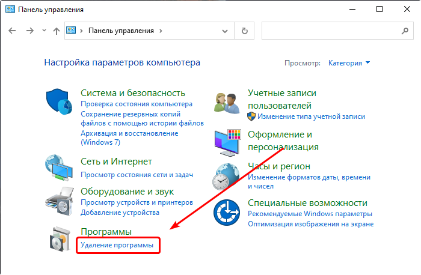
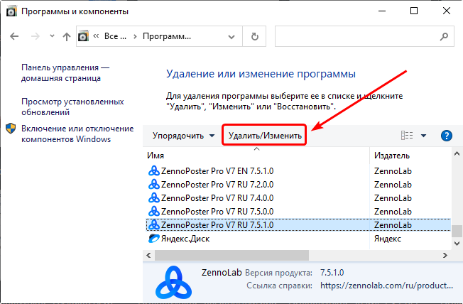
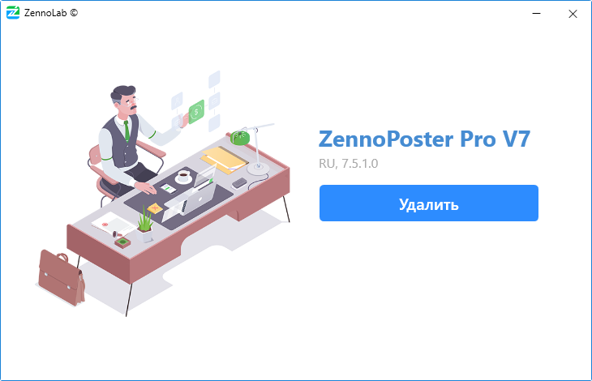
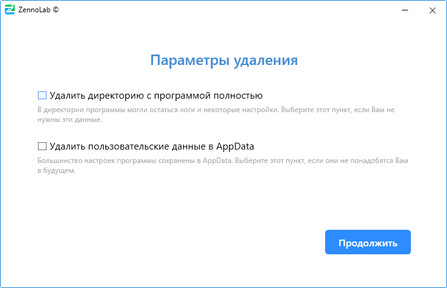
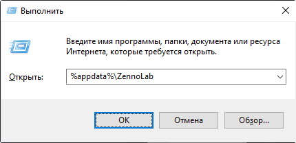
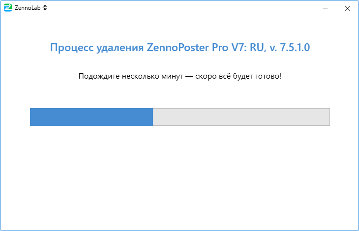
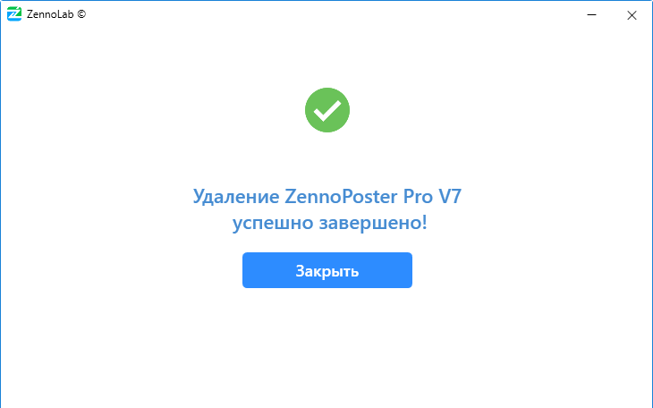

---
sidebar_position: 3
title: "Удаление программы"
description: "Конвертировано из HTML в MDX"
date: "2025-07-19"
converted: true
originalFile: "Удаление программы.txt"
targetUrl: "https://zennolab.atlassian.net/wiki/spaces/RU/pages/2064154800"
---
:::info **Пожалуйста, ознакомьтесь с [*Правилами использования материалов на данном ресурсе*](../Disclaimer).**
:::

> 🔗 **[Оригинальная страница](https://zennolab.atlassian.net/wiki/spaces/RU/pages/2064154800)** — Источник данного материала

_______________________________________________  
# Удаление программы

**1.Откройте “**[**Панель управления**](https://support.microsoft.com/ru-ru/windows/%D0%B3%D0%B4%D0%B5-%D0%BD%D0%B0%D1%85%D0%BE%D0%B4%D0%B8%D1%82%D1%81%D1%8F-%D0%BF%D0%B0%D0%BD%D0%B5%D0%BB%D1%8C-%D1%83%D0%BF%D1%80%D0%B0%D0%B2%D0%BB%D0%B5%D0%BD%D0%B8%D1%8F-aef7065f-a9ec-1ba9-8cab-79b2b83bdda5 "https://support.microsoft.com/ru-ru/windows/%D0%B3%D0%B4%D0%B5-%D0%BD%D0%B0%D1%85%D0%BE%D0%B4%D0%B8%D1%82%D1%81%D1%8F-%D0%BF%D0%B0%D0%BD%D0%B5%D0%BB%D1%8C-%D1%83%D0%BF%D1%80%D0%B0%D0%B2%D0%BB%D0%B5%D0%BD%D0%B8%D1%8F-aef7065f-a9ec-1ba9-8cab-79b2b83bdda5")**” и выберите пункт “Удаление программы”**

Скриншот

**2.Выберите необходимую программу и нажмите “Удалить/Изменить”**
Откроется окно со списком всех установленных на компьютере программ. Выделите нужную программу и нажмите “Удалить/изменить”

Скриншот

**3.Запустится программа удаления**
В открывшемся окне нажмите “Удалить”

Скриншот

**4.Параметры удаления**
На следующем шаге можно выбрать дополнительные опции удаления:

Скриншот

- *Удалить директорию с программой полностью
При включении этой опции будет полностью удалена директория программы. В том числе папка логов и ExternalAssemblies (в этом каталоге хранятся подключаемые к проектам внешние dll библиотеки).
Пример пути для русской Pro версии ZennoPoster 7.5.1.0 - `C:\Program Files\ZennoLab\RU\ZennoPoster Pro V7\7.5.1.0`
- *Удалить пользовательские данные в AppData
Большая часть настроек программ хранится по пути `C:\Users\USERNAME\AppData\Roaming\ZennoLab` - настройки проектов, расписание, настройки самой программы. Если будет отмечена данная опция, то все эти настройки будут безвозвратно утеряны.
В каталог настроек так же можно попасть вызвав окно “Выполнить” (`Win+R`), введя в него строку `%appdata%\ZennoLab` и нажав ОК.

:::caution Важно
ВНИМАНИЕ! Настройки в AppData едины для всех установленных версий программы!Если Вы удалите этот каталог, то пропадут настройки для всех версий программы, а не только для той, которую Вы сейчас удаляете!
:::

**5.Удаление программы**

После того как были выбраны необходимые параметры удаления нажмите “Продолжить” и начнётся процесс деинсталляции программы.

Скриншот

**6.Завершение**

После успешного удаления программы появится окно с уведомлением:

  

## Полезные ссылки

- [❗→ Установка ZennoPoster](/wiki/spaces/RU/pages/2062483925 "/wiki/spaces/RU/pages/2062483925")
- [❗→ Что такое ZennoPoster ?](/wiki/spaces/RU/pages/475562059 "/wiki/spaces/RU/pages/475562059")
- [❗→ Системные требования ZennoPoster](/wiki/spaces/RU/pages/475463745 "/wiki/spaces/RU/pages/475463745")
- [❗→ Из чего состоит ZennoPoster](/wiki/spaces/RU/pages/475431198 "/wiki/spaces/RU/pages/475431198")
- [❗→ ZennoPoster - Demo](https://zennolab.atlassian.net/wiki/spaces/RU/pages/889258323 "https://zennolab.atlassian.net/wiki/spaces/RU/pages/889258323")