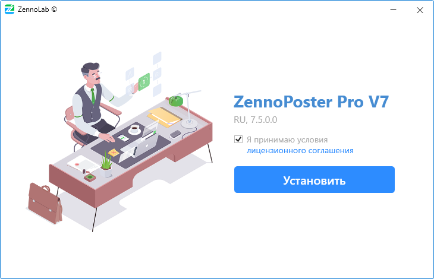
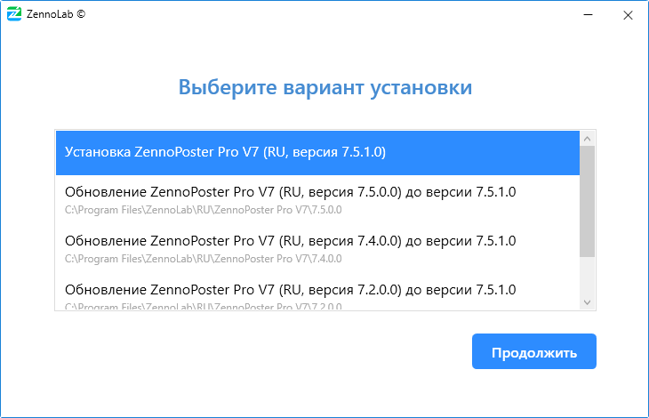

---
sidebar_position: 1
title: "Установка ZennoPoster"
description: "Конвертировано из HTML в MDX"
date: "2025-07-08"
converted: true
originalFile: "Установка ZennoPoster.txt"
targetUrl: "https://zennolab.atlassian.net/wiki/spaces/RU/pages/2062483925/ZennoPoster"
---
:::info **Пожалуйста, ознакомьтесь с [*Правилами использования материалов на данном ресурсе*](../Disclaimer).**
:::

> 🔗 **[Оригинальная страница](https://zennolab.atlassian.net/wiki/spaces/RU/pages/2062483925/ZennoPoster)** — Источник данного материала

_______________________________________________  
# Установка ZennoPoster

**1.Скачайте установщик в** [**Личном кабинете**](https://userarea.zennolab.com/lk/login.aspx "https://userarea.zennolab.com/lk/login.aspx") **и запустите его.**

**2.Прочитайте условия Лицензионного соглашения и примите их, если Вы с ними согласны, затем нажмите кнопку “**Установить”**.**

**3.Вариант установки.**

Если на компьютере есть старые версии программы, то установщик предложит либо обновить одну из них до той версии, которую Вы устанавливаете, либо произвести отдельную установку (на компьютере может быть установлено сразу несколько версий программы).

**4.Путь установки.**

Выберите путь для установки или оставьте тот, что выставлен по умолчанию, и нажмите “Продолжить” (не рекомендуется менять путь по умолчанию).

**5.Выбор папки внешних сборок.**

Если в одной из предыдущих версий Вы использовали внешние dll библиотеки и копировали их в папку *ExternalAssemblies, то на этом шаге Вам будет предложено автоматически скопировать *ExternalAssemblies, в новую установку.

**6.Ввод авторизационных данных.**

Введите свой email и пароль от Личного кабинета и нажмите “*Продолжить”.
Если Вы забыли пароль от учётной записи, то нажмите “Напомнить пароль” - будет открыт браузер по умолчанию на странице восстановления пароля.

**7.Выбор лицензии.**

В этом окне Вы можете выбрать лицензию (если их у Вас несколько) и нужно ли активировать устанавливаемую программу на текущем компьютере. 
После того как сделали выбор нажмите “*Продолжить” и начнётся процесс установки.

По его завершении Вы можете нажать кнопку “*Запустить”, и тогда откроется ProjectMaker или закрыть окно с помощью крестика в правом верхнем углу.

  

## Настройки программы и проектов из предыдущих версий

Большая часть настроек хранится в AppData. Чтобы быстро попасть в эту директорию вызовите окно “Выполнить” (`Win+R`), введите `%appdata%\ZennoLab`и нажмите ОК

Если ранее на компьютере была установлена программа, то настройки автоматически будут подхвачены новой версией (при условии, что Вы не удаляли директорию программы в AppData).

  

## Полезные ссылки

- [❗→ Что такое ZennoPoster ?](/wiki/spaces/RU/pages/475562059 "/wiki/spaces/RU/pages/475562059")
- [❗→ Системные требования ZennoPoster](/wiki/spaces/RU/pages/475463745 "/wiki/spaces/RU/pages/475463745")
- [❗→ Из чего состоит ZennoPoster](/wiki/spaces/RU/pages/475431198 "/wiki/spaces/RU/pages/475431198")
- [❗→ ZennoPoster - Demo](https://zennolab.atlassian.net/wiki/spaces/RU/pages/889258323 "https://zennolab.atlassian.net/wiki/spaces/RU/pages/889258323")