---
sidebar_position: 2
title: "Конструктор действий и Поиск по XPath"
description: ""
date: "2025-08-18"
converted: true
originalFile: "Конструктор действий и Поиск по XPath.txt"
targetUrl: "https://zennolab.atlassian.net/wiki/spaces/RU/pages/483426337/XPath"
---
:::info **Пожалуйста, ознакомьтесь с [*Правилами использования материалов на данном ресурсе*](../Disclaimer).**
:::

> 🔗 **[Оригинальная страница](https://zennolab.atlassian.net/wiki/spaces/RU/pages/483426337/XPath)** — Источник данного материала

_______________________________________________  
# Конструктор действий и Поиск по XPath 

## Описание

Конструктор действий - универсальный инструмент для работы с элементами страницы, который позволяет подобрать оптимальные признаки для его поиска. 

:::warning Внимание
Для использования этой функции вам необходимо располагать знанием основ языка разметки HTML.
:::

  

## Как вызвать?

Существует два способа для вызова конструктора:

1. Необходимо кликнуть правой клавишей мыши по интересующему Вас элементу на странице и выбрать *В конструктор действий из [❗→ контекстного меню](https://zennolab.atlassian.net/wiki/spaces/RU/pages/534315373#%D0%9A%D0%BE%D0%BD%D1%82%D0%B5%D0%BA%D1%81%D1%82%D0%BD%D0%BE%D0%B5-%D0%BC%D0%B5%D0%BD%D1%8E "https://zennolab.atlassian.net/wiki/spaces/RU/pages/534315373#%D0%9A%D0%BE%D0%BD%D1%82%D0%B5%D0%BA%D1%81%D1%82%D0%BD%D0%BE%D0%B5-%D0%BC%D0%B5%D0%BD%D1%8E").

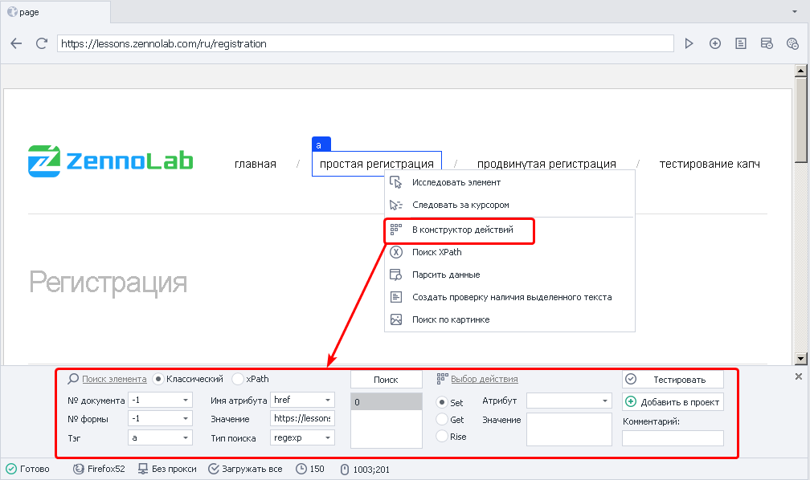

2. Второй способ - из окна [❗→ Дерево элементов](https://zennolab.atlassian.net/wiki/spaces/RU/pages/727777355 "https://zennolab.atlassian.net/wiki/spaces/RU/pages/727777355"). Кликаем ПКМ по нужном элементу и выбираем *В конструктор действий.

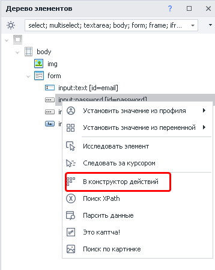

  

:::note На заметку
При добавлении элемента в Конструктор действий его доступные свойства и их атрибуты автоматически попадают в окно Свойства элемента.
:::

## Параметры поиска 

### Классический поиск

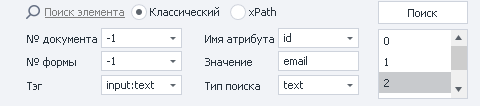

#### **№ документа**

Рекомендуется ставить значение -1 (поиск во всех документах на странице). 

#### **№ формы**

Тоже лучше ставить -1 (поиск по всем формам на странице). При выборе такого значения шаблон будет более универсальным. 

&gt; 
&gt; Пример: на странице 3 формы - поиск, регистрация, заказ товара. Нам надо кликнуть в форме заказа по кнопке и мы выбрали в качестве значения поля “Форма” - 2 (нумерация с нуля). Спустя какое-то время на сайте появляется новая форма, для входа, и вставлена она перед формой заказа. Под номером 2 теперь будет форма входа и наш шаблон либо выдаст ошибку о том, что кнопка не найдена, либо (что гораздо хуже) будет кликать в другой форме по другой кнопке.

:::note На заметку
В настройках программы (Настройки → Запись) можно отметить два чекбокса - “Искать во всех формах на странице” и “Искать во всех документах на странице”  и тогда всегда при поиске элементов для номера документа и формы будет стоять -1.
:::

#### **Тэг**

HTML тэг, который надо найти.

Пример:  
`

`  
`div` - это тэг.

#### **Имя атрибута**

Атрибут HTML тэга по которому производится поиск.

`

`  
`class` и `id` - атрибуты.

#### **Значение**

Значение атрибута, выбранного HTML тега

`

`  
`visible` и `username` - значения атрибутов.

#### **Тип поиска**

1. text - поиск по полному либо частичному вхождению текста;
2. notext - поиск элементов в которых не будет указанного текста;
3. regexp - поиск с помощью [❗→ регулярных выражений](https://zennolab.atlassian.net/wiki/spaces/RU/pages/534086111 "https://zennolab.atlassian.net/wiki/spaces/RU/pages/534086111")
По умолчанию поиск регистронезависимый. Чтобы при поиске с помощью регулярного выражения учитывался регистр добавьте в самом начале выражения `(?-i)`(это означает отключение регистронезависимого поиска)

На скриншоте видно, что после клика по кнопке *Поиск нашлось три элемента, что не очень хорошо - всегда старайтесь подбирать такие параметры поиска, чтоб в итоге находился только один элемент.

### Поиск по XPath

С помощью [❗→ XPath выражений](https://zennolab.atlassian.net/wiki/spaces/RU/pages/862093419/ "https://zennolab.atlassian.net/wiki/spaces/RU/pages/862093419/") Вы можете реализовать более универсальный и устойчивый к изменениям вёрстки сайта алгоритм поиска элементов, в сравнении с классическим поиском или регулярными выражениями.

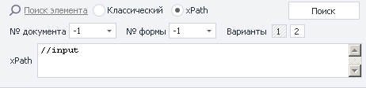

№ документа и № формы отвечают за то же, что и при классическом поиске.

#### XPath 

Поле ввода [❗→ XPath](https://zennolab.atlassian.net/wiki/spaces/RU/pages/862093419 "https://zennolab.atlassian.net/wiki/spaces/RU/pages/862093419") выражения.

#### Варианты

Здесь можно выбрать одно из предложенных *Конструктором выражений.

:::note На заметку
Если ни один из предложенных вариантов Вас не устраивает, то Вы можете составить XPath выражение самостоятельно.
:::

## Выбор действия

Можно выбрать одно из трёх возможных действий

**Set** - [❗→ Установка значения](https://zennolab.atlassian.net/wiki/spaces/RU/pages/534315117 "https://zennolab.atlassian.net/wiki/spaces/RU/pages/534315117")  
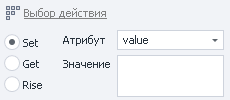

- *Атрибут* - атрибут элемента для которого надо установить новое значение
- *Значение* - текст, который необходимо вставить. Можно использовать как простой текст так и переменные проекта`{ -Variable.someVar- }`, `{ -Profile.Name- }`.

**Get** - [❗→ Получение значения](https://zennolab.atlassian.net/wiki/spaces/RU/pages/534315124 "https://zennolab.atlassian.net/wiki/spaces/RU/pages/534315124")  
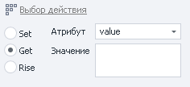

- *Атрибут* - атрибут, значение которого надо получить.
- *Значение* - здесь отобразится значение найденного атрибута.

**Rise** - [❗→ Выполнить действие](https://zennolab.atlassian.net/wiki/spaces/RU/pages/534020211 "https://zennolab.atlassian.net/wiki/spaces/RU/pages/534020211")  
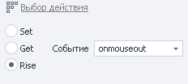  
- здесь можно выбрать необходимое действие, которое нужно сделать с найденным элементом.

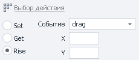  

- Для действий *drag и *drop доступны два дополнительных поля, для координат

  

## Завершающие действия

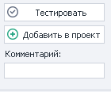

### Тестирование

После того как подобрали необходимые параметры поиска и определились с нужным действием не помешает протестировать подобранные параметры нажав соответствующую кнопку.

### Комментарий

Не плохой идеей будет оставить комментарий для экшена т.к. автоматические комментарии несут мало информации

Комментарии 
по умолчанию

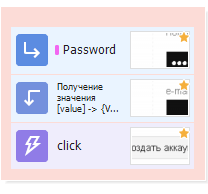

Те же экшены, только
с пользовательскими комментариями

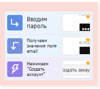

### Добавление в проект

И уже в самом конце когда параметры подобраны, элемент найден, выбрано и протестировано необходимое действие можно нажимать *Добавить в проект.

  

## Полезные ссылки

- [❗→ XPath](https://zennolab.atlassian.net/wiki/spaces/RU/pages/862093419 "https://zennolab.atlassian.net/wiki/spaces/RU/pages/862093419")
- [❗→ Тестер регулярных выражений](https://zennolab.atlassian.net/wiki/spaces/RU/pages/534086111 "https://zennolab.atlassian.net/wiki/spaces/RU/pages/534086111")
- [❗→ Установка значения](https://zennolab.atlassian.net/wiki/spaces/RU/pages/534315117 "https://zennolab.atlassian.net/wiki/spaces/RU/pages/534315117")
- [❗→ Выполнить событие](https://zennolab.atlassian.net/wiki/spaces/RU/pages/534020211 "https://zennolab.atlassian.net/wiki/spaces/RU/pages/534020211")
- [❗→ Получение значения](https://zennolab.atlassian.net/wiki/spaces/RU/pages/534315124 "https://zennolab.atlassian.net/wiki/spaces/RU/pages/534315124")
- [❗→ Окно свойства элемента](https://zennolab.atlassian.net/wiki/spaces/RU/pages/735608879 "https://zennolab.atlassian.net/wiki/spaces/RU/pages/735608879")
- [ZennoPoster + xPath на примере Яндекс.Маркета](https://zennolab.com/discussion/threads/obzor-zennoposter-xpath-na-primere-jandeks-marketa.37497/ "https://zennolab.com/discussion/threads/obzor-zennoposter-xpath-na-primere-jandeks-marketa.37497/") (конкурсная статья с форума)