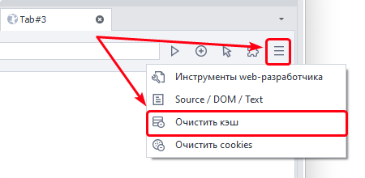

:::info **Пожалуйста, ознакомьтесь с [*Правилами использования материалов на данном ресурсе*](../Disclaimer).**
:::

> 🔗 **[Оригинальная страница](https://zennolab.atlassian.net/wiki/spaces/RU/pages/534315373)** — Источник данного материала

_______________________________________________  
# 💻Окно браузера

## Описание

Браузерное окно - это один из основных элементов ProjectMaker для построения шаблонов автоматизации сайтов. По сути браузерное окно представляет собой инстанс браузера с дополнительными инструментами позволяющими облегчить и ускорить разработку проектов.

Окно состоит из верхней и нижней панели инструментов и, собственно, области просмотра или рабочей зоны браузера. Во многом функционал и работа с этим окном схожа с работой в обычном браузере.

## Инструменты

Рассмотрим все инструменты окна браузера.

### Область открытых табов (вкладок)

На панели (1) отображены все открытые в данный момент вкладки браузера. С помощью кнопки в правой части панели (2) можно открыть список для быстрой навигации по открытым вкладкам.

Управлять созданием табов, а также активацией и их закрытием можно через экшен [❗→ Управление вкладкой браузера (табом браузера)](https://zennolab.atlassian.net/wiki/spaces/RU/pages/534020201 "https://zennolab.atlassian.net/wiki/spaces/RU/pages/534020201")

### Кнопка “Назад”

Служит для навигации по истории открытия веб-страниц и возвращает на предыдущую страницу сайта. Аналогичное действие можно выполнить и с помощью кода:
C#: `instance.ActiveTab.GoBack();`
JS: `history.back();`

### Кнопка “Обновить”

Перезагружает текущую страницу. Во время загрузки страницы меняет вид на крестик, нажав на который можно остановить процесс загрузки страницы.

### Адресная строка

Поле для ввода, редактирования и отображения URL страницы. Аналогична адресной строке обычных браузеров. 

### Переход на страницу

Подтверждает переход по введенному в адресной строке URL. Такого же эффекта можно достичь просто нажав клавишу ENTER.

Основным способом открыть ссылку в браузере является использование действия [❗→ Переход на страницу (Открыть страницу/Navigate)](https://zennolab.atlassian.net/wiki/spaces/RU/pages/534052989 "https://zennolab.atlassian.net/wiki/spaces/RU/pages/534052989") 

### Открытие новой вкладки

Открывает модальное окно в котором нужно ввести имя новой вкладки. Тоже самое действие можно выполнить и с помощью “кубика” [❗→ Управление вкладкой браузера (табом браузера)](https://zennolab.atlassian.net/wiki/spaces/RU/pages/534020201 "https://zennolab.atlassian.net/wiki/spaces/RU/pages/534020201") 

### Режим ввода

Переключает режим ввода данных в браузере на “мышь” или “touch”. Служит в основном одной задаче - в режиме “touch” при включенной записи создаются блоки с [❗→ touch-событиями](https://zennolab.atlassian.net/wiki/spaces/RU/pages/735674386/Touch "https://zennolab.atlassian.net/wiki/spaces/RU/pages/735674386/Touch") и наоборот.

### Расширения

Позволяет взаимодействовать с установленными расширениями (Активация, Настройки, Детали, Удаление). Также имеется возможность установки новых расширений через crx-файлы.

Подробнее о работе с расширениями написано в статье [❗→ Работа с расширениями](https://zennolab.atlassian.net/wiki/spaces/RU/pages/2081423361 "https://zennolab.atlassian.net/wiki/spaces/RU/pages/2081423361") 

### Инструменты web-разработчика

Открывает [❗→ окно Инструментов Web разработчика](https://zennolab.atlassian.net/wiki/spaces/RU/pages/1331134465 "https://zennolab.atlassian.net/wiki/spaces/RU/pages/1331134465") аналогичное такому же окну в браузере Chrome. Используется для более продвинутой работы с DOM, приложениями, трафиком страницы.

:::warning Внимание
Это окно открывается для активной в данный момент вкладки!
:::

### Просмотр исходного кода

[❗→ Открывает окно с исходным кодом](https://zennolab.atlassian.net/wiki/spaces/RU/pages/735903769 "https://zennolab.atlassian.net/wiki/spaces/RU/pages/735903769"), DOM и текстом страницы отображаемого в активной вкладке сайта. Кроме этого окна получить DOM, исходный код и текст страницы можно с помощью переменных окружения проекта: 

`{ -Page.Dom- }`
`{ -Page.Source- }`
`{ -Page.Text- }`

### Очистить кэш

Быстрый доступ к функционалу аналогичного кубика - очищает весь браузерный кэш. Также данное действие можно выполнить с помощью экшена [❗→ Очистить кэш](https://zennolab.atlassian.net/wiki/spaces/RU/pages/489324572 "https://zennolab.atlassian.net/wiki/spaces/RU/pages/489324572").

### Очистить cookies

Быстрый доступ к функционалу аналогичного кубика - очищает все куки инстанса. Также данное действие можно выполнить с помощью экшена [❗→ Очистить куки](https://zennolab.atlassian.net/wiki/spaces/RU/pages/489324572 "https://zennolab.atlassian.net/wiki/spaces/RU/pages/489324572").

:::info Информация
В ZennoPoster 7.3.1.0 был добавлен новый экшен для работы с cookies, который позволяет не только очищать, но и загружать и сохранять cookies в разных форматах.
:::

### Индикатор состояния загрузки страницы

Имеет три состояния:

- **Готово** - при полной загрузке;
- **Загрузка** - в процессе загрузки;
- **Дозагрузка** - подгрузка данных скриптами и плагинами.

### Текущий тип браузера

Отображает тип браузера, который установлен для инстанса. 

Вы можете сменить тип браузера разными способами:

- глобально, для всех новых проектов через [❗→ настройки программы](https://zennolab.atlassian.net/wiki/spaces/RU/pages/808845378#%D0%91%D1%80%D0%B0%D1%83%D0%B7%D0%B5%D1%80-%D0%BF%D0%BE-%D1%83%D0%BC%D0%BE%D0%BB%D1%87%D0%B0%D0%BD%D0%B8%D1%8E "https://zennolab.atlassian.net/wiki/spaces/RU/pages/808845378#%D0%91%D1%80%D0%B0%D1%83%D0%B7%D0%B5%D1%80-%D0%BF%D0%BE-%D1%83%D0%BC%D0%BE%D0%BB%D1%87%D0%B0%D0%BD%D0%B8%D1%8E");
- в [❗→ настройках текущего проекта](https://zennolab.atlassian.net/wiki/spaces/RU/pages/534315477#%D0%A2%D0%B8%D0%BF-%D0%B1%D1%80%D0%B0%D1%83%D0%B7%D0%B5%D1%80%D0%B0 "https://zennolab.atlassian.net/wiki/spaces/RU/pages/534315477#%D0%A2%D0%B8%D0%BF-%D0%B1%D1%80%D0%B0%D1%83%D0%B7%D0%B5%D1%80%D0%B0");
- через экшен [❗→ Браузер=&gt;Настройки=&gt;Запустить инстанс](https://zennolab.atlassian.net/wiki/spaces/RU/pages/489324572#%D0%97%D0%B0%D0%BF%D1%83%D1%81%D1%82%D0%B8%D1%82%D1%8C-%D0%B8%D0%BD%D1%81%D1%82%D0%B0%D0%BD%D1%81 "https://zennolab.atlassian.net/wiki/spaces/RU/pages/489324572#%D0%97%D0%B0%D0%BF%D1%83%D1%81%D1%82%D0%B8%D1%82%D1%8C-%D0%B8%D0%BD%D1%81%D1%82%D0%B0%D0%BD%D1%81") можно менять тип браузера прямо во время выполнения проекта.

### Прокси браузера

Отображает текущий прокси. 

А начиная с версии 7.3.2.0 Вы так же можете установить прокси, просто кликнув по этой кнопке.

Так же установить прокси можно через [❗→ Окно профиля](https://zennolab.atlassian.net/wiki/spaces/RU/pages/735903758#%D0%92%D0%BA%D0%BB%D0%B0%D0%B4%D0%BA%D0%B0-%E2%80%9C%D0%91%D1%80%D0%B0%D1%83%D0%B7%D0%B5%D1%80%E2%80%9D "https://zennolab.atlassian.net/wiki/spaces/RU/pages/735903758#%D0%92%D0%BA%D0%BB%D0%B0%D0%B4%D0%BA%D0%B0-%E2%80%9C%D0%91%D1%80%D0%B0%D1%83%D0%B7%D0%B5%D1%80%E2%80%9D"), либо кубиком “**Браузер**“ → “**Настройки**“ → “[❗→ **Установить прокси**](https://zennolab.atlassian.net/wiki/spaces/RU/pages/489324572#%D0%A3%D1%81%D1%82%D0%B0%D0%BD%D0%BE%D0%B2%D0%B8%D1%82%D1%8C-%D0%BF%D1%80%D0%BE%D0%BA%D1%81%D0%B8 "https://zennolab.atlassian.net/wiki/spaces/RU/pages/489324572#%D0%A3%D1%81%D1%82%D0%B0%D0%BD%D0%BE%D0%B2%D0%B8%D1%82%D1%8C-%D0%BF%D1%80%D0%BE%D0%BA%D1%81%D0%B8")“.

### Правила загрузки контента

Открывает выпадающий список в котором чекбоксами можно отметить какой тип контента нужно разрешить/запретить для загрузки. Те же самые действия можно выполнить с помощью кнопки “**Настройки проекта**”→ “[❗→ **Браузер**](https://zennolab.atlassian.net/wiki/spaces/RU/pages/534315477 "https://zennolab.atlassian.net/wiki/spaces/RU/pages/534315477")” или кубиками “**Добавить действие**”→ “**Браузер**” → “**Настройки**” → “[❗→ **Картинки**”/“**Медиа**”/“**Реклама**”/“**Загрузка стилей**”/“**JavaScript**”/“**Блокировка всплывающих окон**](https://zennolab.atlassian.net/wiki/spaces/RU/pages/489324572 "https://zennolab.atlassian.net/wiki/spaces/RU/pages/489324572")”

Например для более быстрой загрузки ресурса можно отключить картинки и стили CSS.

### Установить таймаут

Открывает окно в котором можно задать время в секундах в течении которого ZennoPoster ожидает полной загрузки активной вкладки. 
Задать таймаут можно и через экшен “**Добавить действие**”→ “**Таб**” → “[❗→ **Настройки**](https://zennolab.atlassian.net/wiki/spaces/RU/pages/534020228/ "https://zennolab.atlassian.net/wiki/spaces/RU/pages/534020228/")”

### Координаты курсора мыши

Показывает значения в пикселях Х и Y координат мыши. Нулевые координаты (0;0) в верхнем левом углу рабочей зоны окна. Используется для быстрого определения координат HTML элементов на странице.

## Контекстное меню

В отличии от других браузеров, браузер в ProjectMaker имеет кардинально отличное контекстное меню, которое можно открыть нажатием правой клавиши мыши на рабочей зоне браузерного окна.

### Установить значение из профиля (переменной)

Эти пункты появляются, когда контекстное меню вызвано для текстового поля. 
Позволяют быстро вставить текст из [❗→ профиля](https://zennolab.atlassian.net/wiki/spaces/RU/pages/1976762378/ZennoPoster#%D0%9F%D1%80%D0%BE%D1%84%D0%B8%D0%BB%D1%8C "https://zennolab.atlassian.net/wiki/spaces/RU/pages/1976762378/ZennoPoster#%D0%9F%D1%80%D0%BE%D1%84%D0%B8%D0%BB%D1%8C") или из [❗→ переменной проекта](https://zennolab.atlassian.net/wiki/spaces/RU/pages/486309922 "https://zennolab.atlassian.net/wiki/spaces/RU/pages/486309922").

### Исследовать элемент

Откроется [❗→ окно дерево элементов](https://zennolab.atlassian.net/wiki/spaces/RU/pages/727777355 "https://zennolab.atlassian.net/wiki/spaces/RU/pages/727777355") и окно [❗→ свойств элемента](https://zennolab.atlassian.net/wiki/spaces/RU/pages/735608879 "https://zennolab.atlassian.net/wiki/spaces/RU/pages/735608879"). Там Вы сможете изучить структуру документа и параметры выбранного HTML-элемента более детально. После чего мы можем переместить его в [❗→ конструктор действия](https://zennolab.atlassian.net/wiki/spaces/RU/pages/483426337/XPath "https://zennolab.atlassian.net/wiki/spaces/RU/pages/483426337/XPath") для выполнения каких-либо действий над элементом ([❗→ клик](https://zennolab.atlassian.net/wiki/spaces/RU/pages/534020211 "https://zennolab.atlassian.net/wiki/spaces/RU/pages/534020211"), [❗→ установка значения](https://zennolab.atlassian.net/wiki/spaces/RU/pages/534315117 "https://zennolab.atlassian.net/wiki/spaces/RU/pages/534315117"), [❗→ взять значение](https://zennolab.atlassian.net/wiki/spaces/RU/pages/534315124 "https://zennolab.atlassian.net/wiki/spaces/RU/pages/534315124")).

### Следовать за курсором

При выборе режима «Следовать за курсором» и перемещении мыши по странице, будет появляться рамка вокруг HTML элементов (если это [❗→ не выключено в настройках программы](https://zennolab.atlassian.net/wiki/spaces/RU/pages/727777290#%D0%92%D1%8B%D0%B4%D0%B5%D0%BB%D1%8F%D1%82%D1%8C-%D1%82%D0%B5%D0%BA%D1%83%D1%89%D0%B8%D0%B9-%D1%8D%D0%BB%D0%B5%D0%BC%D0%B5%D0%BD%D1%82-%D0%B2-%D0%B1%D1%80%D0%B0%D1%83%D0%B7%D0%B5%D1%80%D0%B5 "https://zennolab.atlassian.net/wiki/spaces/RU/pages/727777290#%D0%92%D1%8B%D0%B4%D0%B5%D0%BB%D1%8F%D1%82%D1%8C-%D1%82%D0%B5%D0%BA%D1%83%D1%89%D0%B8%D0%B9-%D1%8D%D0%BB%D0%B5%D0%BC%D0%B5%D0%BD%D1%82-%D0%B2-%D0%B1%D1%80%D0%B0%D1%83%D0%B7%D0%B5%D1%80%D0%B5")). И Вы в режиме реального времени сможете проверить их свойства в [❗→ соответствующем окне](https://zennolab.atlassian.net/wiki/spaces/RU/pages/735608879 "https://zennolab.atlassian.net/wiki/spaces/RU/pages/735608879").

### В конструктор действий

[❗→ Конструктор действий и Поиск по XPath](https://zennolab.atlassian.net/wiki/spaces/RU/pages/483426337 "https://zennolab.atlassian.net/wiki/spaces/RU/pages/483426337") 

### Поиск XPath

Откроется [❗→ конструктор действий](https://zennolab.atlassian.net/wiki/spaces/RU/pages/483426337/ "https://zennolab.atlassian.net/wiki/spaces/RU/pages/483426337/") с выбранным режимом поиска HTML-элемента через [❗→ XPath](https://zennolab.atlassian.net/wiki/spaces/RU/pages/862093419 "https://zennolab.atlassian.net/wiki/spaces/RU/pages/862093419").

### Парсить данные

[❗→ Парсить данные](https://zennolab.atlassian.net/wiki/spaces/RU/pages/534053279 "https://zennolab.atlassian.net/wiki/spaces/RU/pages/534053279") 

### Это капча!

Этот пункт меню появляется при вызове контекстного меню для картинки. Данный элемент помечается как капча и на холст экшенов помещается [❗→ соответствующий экшен](https://zennolab.atlassian.net/wiki/spaces/RU/pages/534053026 "https://zennolab.atlassian.net/wiki/spaces/RU/pages/534053026").

:::warning Внимание
Работает только с простыми текстовыми капчами!
:::

### Создать проверку наличия выделенного текста

Начиная с версии 7.3.1.0 и выше - [❗→ Проверка наличия текста](https://zennolab.atlassian.net/wiki/spaces/RU/pages/1308426253 "https://zennolab.atlassian.net/wiki/spaces/RU/pages/1308426253") 

До версии 7.3.1.0 - [❗→ Создать проверку наличия выделенного текста](https://zennolab.atlassian.net/wiki/spaces/RU/pages/534053296 "https://zennolab.atlassian.net/wiki/spaces/RU/pages/534053296") 

### Поиск по картинке

[❗→ Поиск по картинке](https://zennolab.atlassian.net/wiki/spaces/RU/pages/492044304 "https://zennolab.atlassian.net/wiki/spaces/RU/pages/492044304") 

## Полезные ссылки

- [❗→ Просмотр текста страницы](/wiki/spaces/RU/pages/735903769)
 - [❗→ Конструктор действий и Поиск по XPath](/wiki/spaces/RU/pages/483426337/XPath)
 - [❗→ Парсить данные](/wiki/spaces/RU/pages/534053279)
 - [❗→ Создать проверку наличия выделенного текста](/wiki/spaces/RU/pages/534053296)
 - [❗→ Поиск по картинке](/wiki/spaces/RU/pages/492044304)
 - [❗→ Инструменты web-разработчика (DevTools)](/wiki/spaces/RU/pages/1331134465/web-+DevTools)
 - [❗→ Эмуляция шрифтов](/wiki/spaces/RU/pages/2131066881)
