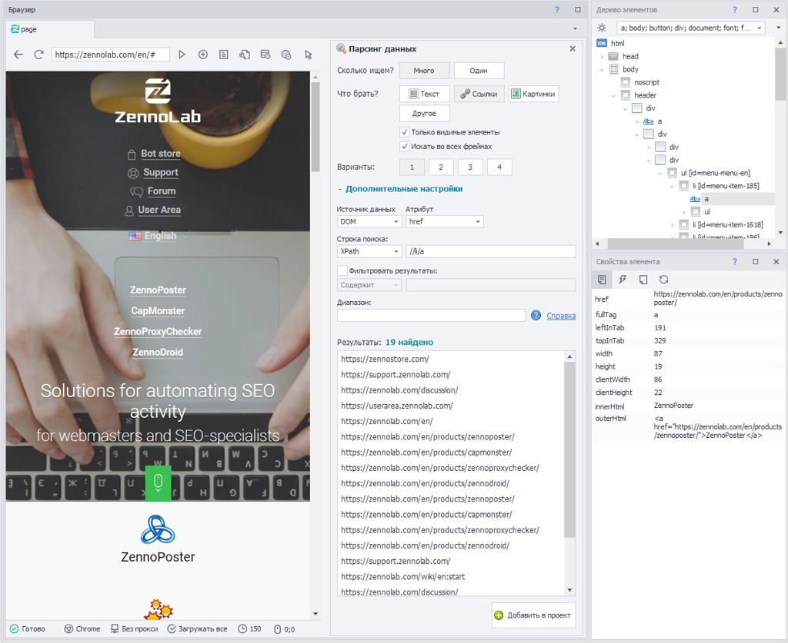
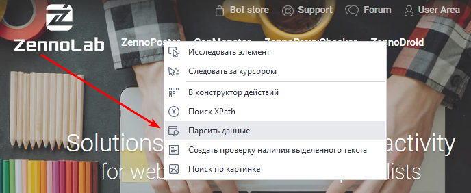
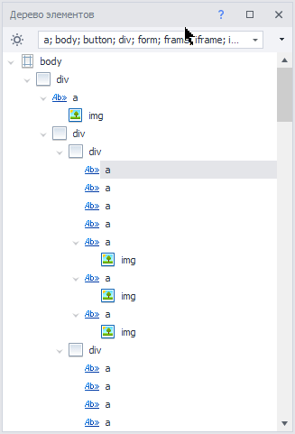
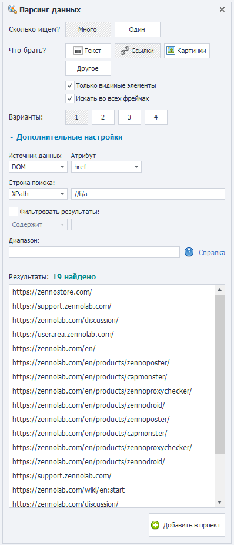
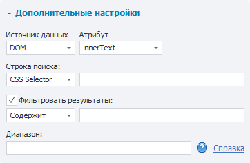
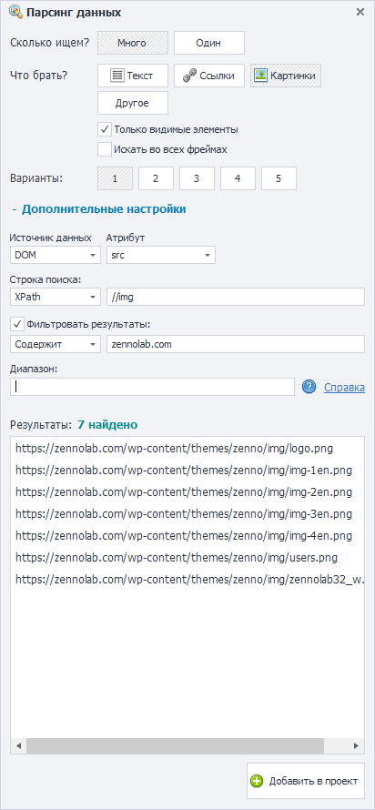

---
sidebar_position: 3
title: "Парсить данные"
description: ""
date: "2025-08-18"
converted: true
originalFile: "Парсить данные.txt"
targetUrl: "https://zennolab.atlassian.net/wiki/spaces/RU/pages/534053279"
---
:::info **Пожалуйста, ознакомьтесь с [*Правилами использования материалов на данном ресурсе*](../Disclaimer).**
:::

> 🔗 **[Оригинальная страница](https://zennolab.atlassian.net/wiki/spaces/RU/pages/534053279)** — Источник данного материала

_______________________________________________  
# Парсить данные

## Описание

На вооружении ZennoPoster, имеется множество полезных инструментов, для анализа и сбора данных. Один из них «*Парсинг данных», в котором, без особых знаний, легким движением руки, с минимальным количеством кликов мыши, в считанное мгновение, можно настроить сбор интересующих вас данных, с текущей страницы.

  

## Как открыть окно Парсинг данных?

В контекстном меню окна браузера «***Парсить данные***»

В контекстном меню «***Дерева элементов***» → пункт «***Парсить данные***»

  

## Детальный разбор панели Парсинг данных

Данное окно, логически разделяется на 2-е части:

1. Быстрый поиск
2. Продвинутый поиск (имеющий дополнительные настройки)

## Быстрый поиск

### **Сколько ищем?**

Один или множество объектов.

### **Что брать?**

- **Текст** - видимое представление объекта.
- **Ссылки** - данные в виде унифицированного указателя на ресурс.
- **Картинки** - данные в виде пути до изображения (пример: https://zennolab.com/wp-content/themes/zenno/img/logo.png).
- **Другое** - выбрать или указать, интересующий вас HTML-тег.
- **Только видимые элементы** - парсить только те объекты, которые отображены (видимы) на текущей странице.
- **Искать во всех фреймах** (от англ. frame) - самостоятельный, вложенный HTML-документ, в которым могут находиться нужные данные или наоборот.
- **Варианты** - [ 1 ], [ 2 ], [ 3 ] и пр. автоматически предложенный вариант из возможно подходящих условий.

## Продвинутый поиск

**+ Дополнительные настройки**, применяются для более гибкого поиска.

- **Источник данных** - структура данных в виде DOM или HTML ([❗→ разница между DOM и Html](https://zennolab.atlassian.net/wiki/spaces/RU/pages/534085840#%D0%A0%D0%B0%D0%B7%D0%BD%D0%B8%D1%86%D0%B0-%D0%BC%D0%B5%D0%B6%D0%B4%D1%83-Source-%D0%B8-Dom "https://zennolab.atlassian.net/wiki/spaces/RU/pages/534085840#%D0%A0%D0%B0%D0%B7%D0%BD%D0%B8%D1%86%D0%B0-%D0%BC%D0%B5%D0%B6%D0%B4%D1%83-Source-%D0%B8-Dom")).
- **Атрибут** - свойство HTML-тега (элемента, объекта).
- **Строка поиска** - в которой можно указать путь, который сообщает, к конкретно какому элементу (или элементам) веб-страницы необходимо обратиться, используя язык запросов: *XPath или *CSS Selector.
- **Фильтровать результаты** - отобрать найденное по условию, но в результат поместить только то, что: Содержит, Не содержит, Regex ([❗→ регулярное выражение](https://zennolab.atlassian.net/wiki/spaces/RU/pages/534086111 "https://zennolab.atlassian.net/wiki/spaces/RU/pages/534086111")).
- **Диапазон** - [❗→ условие](https://zennolab.atlassian.net/wiki/spaces/RU/pages/488964137 "https://zennolab.atlassian.net/wiki/spaces/RU/pages/488964137"), по которому, можно отобрать данные из массива объектов.

### **Результаты**

Окно, в котором наглядно видно предварительный результат данных, по выбранному условию.

  

## Добавить в проект

После того, как вы выбрали, все необходимые условия и наглядно убедились в окне предварительного просмотра, необходимо нажать кнопку: ***Добавить в проект***. После, в рабочей области проекта, появится действие «[❗→ *Парсить данные*](https://zennolab.atlassian.net/wiki/spaces/RU/pages/534085857 "https://zennolab.atlassian.net/wiki/spaces/RU/pages/534085857")», в котором, ***<u data-renderer-mark="true">необходимо указать, место для сохранения полученных данных</u>***.

  

## Пример использования

Требование: Собрать адреса всех изображений активной страницы, текущего домена (в примере используется [официальный сайт zennolab.com](https://zennolab.com/en/ "https://zennolab.com/en/")).

Вуа-ля! Быстро и просто… Мы получили необходимый результат!

  

## Полезные ссылки

- [❗→ Конструктор действий и Поиск по XPath](https://zennolab.atlassian.net/wiki/spaces/RU/pages/483426337 "https://zennolab.atlassian.net/wiki/spaces/RU/pages/483426337")
- [❗→ Окно дерева элементов](https://zennolab.atlassian.net/wiki/spaces/RU/pages/727777355 "https://zennolab.atlassian.net/wiki/spaces/RU/pages/727777355")
- [❗→ Окно свойства элемента](https://zennolab.atlassian.net/wiki/spaces/RU/pages/735608879 "https://zennolab.atlassian.net/wiki/spaces/RU/pages/735608879")
- [❗→ XPath](https://zennolab.atlassian.net/wiki/spaces/RU/pages/862093419 "https://zennolab.atlassian.net/wiki/spaces/RU/pages/862093419")