---
sidebar_position: 5
title: "Поиск по картинке"
description: ""
date: "2025-08-18"
converted: true
originalFile: "Поиск по картинке.txt"
targetUrl: "https://zennolab.atlassian.net/wiki/spaces/RU/pages/492044304"
---
:::info **Пожалуйста, ознакомьтесь с [*Правилами использования материалов на данном ресурсе*](../Disclaimer).**
:::

> 🔗 **[Оригинальная страница](https://zennolab.atlassian.net/wiki/spaces/RU/pages/492044304)** — Источник данного материала

_______________________________________________  
# Поиск по картинке
  
## Описание

Позволяет произвести нажатие на элемент используя визуальный поиск. Рекомендуется использовать когда не получается произвести поиск элемента другими способами или элемент нарисован на Flash, либо с помощью [canvas](https://developer.mozilla.org/ru/docs/Web/API/Canvas_API "https://developer.mozilla.org/ru/docs/Web/API/Canvas_API").

:::warning Внимание
Операция использует много ресурсов компьютера
:::

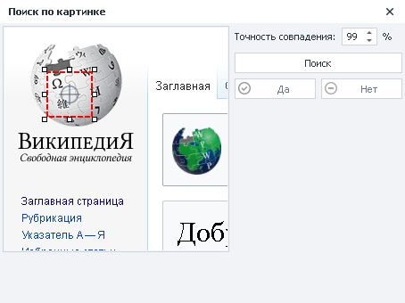

  

## Как добавить в проект?

Навести курсор мыши на элемент и вызвать контекстное меню правой кнопкой

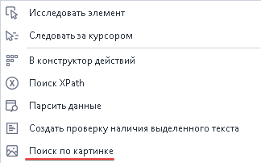

  

## Для чего это используется?

- Клик по элементу, к которому нельзя подобраться с помощью экшена [❗→ Выполнить событие](https://zennolab.atlassian.net/wiki/spaces/RU/pages/534020211 "https://zennolab.atlassian.net/wiki/spaces/RU/pages/534020211")

  

## Как работать с окном?

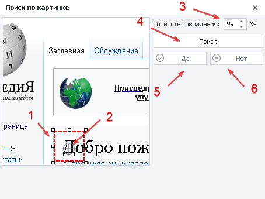

1. **Регулируемая область поиска** - выделять необходимо уникальную часть элемента. Если выделяете кнопку, то не нужно выделять её всю, так как она содержит много монотонного цвета.
2. **Прицел клика** - задаётся место клика внутри области поиска, можно передвигать.
3. **Точность совпадения**.
4. **Поиск** - поиск элемента в окне браузера.

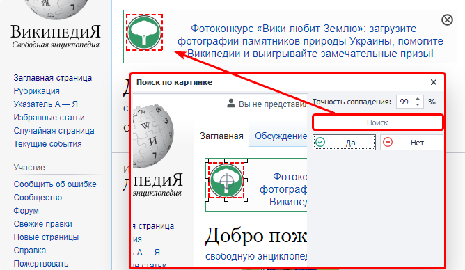

:::info Информация
После нажатие кнопки Поиск найденный элемент в окне браузера будет выделен красной рамкой
:::

5. **Да** - если элемент найден согласно вашим критериям.

6. **Нет** - поиск выполнен неверно, изменяем параметры поиска.

Когда элемент верно определён переходим к настройкам клика.

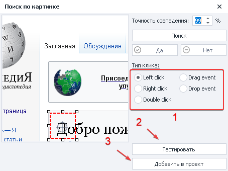

1. Выбираем *тип клика.
2. Проверить выполнение в окне браузера.
3. Добавить настроенный экшен в проект.

Пример

Нужно нажать на кнопку выполнив поиск по картинке

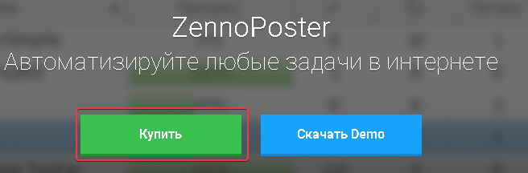

В окне браузера вызываем окно поиска и задаём уникальную область

**Уникальная области**

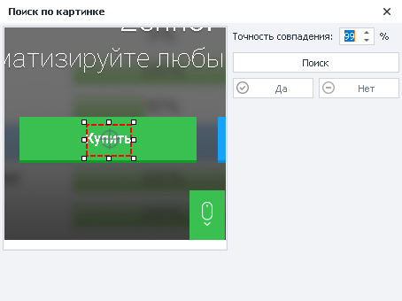

**Неуникальная область**

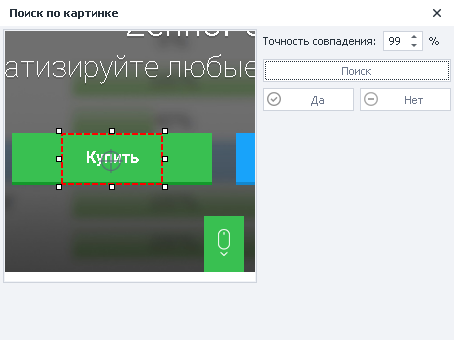

Кнопка содержит много монотонного цвета

Задаём тип клика, в нашем случае левой кнопкой мыши, и тестируем выполнение в окне браузера

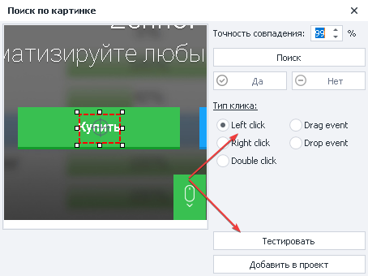

Клик был успешно выполнен в окне браузера - добавляем экшен на холст проекта

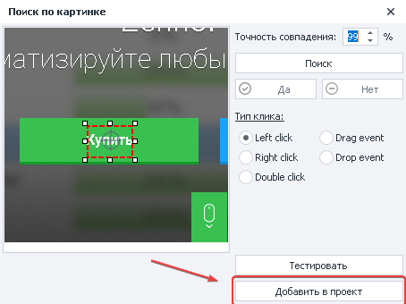

Всё готово, можем продолжить работу с проектом

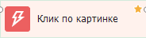

  

## Пример использования

Это может быть полезно во Flash играх или приложениях, так как нет возможности получить доступ к конкретным элементам. Например, если нужно кликнуть по какой-либо кнопке в Flash приложении, алгоритм будет таким:

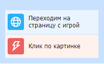

1. Переходим на страницу и ждём полную загрузку.
2. Наводим курсор мыши на элемент, вызываем контекстное меню и выбираем “Поиск по картинке”.
3. Задаём уникальную область поиска картинки и задаём параметры нажатия.
4. Тестируем в окне браузера.
5. Добавляем экшен в проект

  

## Полезные ссылки

- [❗→ Эмуляция мыши](https://zennolab.atlassian.net/wiki/spaces/RU/pages/534315158 "https://zennolab.atlassian.net/wiki/spaces/RU/pages/534315158")
- [❗→ Окно браузера](https://zennolab.atlassian.net/wiki/spaces/RU/pages/534315373 "https://zennolab.atlassian.net/wiki/spaces/RU/pages/534315373")