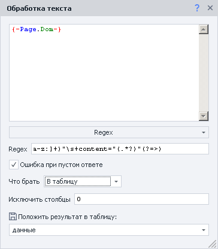

:::info **Пожалуйста, ознакомьтесь с [*Правилами использования материалов на данном ресурсе*](../Disclaimer).**
:::

> 🔗 **[Оригинальная страница](https://zennolab.atlassian.net/wiki/spaces/RU/pages/735903769)** — Источник данного материала

_______________________________________________  
# Просмотр текста страницы
  
## Описание

С помощью данного инструмента Вы легко можете просмотреть исходный код (Source), DOM модель и отображаемый текст загруженной в [❗→ браузере](https://zennolab.atlassian.net/wiki/spaces/RU/pages/534315373 "https://zennolab.atlassian.net/wiki/spaces/RU/pages/534315373")страницы.

:::note На заметку
В чём разница между DOM и исходным кодом страницы Вы можете прочитать в заметке Разница между Source и DOM
:::

:::note На заметку
Если Вы работаете на движке Chrome, то в качестве альтернативы можете использовать инструменты web-разработчика
:::

  

## Для чего это используется?

Данный инструмент используется когда нужно более глубже понять структуру страницы:

- Поиск данных для того, чтобы “прицепиться” к элементу для [❗→ клика](https://zennolab.atlassian.net/wiki/spaces/RU/pages/534020211 "https://zennolab.atlassian.net/wiki/spaces/RU/pages/534020211")/[❗→ получения](https://zennolab.atlassian.net/wiki/spaces/RU/pages/534315124 "https://zennolab.atlassian.net/wiki/spaces/RU/pages/534315124")/[❗→ установки](https://zennolab.atlassian.net/wiki/spaces/RU/pages/534315117 "https://zennolab.atlassian.net/wiki/spaces/RU/pages/534315117") значения
- Парсинг данных к которым не подобраться с помощью [❗→ конструктора действий](https://zennolab.atlassian.net/wiki/spaces/RU/pages/483426337/.+XPath "https://zennolab.atlassian.net/wiki/spaces/RU/pages/483426337/.+XPath")
- Быстрое копирование исходного кода, DOM или текста в [❗→ Тестер регулярных выражений](https://zennolab.atlassian.net/wiki/spaces/RU/pages/534086111 "https://zennolab.atlassian.net/wiki/spaces/RU/pages/534086111")

  

## Как открыть окно?

Кнопка включения данного окна находится правее адресной строки браузера.

  

## Как работать с окном?

При клике по иконке открывается окно:

### Выбор содержимого

Тут необходимо выбрать, что Вы хотите просматривать: **DOM** (по умолчанию), **исходный код** или **видимый текст** на странице ([❗→ разница между Source и DOM](https://zennolab.atlassian.net/wiki/spaces/RU/pages/534085840#%D0%A0%D0%B0%D0%B7%D0%BD%D0%B8%D1%86%D0%B0-%D0%BC%D0%B5%D0%B6%D0%B4%D1%83-Source-%D0%B8-Dom "https://zennolab.atlassian.net/wiki/spaces/RU/pages/534085840#%D0%A0%D0%B0%D0%B7%D0%BD%D0%B8%D1%86%D0%B0-%D0%BC%D0%B5%D0%B6%D0%B4%D1%83-Source-%D0%B8-Dom")).

### Переносить по словам

При активации данной опции если строка слишком длинная, то она будет перенесена на следующую , а не скрываться за границей окна. В качестве примера скриншот того же окна, но с активной данной опцией:

### Копировать в конструктор регулярных выражений

При клике по данной кнопке будет запущен [❗→ конструктор регулярных выражений](https://zennolab.atlassian.net/wiki/spaces/RU/pages/534086111 "https://zennolab.atlassian.net/wiki/spaces/RU/pages/534086111"), а содержимое окна будет автоматически в него скопировано.

  

## Пример использования

Представим, что Вам необходимо спарсить тэги `<meta>` с атрибутом `property` со [страницы темы на форуме ZennoLab](https://zennolab.com/discussion/threads/capmonster-cloud-novyj-servis-avtomaticheskogo-raspoznavanija-kapch.59736/ "https://zennolab.com/discussion/threads/capmonster-cloud-novyj-servis-avtomaticheskogo-raspoznavanija-kapch.59736/"). Через [❗→ конструктор действий](https://zennolab.atlassian.net/wiki/spaces/RU/pages/483426337 "https://zennolab.atlassian.net/wiki/spaces/RU/pages/483426337") к ним не подберёшься, т.к. эти тэги никак не отображены. Наши действия:

- Переходим на необходимую страницу
- Запускаем окно просмотра кода (конкретно в этом случае можно использовать как DOM так и исходный код, это никак не отразится на итоговом результате) и смотрим на необходимые тэги (их несколько, но тут будет приведён только один):

 У всех тэгов одна и та же структура: всегда начинаются с `<meta property="` и заканчиваются на `>` в кавычках, сразу после `property,` название этого свойства, а в атрибуте `content` - содержимое.
- Копируем содержимое в [❗→ конструктор регулярных выражений](https://zennolab.atlassian.net/wiki/spaces/RU/pages/534086111 "https://zennolab.atlassian.net/wiki/spaces/RU/pages/534086111") с помощью одноимённой кнопки. На основе анализа из предыдущего шага создаём регулярку - `(?<=<meta\ property=)"([a-z:]+)"\s+content="(.*?)"(?=>)`

- С помощью экшена [❗→ Обработка текста](https://zennolab.atlassian.net/wiki/spaces/RU/pages/488865793 "https://zennolab.atlassian.net/wiki/spaces/RU/pages/488865793") и его действия Regex достаём из кода страницы нужные нам значения и сохраняем в таблицу:

Небольшие пояснения к скриншоту:

- `{ -Page.Dom- }` - в данной переменной хранится DOM вкладки. Для исходного кода - это `{ -Page.Source- }`, для текста - `{ -Page.Text- }`. В [❗→ окне переменных](https://zennolab.atlassian.net/wiki/spaces/RU/pages/735608872#%D0%9E%D0%BA%D1%80%D1%83%D0%B6%D0%B5%D0%BD%D0%B8%D0%B5 "https://zennolab.atlassian.net/wiki/spaces/RU/pages/735608872#%D0%9E%D0%BA%D1%80%D1%83%D0%B6%D0%B5%D0%BD%D0%B8%D0%B5") можно найти и другие.
- *Почему был исключён столбец под номером ноль?* В [❗→ регулярном выражении](https://zennolab.atlassian.net/wiki/spaces/RU/pages/534086111 "https://zennolab.atlassian.net/wiki/spaces/RU/pages/534086111") была использована скобочная группировка ( **(?&lt;=&lt;meta\ property=)"([a-z:]+)"\s+content="(.\*?)"(?=&gt;)** - две группы выделены красным ). При тестировании в конструкторе регулярных выражений , перейдя на вкладку *Группы,* Вы заметите, что было найдено три группы, несмотря на то, что у нас их две: в самой первой группе находится текст *полного* совпадения, а дальше уже следуют группы, которые были определены. А т.к. нумерация начинается с нуля, мы исключаем именно столбец с номер 0, а не 1.

* * *

## Полезные ссылки

- [❗→ Тестер регулярных выражений](https://zennolab.atlassian.net/wiki/spaces/RU/pages/534086111 "https://zennolab.atlassian.net/wiki/spaces/RU/pages/534086111")
- [❗→ XPath](https://zennolab.atlassian.net/wiki/spaces/RU/pages/862093419 "https://zennolab.atlassian.net/wiki/spaces/RU/pages/862093419")
- [❗→ Обработка текста](https://zennolab.atlassian.net/wiki/spaces/RU/pages/488865793 "https://zennolab.atlassian.net/wiki/spaces/RU/pages/488865793")
- [❗→ 💻Окно браузера](https://zennolab.atlassian.net/wiki/spaces/RU/pages/534315373 "https://zennolab.atlassian.net/wiki/spaces/RU/pages/534315373")