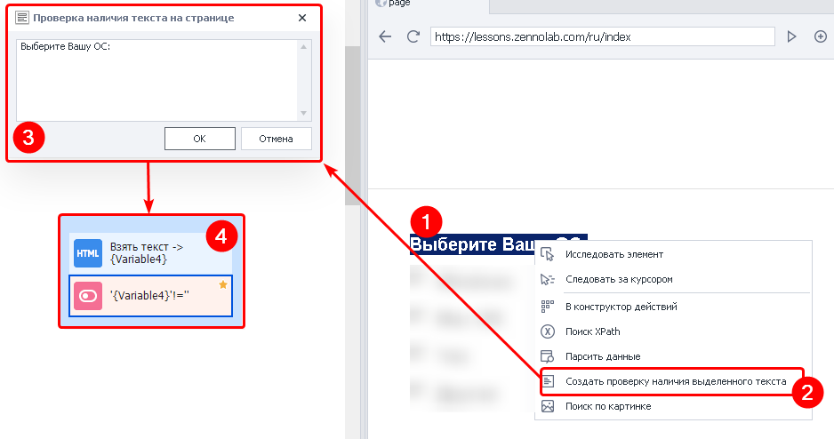
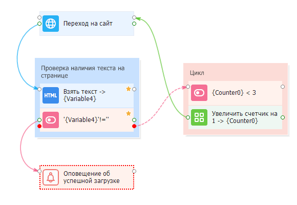

---
sidebar_position: 4
title: "Создать проверку наличия выделенного текста"
description: ""
date: "2025-08-18"
converted: true
originalFile: "Создать проверку наличия выделенного текста.txt"
targetUrl: "https://zennolab.atlassian.net/wiki/spaces/RU/pages/534053296"
---
:::info **Пожалуйста, ознакомьтесь с [*Правилами использования материалов на данном ресурсе*](../Disclaimer).**
:::

> 🔗 **[Оригинальная страница](https://zennolab.atlassian.net/wiki/spaces/RU/pages/534053296)** — Источник данного материала

_______________________________________________  
# Создать проверку наличия выделенного текста

## Описание

Служит это действие, как не сложно догадаться, для проверки того есть ли на странице определённый текст или нет.

Это не отдельный экшен, а группа действий:

1. Поиск с помощью экшена [❗→ Данные](https://zennolab.atlassian.net/wiki/spaces/RU/pages/534085840 "https://zennolab.atlassian.net/wiki/spaces/RU/pages/534085840") заданного текста
2. Проверка с помощью [❗→ if](https://zennolab.atlassian.net/wiki/spaces/RU/pages/534315151 "https://zennolab.atlassian.net/wiki/spaces/RU/pages/534315151"), найдено что-то или нет

:::info Информация
Это устаревшая функция. Начиная с ZennoPoster 7.3.1.0 используется новый экшен - Проверка наличия текста
:::

  

## Как добавить действие в проект?

1. Выделяем в браузере ProjectMaker текст, для которого нужно создать проверку.
2. Нажимаем на выделенном тексте ПКМ и выбираем пункт *Создать проверку наличия выделенного текста
3. Появится диалоговое окно для проверки правильности взятия выделенного текста. Если всё верно, то нажимаем ОК. Текст в данном окне можно редактировать.
4. Автоматически создадутся два экшена - [❗→ *Взять текст таба](https://zennolab.atlassian.net/wiki/spaces/RU/pages/534085840 "https://zennolab.atlassian.net/wiki/spaces/RU/pages/534085840") и логическая проверка [❗→ *if](https://zennolab.atlassian.net/wiki/spaces/RU/pages/534315151 "https://zennolab.atlassian.net/wiki/spaces/RU/pages/534315151").

Если на странице будет найден искомый текст, то кубик *if завершится успехом (выйдет по зелёной ветке), в противном случае - ошибкой (красная ветка).

:::warning Внимание
Всегда перепроверяйте правильность работы этого действия: и когда текст есть на странице, и когда его нет. Бывают случаи когда текста нет, но данное действие его находит и выход будет по зелёной ветке. Всё это из-за особенностей вёрстки конкретного сайта - для пользователя текст скрыт, но программа его “видит”.
:::

  

## Для чего это используется?

Отлов ошибок, либо же наоборот проверка успешности того или иного действия

- При регистрации
- При постинге
- При загрузке страницы
- При разгадывании капчи

  

## Пример использования

Проверка успешной загрузки страницы.

Проблема: сайт не всегда корректно загружается (особенно если Вы используете не очень качественные [❗→ прокси](https://zennolab.atlassian.net/wiki/spaces/RU/pages/492208129 "https://zennolab.atlassian.net/wiki/spaces/RU/pages/492208129")) - страница может не загрузиться (будет пустая, белая), либо может появится HTTP ошибка (404, 403, 503 и др.).

Возможное решение: найти на странице статичный текст (который никогда не меняется) и после перехода на сайт искать этот текст на странице. Если текст не найден, значит страница не прогрузилась. В таком случае с помощью [❗→ цикла](https://zennolab.atlassian.net/wiki/spaces/RU/pages/489259031 "https://zennolab.atlassian.net/wiki/spaces/RU/pages/489259031") и кубика [❗→ перехода на странице](https://zennolab.atlassian.net/wiki/spaces/RU/pages/534052989/Navigate "https://zennolab.atlassian.net/wiki/spaces/RU/pages/534052989/Navigate") пробуем несколько раз перезагрузить страницу, каждый раз пробуя найти нужный текст.

  

## Полезные ссылки

- [❗→ Тестер регулярных выражений](https://zennolab.atlassian.net/wiki/spaces/RU/pages/534086111 "https://zennolab.atlassian.net/wiki/spaces/RU/pages/534086111")
- [❗→ IF (условие "Если ... то ...")](https://zennolab.atlassian.net/wiki/spaces/RU/pages/534315151 "https://zennolab.atlassian.net/wiki/spaces/RU/pages/534315151")
- [❗→ Данные (операции с табом)](https://zennolab.atlassian.net/wiki/spaces/RU/pages/534085840 "https://zennolab.atlassian.net/wiki/spaces/RU/pages/534085840")