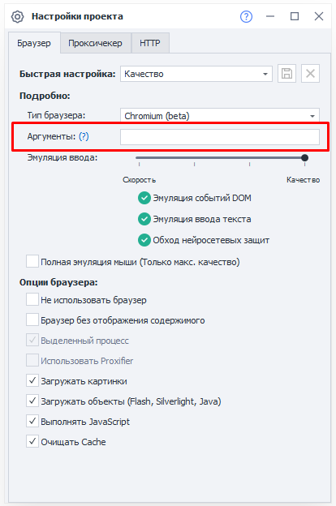
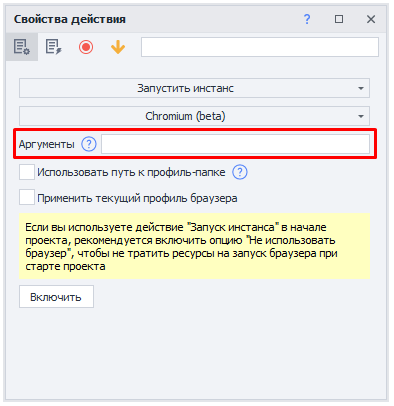

---
sidebar_position: 7
title: "Эмуляция шрифтов"
description: ""
date: "2025-08-18"
converted: true
originalFile: "Эмуляция шрифтов.txt"
targetUrl: "https://zennolab.atlassian.net/wiki/spaces/RU/pages/2131066881"
---
:::info **Пожалуйста, ознакомьтесь с [*Правилами использования материалов на данном ресурсе*](../Disclaimer).**
:::

> 🔗 **[Оригинальная страница](https://zennolab.atlassian.net/wiki/spaces/RU/pages/2131066881)** — Источник данного материала

_______________________________________________  
# Эмуляция шрифтов

## Что это?

Позволяет задать список шрифтов доступный браузеру.

## Для чего это используется?

Данная возможность позволяет улучшить качество эмуляции браузера.

## Как настроить список шрифтов?

Установка списка шрифтов происходит путём указания аргумента `--zl-fonts-dir` при запуске браузера. Этот аргумент указывает каталог из которого будут использоваться все найденные там шрифты.

Примеры:

- `--zl-fonts-dir=Z:\Fonts` - будет ожидать шрифты в `Z:\Fonts`.

При отсутствии аргумента, будут использоваться системные шрифты.

Также в указанном каталоге должен содержаться хотя бы один из перечисленных шрифтов:

- Sans
- Arial
- MS UI Gothic
- Microsoft Sans Serif
- Segoe UI
- Calibri
- Times New Roman
- Courier New

## Где указать аргумент запуска браузера?

Имеется два места для указания аргумента:

1. Статический блок - [❗→ Настройки проекта | Аргументы](https://zennolab.atlassian.net/wiki/spaces/RU/pages/534315477#%D0%90%D1%80%D0%B3%D1%83%D0%BC%D0%B5%D0%BD%D1%82%D1%8B) 

2. Действие `Настройки|Запустить инстанс` - [❗→ Настройки браузера | Аргументы](https://zennolab.atlassian.net/wiki/spaces/RU/pages/489324572#%D0%90%D1%80%D0%B3%D1%83%D0%BC%D0%B5%D0%BD%D1%82%D1%8B) 

## Откуда взять список шрифтов?

Вы можете скачать готовые наборы шрифтов из интернета. Примеры наборов с ссылками на них:

- Чистый Windows 10 Pro - [ru.zip](https://www.dropbox.com/s/jzigwy17p0v9z34/ru.zip?dl=0) и [en.zip](https://www.dropbox.com/s/jw2jzyuxtqddzx2/en.zip?dl=0)
- Windows 10 Pro + Office - [ru.zip](https://www.dropbox.com/s/4fyudzexzp7pmpl/ru.zip?dl=0) и [en.zip](https://www.dropbox.com/s/5n46v94h2nweve1/en.zip?dl=0)
- Windows 10 Pro + VisualStudio 2022 - [ru.zip](https://www.dropbox.com/s/ertyj80yajtv333/ru.zip?dl=0) и [en.zip](https://www.dropbox.com/s/mhvb5pvqt0u0vqq/en.zip?dl=0)
- Windows 10 Pro + Office + VisualStudio 2022 - [ru.zip](https://www.dropbox.com/s/00pocd1edahsfrs/ru.zip?dl=0) и [en.zip](https://www.dropbox.com/s/foi7lb37cdt914u/en.zip?dl=0)

:::info Информация
Это наборы шрифтов для эмуляции конкретной ОС с установленными программами. То есть, чтобы их установить не нужно иметь Windows 10 Pro.
:::

Также, вы можете подготовить список шрифтов через установку и настройку Windows:

1. Установить Windows на виртуальную машину
2. Установить необходимый вам набор приложений, которые могут доустановить шрифты в систему
3. Скачать шрифты которые задействованы в этой ОС. Почти все из них находятся по пути `C:\Windows\Fonts`
4. Перенести на компьютер с установленным ZennoPoster, чтобы применить эмуляцию