---
sidebar_position: 2
title: "Свойства действия"
description: ""
date: "2025-08-18"
converted: true
originalFile: "Свойства действия.txt"
targetUrl: "https://zennolab.atlassian.net/wiki/spaces/RU/pages/494731280"
---
import DisclaimerNotice from '@site/src/components/DisclaimerNotice';

<DisclaimerNotice />

> 🔗 **[Оригинальная страница](https://zennolab.atlassian.net/wiki/spaces/RU/pages/494731280)** — Источник данного материала

_______________________________________________  
## Описание
На стадии редактирования и отладки проекта можно изменять все ранее записанные параметры экшенов. 

### Как открыть окно?
Это зависит от режима отображения открытого проекта:

#### Без браузера
Необходимо дважды кликнуть по экшену и откроется окно свойств. В этом режиме можно открывать окно сразу для нескольких экшенов.

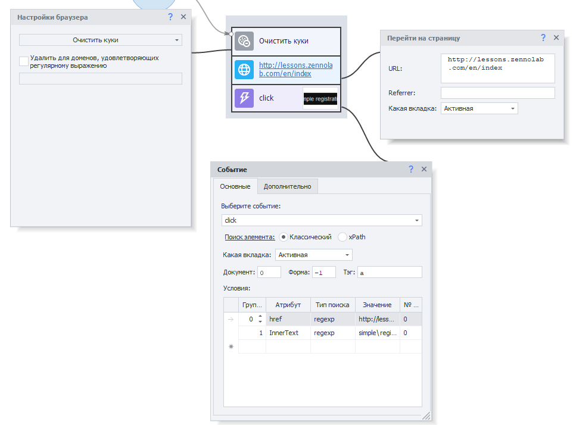

#### С браузером
Надо включить отображение в меню **Окно → Свойства действия**. В появившемся окне будут отображаться настройки выделенного экшена.

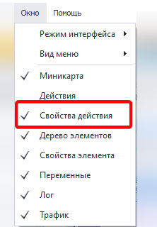

:::tip Окно свойств сразу для нескольких экшенов
В этом режиме тоже есть такая возможность.  
Для этого откройте: **Редактирование → Настройки → Редактор**.  
И там включите опцию «Открывать несколько настроек действий».
:::

| Режим «С браузером»    | Режим «Без браузера» |
| -------- | ------- |
| 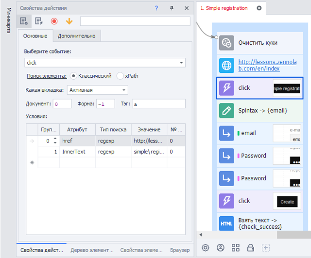  | 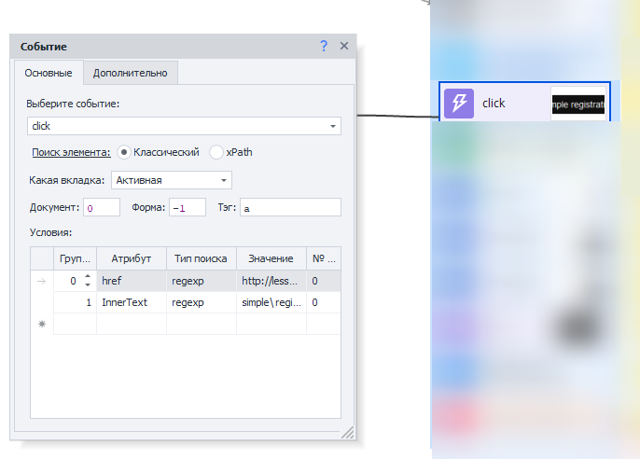    |

_______________________________________________ 
## Кнопка «Выполненные»
Если при отладке в работе экшена обнаруживается ошибка, то можно в режиме реального времени изменить те или иные параметры:

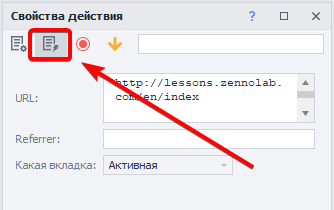

После активации этой функции переменные будут заменены на значения, которые в них хранятся.

:::warning Сработает только после выполнения экшена
:::

| До активации    | После активации|
| -------- | ------- |
| 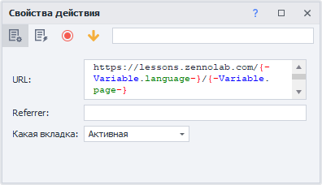  | 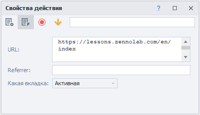   |

_______________________________________________ 
## Комментарий
Для удобства ориентирования по проекту для экшена можно указать комментарий:

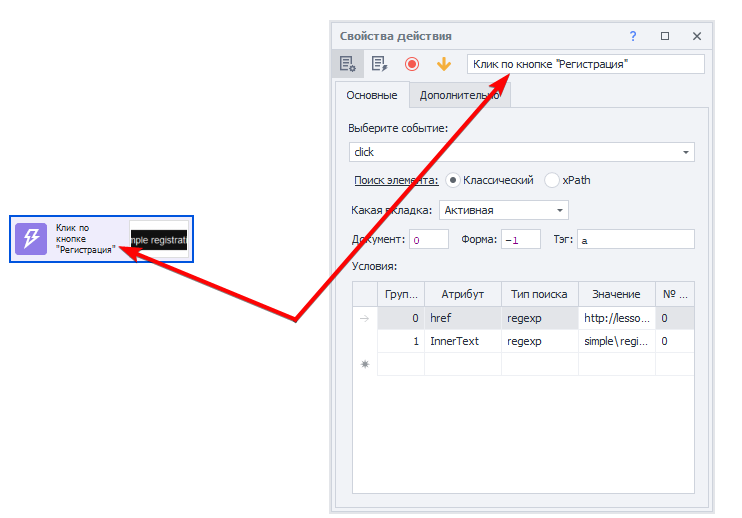

Затем этот текст можно изменить через ПКМ в пункте **Комментарий** из контекстного меню:

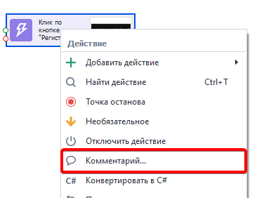
_______________________________________________
## Точка останова
Позволяет останавливать выполнение проекта на выбранном экшене. Это удобно при отладке, когда надо проанализировать содержимое переменных или страницы в определённый момент работы проекта.

Включить её можно двумя способами: через контекстное меню и в свойствах действия.

| Контекстное меню    | Свойства действия|
| -------- | ------- |
| 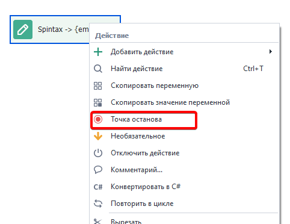  | 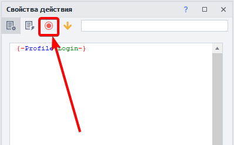  |

:::info После её включения появится красный кружок:

:::
_______________________________________________
## Необязательное
При включении данной опции экшен всегда будет выходить по успешной (зелёной) ветке, если даже фактически он завершился ошибкой.

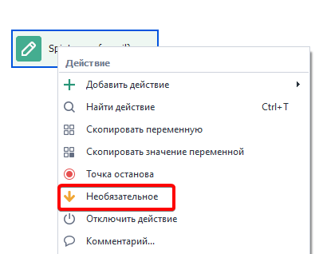

Как и в случае с точкой останова, сделать экшен необязательным можно двумя способами: контекстное меню и свойства действия

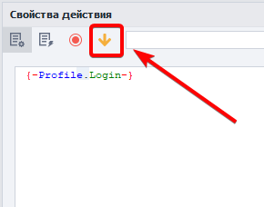

:::info После включения возле экшена появится стрелочка:

:::

_______________________________________________

