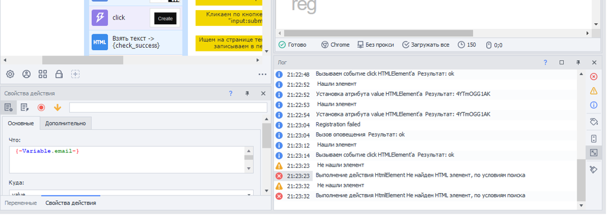
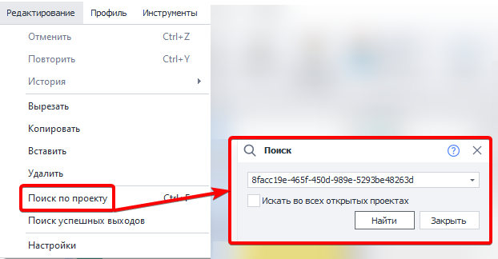

---
sidebar_position: 3
title: "Ошибки при отладке"
description: ""
date: "2025-08-18"
converted: true
originalFile: "Ошибки при отладке.txt"
targetUrl: "https://zennolab.atlassian.net/wiki/spaces/RU/pages/494895107"
---
import DisclaimerNotice from '@site/src/components/DisclaimerNotice';

<DisclaimerNotice />

> 🔗 **[Оригинальная страница](https://zennolab.atlassian.net/wiki/spaces/RU/pages/494895107)** — Источник данного материала

_______________________________________________  
## Описание
В процессе разработки и тестирования шаблона для поиска и исправления ошибок используется окно лога. В нем фиксируются результаты всех успешных и неудачных действий.

### Инструменты для работы с ошибками:
- **Цветовая индикация.** Строки с невыполненными действиями подсвечиваются красным цветом.  
- **Быстрый переход.** Двойной клик по записи в логе автоматически находит проблемный экшен и центрирует на нем рабочую область проекта.  
- **Копирование ID.** По клику правой кнопкой мыши на строке можно скопировать ID экшена. Эта опция также доступна в логе самого ZennoPoster.

### Поиск
Конкретный экшен можно легко найти по его ID:  

Обнаружив экшен, вызвавший ошибку, вы можете скорректировать его параметры и возобновить выполнение проекта с текущего действия.  

_______________________________________________ 