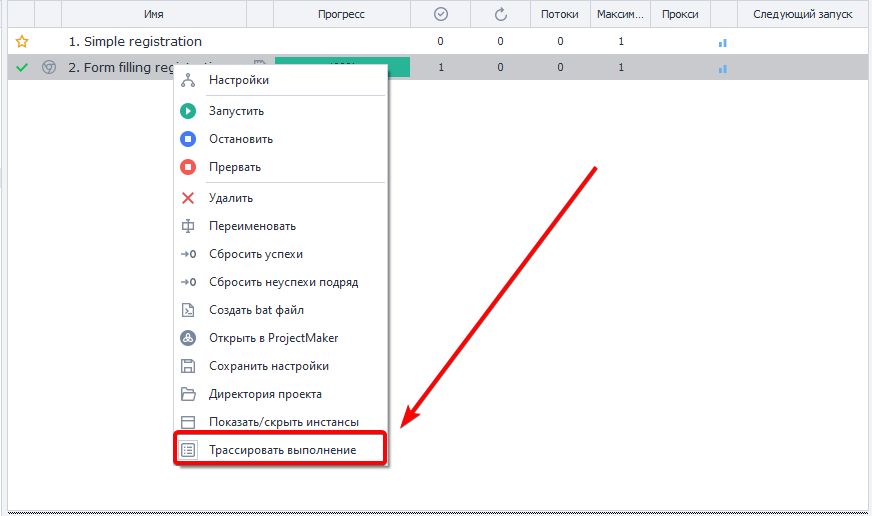

---
sidebar_position: 5
title: "Трассировка проектов"
description: ""
date: "2025-08-18"
converted: true
originalFile: "Трассировка проектов.txt"
targetUrl: "https://zennolab.atlassian.net/wiki/spaces/RU/pages/494829586"
---
import DisclaimerNotice from '@site/src/components/DisclaimerNotice';

<DisclaimerNotice />

> 🔗 **[Оригинальная страница](https://zennolab.atlassian.net/wiki/spaces/RU/pages/494829586)** — Источник данного материала

_______________________________________________  
## Описание
:::tip **Слово *трассировка* происходит от французского *tracer*, что означает *отслеживать*.**
:::   

В нашем случае данная функция обозначает процесс отслеживания работы проекта, запись или отображение последовательности шагов, выполняемых программой. Она нужны для исследования работы шаблона: отладки, замера скорости выполнения, поиска места ошибки.  

Трассировка запускается в ZennoPoster через панель заданий. Нужно: **Нажать ПКМ по нужному заданию → Трассировать выполнение**. 



Трассирование начинает работать сразу после включения, записывая все действия по порядку.  

### Путь сохранения файлов с результатами
Файлы находятся в каталоге пользователя: `C:\Users\ИМЯ ЮЗЕРА\Documents\ZennoLab\Traces` и сгруппированы по заданиям.

### Формат записи
`<Время события>`|`<Статус сообщения>`|`<ID действия>`|`<Время выполнения (мс)>`

### Возможные статусы
**`Info`** — информационное сообщение;  
**`In`** — означает начало выполнения действия с указанным ID;  
**`Good`** — удачное выполнение действия с указанным ID и переход по зелёной ветке;  
**`Bad`** — неудачное выполнение действия с указанным ID и переход по красной ветке.  

### Пример содержимого файла трассировки
```23-02-2021 06:08:59.3600|Info|---Project Start Execute---|
23-02-2021 06:09:17.9110|In |cca-1035|
23-02-2021 06:09:20.5203|Good|cca-1035|2520
23-02-2021 06:09:20.5525|In |8c7d7d95-d574-43a5-a677-6ebc17490caf|
23-02-2021 06:09:27.3366|Good|8c7d7d95-d574-43a5-a677-6ebc17490caf|6721
23-02-2021 06:09:27.3571|In |03aa3431-0d85-4374-ad32-2821d22f1674|
23-02-2021 06:09:27.3708|Good|03aa3431-0d85-4374-ad32-2821d22f1674|3
23-02-2021 06:09:27.3893|In |re-2884|
23-02-2021 06:09:28.3229|Good|re-2884|918
23-02-2021 06:09:28.3356|In |00b6f04c-711c-4362-9404-f8fb2fdf5a51|
23-02-2021 06:09:28.3463|Good|00b6f04c-711c-4362-9404-f8fb2fdf5a51|0
23-02-2021 06:09:28.3571|In |re-4835|
23-02-2021 06:09:29.0290|Good|re-4835|661
23-02-2021 06:09:29.0455|In |67c9448b-ebbe-4f54-8206-868f8ddc38c3|
23-02-2021 06:09:29.0612|Good|67c9448b-ebbe-4f54-8206-868f8ddc38c3|2
23-02-2021 06:09:29.3509|Info|---Project Executed---|
```

### Пример использования
Иногда процесс выполнения задачи зависает, и через стандартный интерфейс невозможно определить, на каком именно этапе произошла остановка. В таких неочевидных ситуациях помогает режим трассировки. Как только вы его активируете, система мгновенно зафиксирует проблемный шаг и запишет подробную информацию о текущем действии в лог-файл для дальнейшего анализа.