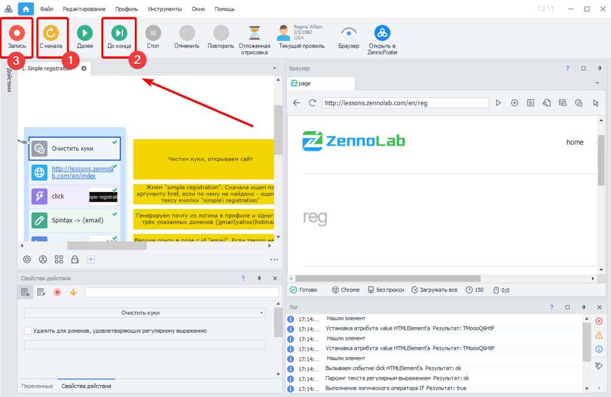

---
sidebar_position: 4
title: "Актуализация проблемных экшенов"
description: ""
date: "2025-08-18"
converted: true
originalFile: "Дозапись проблемных участков.txt"
targetUrl: "https://zennolab.atlassian.net/wiki/spaces/RU/pages/494731287"
---
import DisclaimerNotice from '@site/src/components/DisclaimerNotice';

<DisclaimerNotice />

> 🔗 **[Оригинальная страница](https://zennolab.atlassian.net/wiki/spaces/RU/pages/494731287)** — Источник данного материала

_______________________________________________  
## Описание
Если целевой сайт обновляет структуру или код страниц, старые экшены могут перестать работать (например, изменились атрибуты элемента или он вовсе исчез).  

В таких случаях вы можете перезаписать устаревшие действия, сохранив основную структуру проекта.

### Как актуализировать экшены:  
1. Откройте шаблон и запустите отладку кнопками **С начала (1)** или **До конца (2)**. Выполнение остановится на первой точке останова или на шаге с ошибкой.  
2. Оказавшись на проблемном участке, включите режим **Запись (3)**.  
3. В режиме реального времени выполните нужные действия в браузере, чтобы записать новые актуальные экшены взамен нерабочих.  

