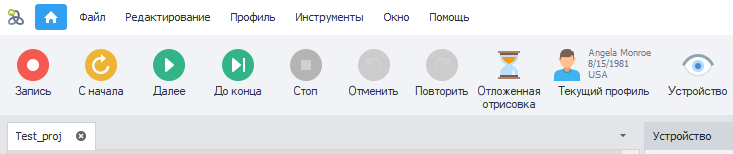
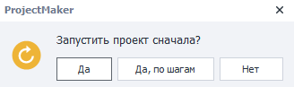
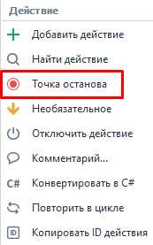
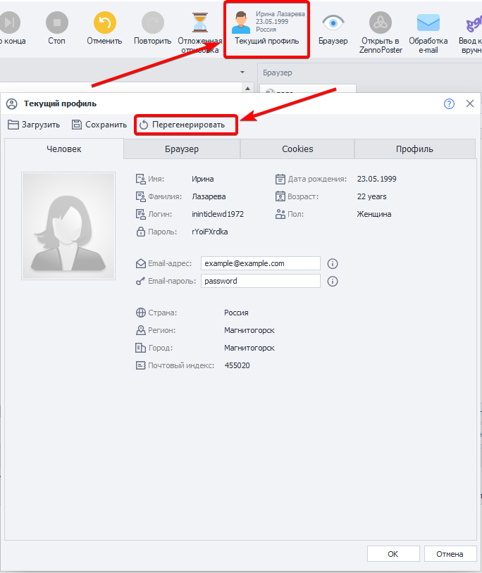

---
sidebar_position: 1
title: "Запуск отладки"
description: ""
date: "2025-08-18"
converted: true
originalFile: "Запуск отладки.txt"
targetUrl: "https://zennolab.atlassian.net/wiki/spaces/RU/pages/494731265"
---
import DisclaimerNotice from '@site/src/components/DisclaimerNotice';

<DisclaimerNotice />

> 🔗 **[Оригинальная страница](https://zennolab.atlassian.net/wiki/spaces/RU/pages/494731265)** — Источник данного материала

_______________________________________________  
## Запуск отладки
  

Рассмотрим детальнее панель записи и отладки. 

### С начала
Нажатие этой кнопки приводит к запуску проекта с самого начала. При этом будет сгенерирован новый профиль.  

### По шагам
При старте *С начала* будет предложено пройти весь проект *По шагам*. Тогда каждое последующее действие будет выполняться только после кнопки ***Далее***.  

 

Если вместо **«Да, по шагам»** нажать просто **«Да»**, то проект выполнится сразу до конца или до следующей *Точки останова (от англ. Breakpoint)*. Это точку можно установить, нажав ПКМ по любому экшену.  

   

Вы можете переключаться между двумя этими режимами, используя во время отладки попеременно кнопки ***Далее*** (по шагам)  и ***До конца*** (до останова).

### С курсора
Вы можете кликнуть по любому экшену в проекте и нажать одну из кнопок для старта — выполнение начнется именно с этого места.

Функция незаменима при поиске ошибок: можно точечно менять настройки экшенов и сразу тестировать изменения, обходясь без полного перезапуска проекта.
## Перегенерация профиля
Во время тестирования шаблона можно заново сгенерировать значения личности, нажав на специальную кнопку.  

Так, например, можно проверить, как сайт или приложение реагируют на определенные значения.

Более подробную информацию о профиле можно найти в статье [Окно профиля](/zennoposter/ProjectMaker/Program-interface/Profile_Window).