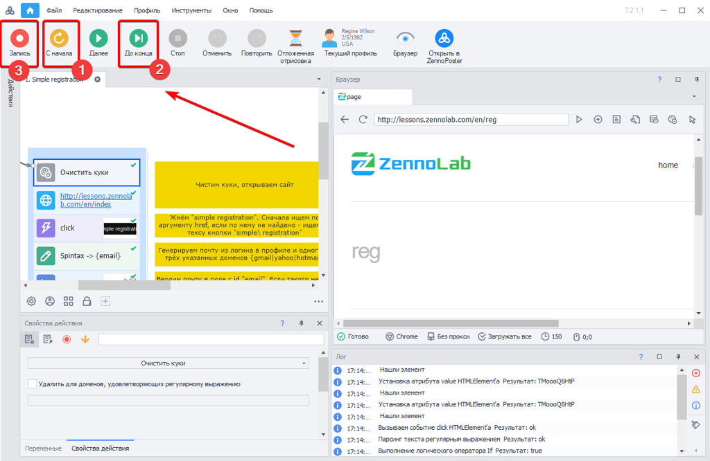

---
sidebar_position: 4
title: "Дозапись проблемных участков"
description: ""
date: "2025-08-18"
converted: true
originalFile: "Дозапись проблемных участков.txt"
targetUrl: "https://zennolab.atlassian.net/wiki/spaces/RU/pages/494731287"
---
:::info **Пожалуйста, ознакомьтесь с [*Правилами использования материалов на данном ресурсе*](../Disclaimer).**
:::

> 🔗 **[Оригинальная страница](https://zennolab.atlassian.net/wiki/spaces/RU/pages/494731287)** — Источник данного материала

_______________________________________________  
# Дозапись проблемных участков

Иногда бывает, что сайт, с которым Вы работали ранее, что-то изменил в структуре и коде своих страниц и шаблон уже не выполняется успешно.

В этом случае Вы имеете возможность дописать новые экшены, не меняя основную структуру шаблона.

Для этого откройте шаблон, запустите его **С начала** (1) и до точки останова или нажав кнопку **До конца** (2) (при этом выполнение остановится на первой точке останова). При возникновении ошибки (у элемента изменились атрибуты, либо самого элемента уже нет на странице), Вы можете в режиме реального времени нажать на **Запись** (3)и записать новые экшены взамен старых, которые по той или иной причине уже не отрабатывают корректно.

