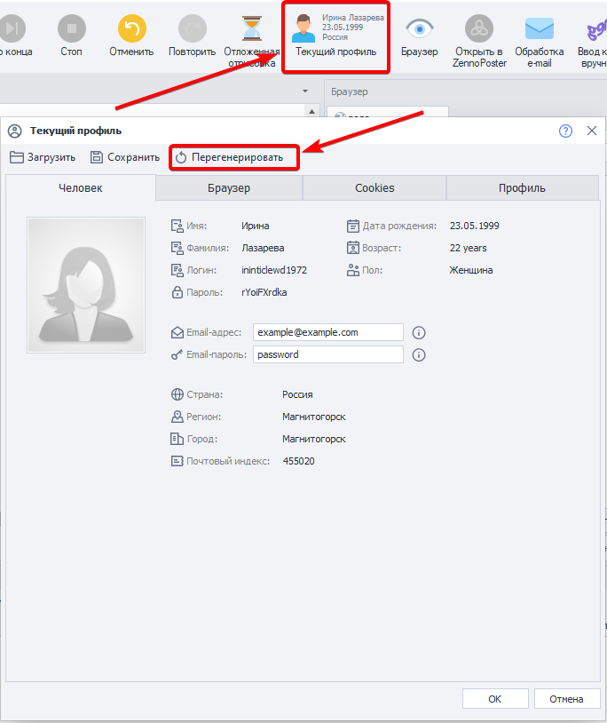

---
sidebar_position: 1
title: "Запуск отладки"
description: ""
date: "2025-08-18"
converted: true
originalFile: "Запуск отладки.txt"
targetUrl: "https://zennolab.atlassian.net/wiki/spaces/RU/pages/494731265"
---
:::info **Пожалуйста, ознакомьтесь с [*Правилами использования материалов на данном ресурсе*](../Disclaimer).**
:::

> 🔗 **[Оригинальная страница](https://zennolab.atlassian.net/wiki/spaces/RU/pages/494731265)** — Источник данного материала

_______________________________________________  
# Запуск отладки

Начиная с 5ой версии ZennoPoster, реализована возможность параллельной записи и отладки проекта.

## С начала

Для того чтобы осуществить старт проекта сначала (как это было бы при новом старте проекта в ZennoPoster), нажмите соответствующую кнопку [1]. При этом будет сгенерирован новый профиль и новые данные для браузера, исходя из [❗→ этих](https://zennolab.atlassian.net/wiki/spaces/RU/pages/475332799 "https://zennolab.atlassian.net/wiki/spaces/RU/pages/475332799") настроек.

## По шагам

При старте отладки Вам будет предложен вариант прогона по шагам. В этом случае, каждое дальнейшее действие будет выполнено только после нажатия кнопки [2]. В случае отказа от прогона по шагам, шаблон будет автоматически выполнен до конца или до следующей точки останова (установить которую можно по правому клику мыши на любом экшене).

Вы можете переключаться между двумя этими режимами (по шагам и до точки останова), используя во время отладки попеременно кнопки [2] и [3].

## С курсора

Установив курсор на любом из экшенов, Вы можете инициировать выполнение шаблона с выбранного шага. Аналогичным образом или в режиме [2] или в [3].

Это очень удобно при отладке частей шаблона, где возникают ошибки, когда Вы можете изменять настройки экшенов и пробовать повторно тестировать их работу.

## Перегенерация профиля

Во время выполнения шаблона, Вы можете изменить или полностью перегенерировать значения профиля личности или браузера через соответствующие инструменты, обозначенные цифрой [5]. Это удобно, когда нужно протестировать работу сайта с другим User Agent, например. 

Более подробную информацию о профиля можно найти в статье [❗→ Окно профиля](https://zennolab.atlassian.net/wiki/spaces/RU/pages/735903758 "https://zennolab.atlassian.net/wiki/spaces/RU/pages/735903758").