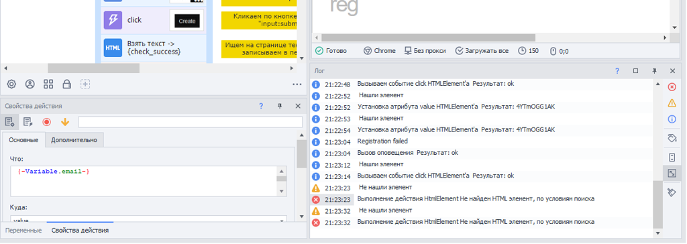
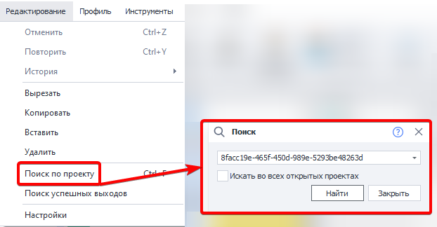

---
sidebar_position: 3
title: "Ошибки при отладке"
description: ""
date: "2025-08-18"
converted: true
originalFile: "Ошибки при отладке.txt"
targetUrl: "https://zennolab.atlassian.net/wiki/spaces/RU/pages/494895107"
---
:::info **Пожалуйста, ознакомьтесь с [*Правилами использования материалов на данном ресурсе*](../Disclaimer).**
:::

> 🔗 **[Оригинальная страница](https://zennolab.atlassian.net/wiki/spaces/RU/pages/494895107)** — Источник данного материала

_______________________________________________  
# Ошибки при отладке

При создании и редактировании шаблона, Вы, вероятнее всего, встретитесь с ошибками при его отладке, когда необходимо будет корректировать те или иные действия в проекте. В этом Вам [❗→ поможет лог](https://zennolab.atlassian.net/wiki/spaces/RU/pages/725352532 "https://zennolab.atlassian.net/wiki/spaces/RU/pages/725352532"), в который записываются все успешные и неуспешные действия.

В случае возникновения ошибки, строка в логе помечается красным.

Для того, чтобы найти экшен, отработавший с ошибкой, достаточно два раза кликнуть на эту строку в логе и фокус в проекте автоматически будет центрирован на этом экшене.

Также, Вы можете кликнуть на данной строке правой клавишей мыши и скопировать ID экшена (это возможно в том числе и в логе ZennoPoster).

Зная ID экшена, его легко можно [❗→ найти используя поиск](https://zennolab.atlassian.net/wiki/spaces/RU/pages/724566074 "https://zennolab.atlassian.net/wiki/spaces/RU/pages/724566074"):

Когда экшен, отработавший с ошибкой, Вами найден, Вы можете исправить [❗→ его настройки](https://zennolab.atlassian.net/wiki/spaces/RU/pages/494731280 "https://zennolab.atlassian.net/wiki/spaces/RU/pages/494731280") и запустить отладку [❗→ с этого же места](https://zennolab.atlassian.net/wiki/spaces/RU/pages/494731265/1#%D0%A1-%D0%BA%D1%83%D1%80%D1%81%D0%BE%D1%80%D0%B0 "https://zennolab.atlassian.net/wiki/spaces/RU/pages/494731265/1#%D0%A1-%D0%BA%D1%83%D1%80%D1%81%D0%BE%D1%80%D0%B0").