---
sidebar_position: 2
title: "Свойства действия"
description: ""
date: "2025-08-18"
converted: true
originalFile: "Свойства действия.txt"
targetUrl: "https://zennolab.atlassian.net/wiki/spaces/RU/pages/494731280"
---
:::info **Пожалуйста, ознакомьтесь с [*Правилами использования материалов на данном ресурсе*](../Disclaimer).**
:::

> 🔗 **[Оригинальная страница](https://zennolab.atlassian.net/wiki/spaces/RU/pages/494731280)** — Источник данного материала

_______________________________________________  
# Свойства действия
  
## Описание

На стадии редактирования и отладки проекта Вы можете изменять все ранее записанные параметры экшенов. 

  

## Как открыть окно?

Всё зависит от режима отображения открытого проекта.

- с браузером:

 - надо включить отображение этого окна в меню *Окно =&gt; *Свойства действия. В этом окне будут отображаться настройки выделенного экшена.

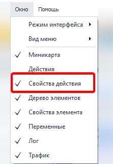

- без браузера:

 - необходимо дважды кликнуть по экшену и откроется окно свойств. В этом режиме можно открывать окно сразу для нескольких экшенов:

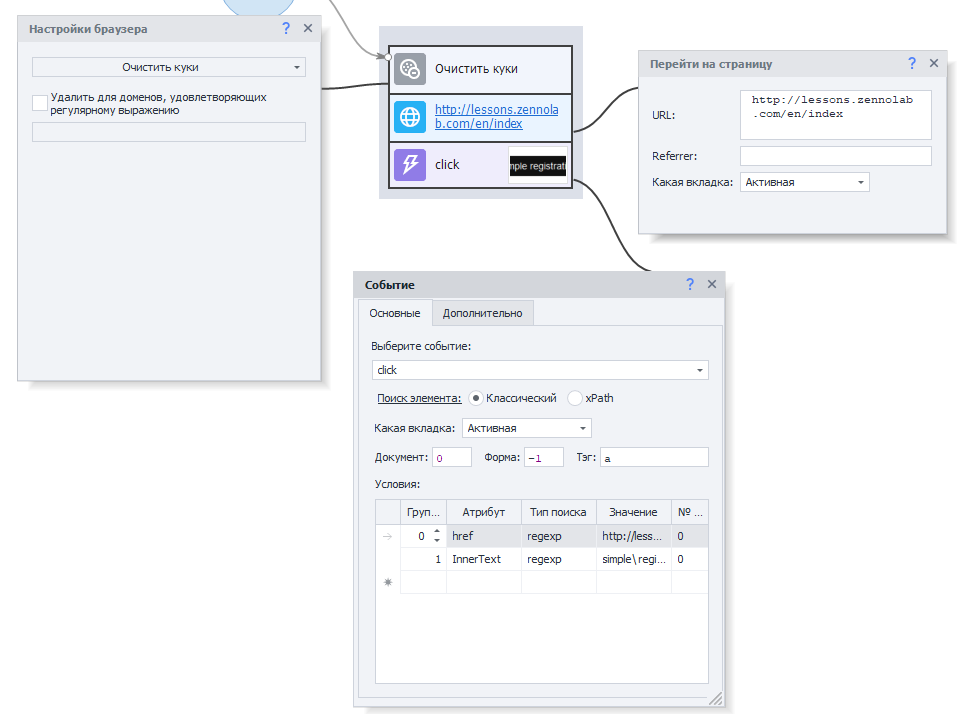

Режим “С браузером“

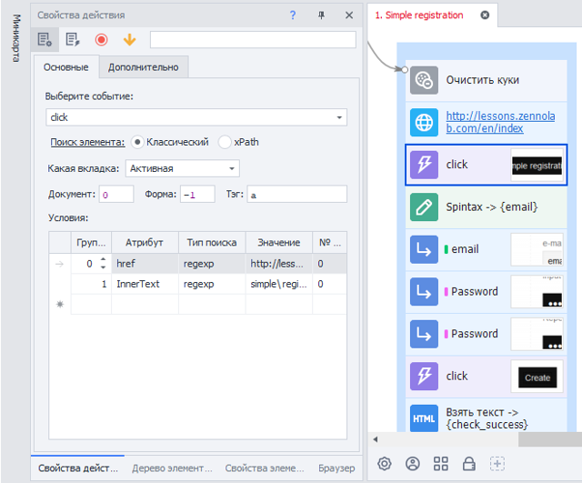

Режим “Без браузера“

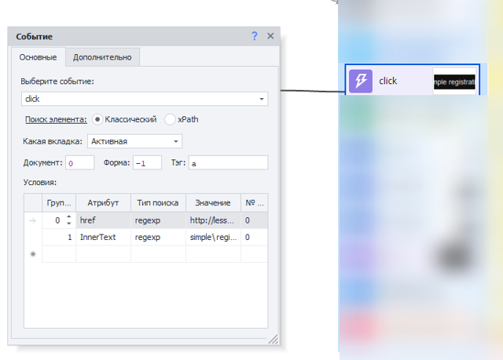

:::note На заметку
В режиме “С браузером” у Вас тоже есть возможность открывать окно свойств сразу для нескольких экшенов. Для этого откройте окно Редактирование =&gt; Настройки =&gt; вкладка Редактор. И включите опцию Открывать несколько настроек действий в режиме “С браузером”.
:::

  

## Кнопка “Выполненные”

Если при отладке в работе экшена фиксируется ошибка, Вы можете в режиме реального времени исправить те или иные параметры. Поможет Вам в этом возможность просмотра с каким значением переменных выполнялся экшен:

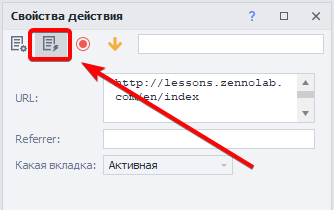

После активации этой функции [❗→ переменные](https://zennolab.atlassian.net/wiki/spaces/RU/pages/735608872 "https://zennolab.atlassian.net/wiki/spaces/RU/pages/735608872") будут заменены значениями, которые они хранят.

:::warning Внимание
Сработает только после того, как экшен был выполнен.
:::

**До активации**

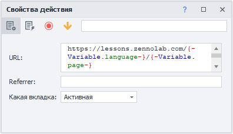

**После активации**

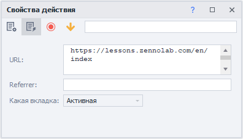

## Комментарий

Для удобства ориентирования по проекту Вы можете для экшена указать комментарий:

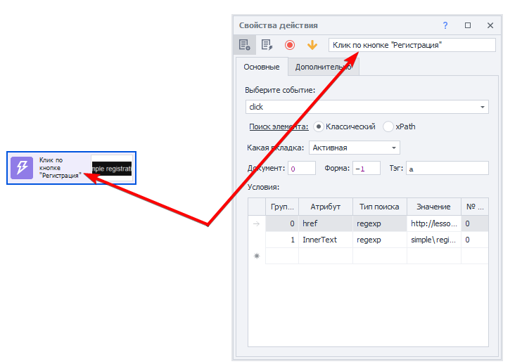

Так же этот текст можно изменить кликнув по экшену правой кнопкой мыши и выбрав пункт *Комментарий из контекстного меню:

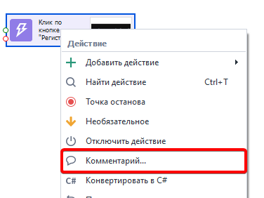

## Точка останова

Позволяет останавливать выполнение проекта на выбранном экшене. Очень удобно при отладке, когда необходимо проанализировать содержимое переменных, страницы в определённый момент работы проекта.

Включить её можно двумя способами: через контекстное меню и в свойствах действия.

Контекстное меню

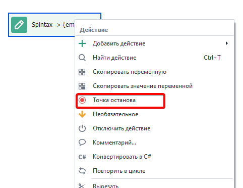

Свойства действия

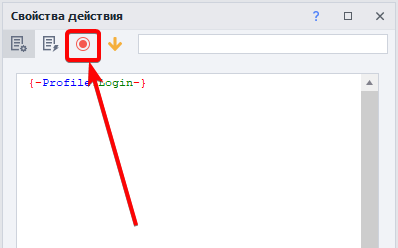

После её включения на экшене появится значок - красный кружок:

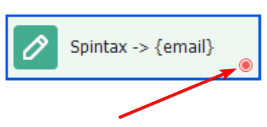

## Необязательное

При включении данной опции экшен всегда будет выходить по успешной (зелёной) ветке, если даже фактически он завершился ошибкой.

Как и в случае с точкой останова, сделать экшен необязательным можно двумя способами: контекстное меню и свойства действия

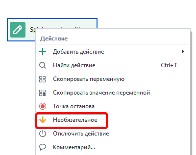

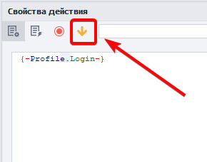

Вид на экшене:

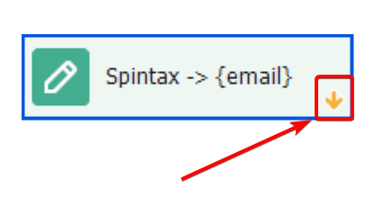

