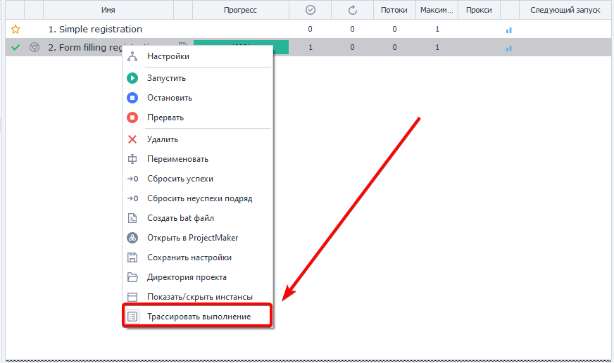

---
sidebar_position: 5
title: "Трассировка проектов"
description: ""
date: "2025-08-18"
converted: true
originalFile: "Трассировка проектов.txt"
targetUrl: "https://zennolab.atlassian.net/wiki/spaces/RU/pages/494829586"
---
:::info **Пожалуйста, ознакомьтесь с [*Правилами использования материалов на данном ресурсе*](../Disclaimer).**
:::

> 🔗 **[Оригинальная страница](https://zennolab.atlassian.net/wiki/spaces/RU/pages/494829586)** — Источник данного материала

_______________________________________________  
# Трассировка проектов

Функция может пригодится при отладке проектов, замеров скорости выполнения действий, поиск места зависания проекта и прочих задач, связанных с исследованием работы проектов в ZennoPoster.

Включить трассировку выполнения можно в контекстном меню задания:




Трассирование начинает работать сразу после включения, записывая текущее действие и далее по порядку.

### Путь сохранения файлов с результатами

Файлы находятся в каталоге пользователя: C:\Users\&lt;ИМЯ ЮЗЕРА&gt;\Documents\ZennoLab\Traces и сгруппированы по заданиям.

### Формат записи имеет такой вид

&lt;Время события&gt;|&lt;Статус сообщения&gt;|&lt;ID действия&gt;|&lt;Время выполнения (мс)&gt;

### Возможные статусы сообщения

**Info** - информационное сообщение;
**In** - означает начало выполнения действия с указанным ID;
**Good** - удачное выполнение действия с указанным ID и переход по зелёной ветке;
**Bad** - неудачное выполнение действия с указанным ID и переход по красной ветке.

### Пример содержимого файла трассировки

```23-02-2021 06:08:59.3600|Info|---Project Start Execute---|
23-02-2021 06:09:17.9110|In |cca-1035|
23-02-2021 06:09:20.5203|Good|cca-1035|2520
23-02-2021 06:09:20.5525|In |8c7d7d95-d574-43a5-a677-6ebc17490caf|
23-02-2021 06:09:27.3366|Good|8c7d7d95-d574-43a5-a677-6ebc17490caf|6721
23-02-2021 06:09:27.3571|In |03aa3431-0d85-4374-ad32-2821d22f1674|
23-02-2021 06:09:27.3708|Good|03aa3431-0d85-4374-ad32-2821d22f1674|3
23-02-2021 06:09:27.3893|In |re-2884|
23-02-2021 06:09:28.3229|Good|re-2884|918
23-02-2021 06:09:28.3356|In |00b6f04c-711c-4362-9404-f8fb2fdf5a51|
23-02-2021 06:09:28.3463|Good|00b6f04c-711c-4362-9404-f8fb2fdf5a51|0
23-02-2021 06:09:28.3571|In |re-4835|
23-02-2021 06:09:29.0290|Good|re-4835|661
23-02-2021 06:09:29.0455|In |67c9448b-ebbe-4f54-8206-868f8ddc38c3|
23-02-2021 06:09:29.0612|Good|67c9448b-ebbe-4f54-8206-868f8ddc38c3|2
23-02-2021 06:09:29.3509|Info|---Project Executed---|
```

### Пример использования

Бывают случаи, когда выполнение задания зависло на каком-то действии. При этом визуально никак не определить какое именно действие не может выполнится. В этот момент достаточно включить трассирование задания и текущее действие сразу запишется в файл.