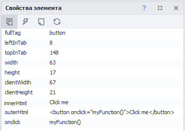
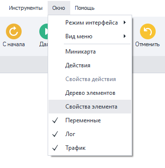
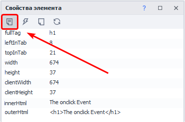
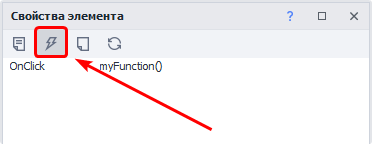
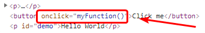
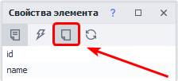
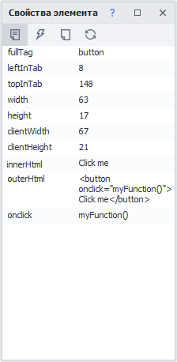
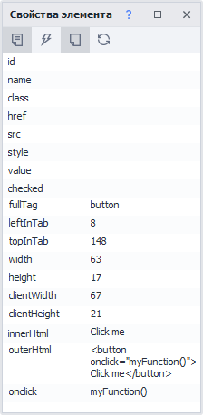
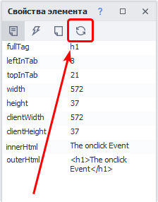

---
sidebar_position: 6
title: "Окно свойства элемента"
description: ""
date: "2025-07-19"
converted: true
originalFile: "Окно свойства элемента.txt"
targetUrl: "https://zennolab.atlassian.net/wiki/spaces/RU/pages/735608879"
---
import DisclaimerNotice from '@site/src/components/DisclaimerNotice';

<DisclaimerNotice />

> 🔗 **[Оригинальная страница](https://zennolab.atlassian.net/wiki/spaces/RU/pages/735608879)** — Источник данного материала

_______________________________________________  
## Описание
При работе с HTML-кодом страницы, в зависимости от тега, элемент имеет свои атрибуты, которые помогают анализировать или идентифицировать объект, для последующей работы с ним.

При анализе исходного кода, не редко встречаются (на первый взгляд) одинаковые элементы, что может дать некорректный результат при работе с данными. Воспользовавшись окном **Свойства элемента**, можно детально изучить объекты, а именно их *атрибуты (свойства)*.
_______________________________________________ 
## Принцип работы
Чтобы включить это окно, надо кликнуть в верхнем меню по пункту **Окно → Свойства элемента**: 

### Отображение информации по нужному элементу
Есть несколько способов как отобразить информацию в этом окне по интересующему Вас элементу

- добавить его в [Конструктор действий и Поиск по XPath](../Browser_Window/Action_Constructor_and_XPath_Search)
- выбрать в [Окне дерева элементов](./Element_Tree_Window)
- **ПКМ** по нужному элементу → **Исследовать** или **Следовать за курсором**.

### Вкладка «Свойства»
:::info Открыта по умолчанию.
:::

На ней отображаются атрибуты выбранного HTML элемента.

### Вкладка «События»

На данной вкладке отображаются привязанные к этому элементу JavaScript события.

:::warning Событие отобразится тут только если
Оно явно указано как атрибут в HTML коде анализируемого элемента:

:::

### Кнопка «Показать пустые поля»

При включении во вкладках **Свойства** и **События** дополнительно будут отображены пустые атрибуты\события.

| До включения     | После включения |
| ----------- | ----------- |
|       |       |

### Кнопка «Обновить поля»

С помощью данной кнопки можно обновить значения атрибутов элемента
_______________________________________________ 
## Полезные ссылки
- [❗→ Окно дерева элементов](/wiki/spaces/RU/pages/727777355 "/wiki/spaces/RU/pages/727777355")
- [❗→ Конструктор действий и Поиск по XPath](/wiki/spaces/RU/pages/483426337 "/wiki/spaces/RU/pages/483426337")
- [❗→ Инструменты web-разработчика (DevTools)](/wiki/spaces/RU/pages/1331134465 "/wiki/spaces/RU/pages/1331134465")
- [❗→ Просмотр текста страницы](/wiki/spaces/RU/pages/735903769 "/wiki/spaces/RU/pages/735903769")