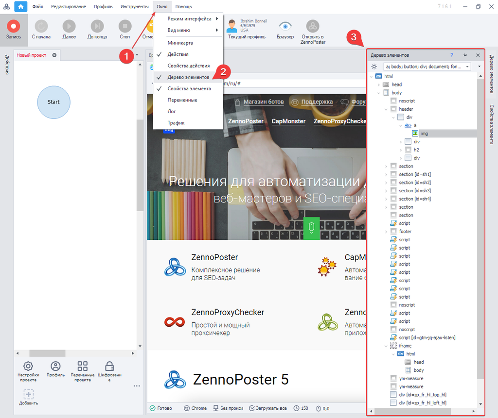
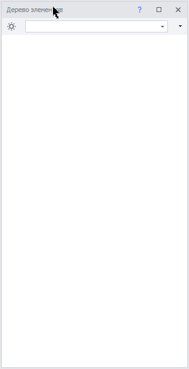
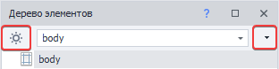
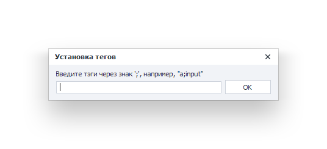
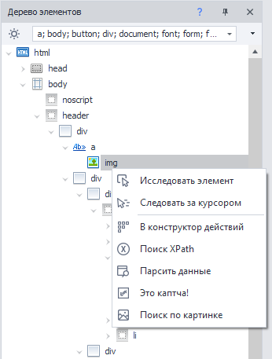
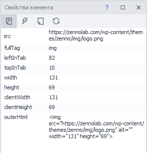
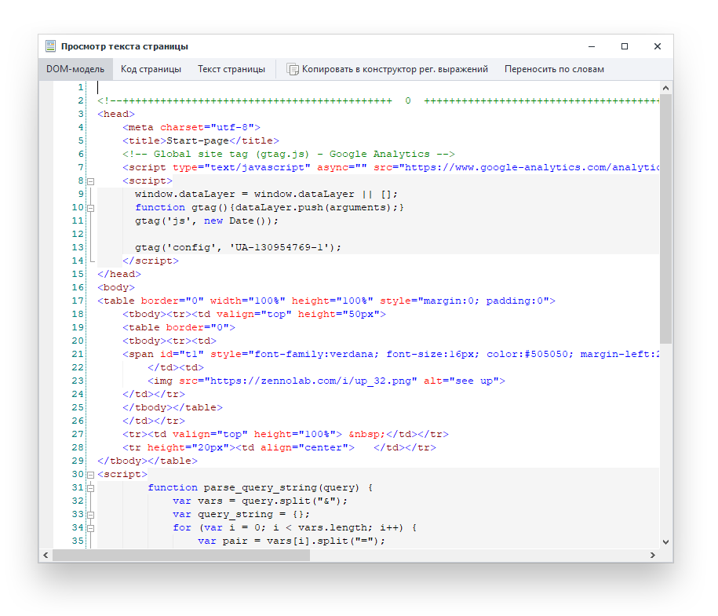
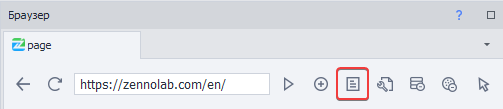
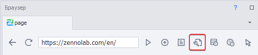

---
sidebar_position: 5
title: "Окно дерева элементов"
description: ""
date: "2025-07-19"
converted: true
originalFile: "Окно дерева элементов.txt"
targetUrl: "https://zennolab.atlassian.net/wiki/spaces/RU/pages/727777355"
---
import DisclaimerNotice from '@site/src/components/DisclaimerNotice';

<DisclaimerNotice />

> 🔗 **[Оригинальная страница](https://zennolab.atlassian.net/wiki/spaces/RU/pages/727777355)** — Источник данного материала

_______________________________________________  
## Описание

Инструмент для визуального анализа HTML кода страницы.

### Построение страницы

Когда пользователь запрашивает страницу сайта, браузер (от англ. browser, веб-обозреватель) получает исходный HTML‑код. Прежде чем начать отображать графику, браузер проводит анализ этого кода и строит дерево узлов страницы (**render tree**).  

Работа со структурой HTML является неотъемлемой частью любого браузерного проекта. Для упрощения этого процесса в программу **ZennoPoster** встроен инструмент для визуального анализа дерева элементов.

### Как открыть окно в программе?
Необходимо в ProjectMaker в верхнем меню нажать:

| **Окно → Дерево элементов** |
| :--: |
|  |

Теперь можно перемещаться по элементам страницы и наглядно видеть выделенный объект в браузере.

### Фильтр дерева элементов
В окне дерева элементов, можно настроить вывод определенных тегов, освободив себя, тем самым от лишних элементов, что упростит анализ документа и в разы сократит время поиска нужного вам тега.

 

Дополнительно на панели окна, располагаются кнопки:

- **Показать только важные элементы** — автоматически оставит только (важные) часто используемые теги.
- **Добавить или удалить теги** — по умолчанию в программу добавлены часто используемые элементы, но вы можете управлять их списком самостоятельно.

_______________________________________________
## Работа с объектом страницы
Правой кнопкой мыши (ПКМ) на выбранном элементе, вызвав контекстное меню, можно выбрать раздел для дальнейшей работы с элементом, как с объектом.  

- **Исследовать элемент** - вызывает окно [Свойства элемента](./Element_Properties_Window) для более детального анализа свойств, у выбранного вами элемента.
- [**В конструктор действий**](../Browser_Window/Action_Constructor_and_XPath_Search) - позволяет тонко настроить методы поиска элемента, одновременно тестируя действия над ним.
- **[Поиск по XPath](../Browser_Window/Action_Constructor_and_XPath_Search)** - автоматически строит путь до элемента, в представление XML Path Language, для последующей работы в конструкторе действий.
- **[Парсить данные](../Browser_Window/Parse_Data)** - вы можете с минимальным количеством кликов настроить условия сбора данных, при этом с предварительным выводом результата в том же окне.
- **Это каптча** - добавляет в проект [модуль ввода каптчи в ручную](../Tools/Manual_Captcha_Entry).
- **[Поиск по картинке](../Browser_Window/Image_Search)** - нужен для определенных действий мышью над выбранным участком.
_______________________________________________
## Дополнительные инструменты
Они понадобятся для работы с исходным кодом страницы.

### Свойства элемента
[Панель для анализа атрибутов HTML элемента](./Element_Properties_Window)

**Окно → Свойства элемента**

### Просмотр текста страницы
Инструмент для анализа DOM-модели документа, исходного HTML-код, а также текстового содержимого страницы.

Помимо анализа исходного кода текущей страницы, можно настроить поиск по регулярному выражению. Для этого, необходимо нажать [**Копировать в конструктор рег. выражений**](../Tools/Regular_Expression_Tester) и содержимое документа, поместиться в область *Текст для обработки*, для дальнейшего создания/тестирования регулярного выражения.

| Кнопка для просмотра исходного кода в браузере |
| :--: |
|  |

### Инструмент веб-разработчика
Developer tools (или сокращённо *DevTools*) — набор инструментов, который помогает тестировать, отлаживать, профилировать и проверять код на соответствие тем или иным стандартам и многое другое.

:::info Доступен только при работе с браузером Google Chrome
:::

| Открыть DevTools для активной вкладки |
| :--: |
|  |
_______________________________________________
