---
sidebar_position: 4
title: "Окно лога"
description: ""
date: "2025-07-19"
converted: true
originalFile: "Окно лога.txt"
targetUrl: "https://zennolab.atlassian.net/wiki/spaces/RU/pages/725352532"
---
import DisclaimerNotice from '@site/src/components/DisclaimerNotice';

<DisclaimerNotice />

> 🔗 **[Оригинальная страница](https://zennolab.atlassian.net/wiki/spaces/RU/pages/725352532)** — Источник данного материала

_______________________________________________  
## Описание
Лог служит для вывода сообщений пользователю. Сообщение может иметь один из трёх типов:

- **Информационное** — («*Начинаем работу*», «*Приступаем к регистрации*», «*Успешно создали аккаунт*» и т.п.);
- **Предупреждающее** — (любые некритические ошибки в работе шаблона);
- **Ошибочное** — (в работе произошла серьёзная ошибка, на которую надо обратить внимание).

Помимо прочего эти три вида сообщений отличаются иконками:

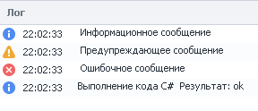

Так же, начиная с ZennoPoster 7.2.1.0, сообщениям можно задавать цвет фона


Сообщения в лог выводятся с помощью экшена [Оповещение](../Project-editor/Actions-in-ProjectMaker-Actions-Blocks/Logic/Notification_Log_Entry).

## Для чего используется?
Представим ситуацию: вы создали шаблон, и одно его выполнение занимает около 8 минут. При этом вывод в лог вы не используете вовсе. Шаблон запускается и без проблем отрабатывает несколько раз подряд — один, два, пять, десять…

Однако на одном из следующих запусков (например, на одиннадцатом) выполнение неожиданно «зависает»: шаблон не завершается успешно, но и ошибки не возникает. Он может находиться в таком состоянии 10, 20 или даже 30 минут. В результате остаётся только принудительно закрыть программу и перезапустить шаблон, надеясь, что ситуация больше не повторится.

Чтобы избежать подобных сценариев, рекомендуется добавлять вывод сообщений в лог. Это позволяет в любой момент видеть, на каком этапе сейчас находится выполнение шаблона. Если он всё-таки зависнет, по последним записям в логе можно быстро понять, на каком шаге возникла проблема и где стоит искать причину.

Если при этом кажется, что сообщений в логе ZennoPoster слишком много, но удалять экшены не хочется, есть удобное решение. Можно настроить отображение таких сообщений только в ProjectMaker. Для этого в экшене [Оповещение](../Project-editor/Actions-in-ProjectMaker-Actions-Blocks/Logic/Notification_Log_Entry) достаточно снять галочку **Показывать в ZennoPoster** — логика шаблона сохранится, а интерфейс ZennoPoster останется чистым.
_______________________________________________
## Принцип работы
### Включение окна лога
Чтобы включить его надо кликнуть в верхнем меню по пункту **Окно** и выбрать пункт **Лог**:

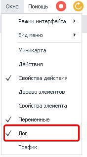


<details>
<summary>Если окно лога не отображается</summary>

Бывают случаи, когда окно лога не отображается, хоть возле него в настройках и стоит чекбокс (как показано на скриншоте выше), говорящий о том, что оно включено. Если после нескольких попыток его включить оно так и не появилось, то можно произвести общий сброс настроек окон в ProjectMaker. 

:::warning Эти действия приведут к сбросу настроек окон.
Если ранее вы настроили интерфейс программы под себя, расположив её окна удобным для вас способом, то все эти настройки будут удалены и будет установлено значение по умолчанию.
:::

Заходим в *Редактирование → Настройки → Отладка* → и в самом низу окна ищем кнопку *Сбросить панели*. После нажатия данной кнопки и перезагрузки ProjectMaker все настройки окон будут сброшены.  

Лог при этом должен начать корректно работать (данный метод можно использовать и при проблемах с отображением других окон программы).

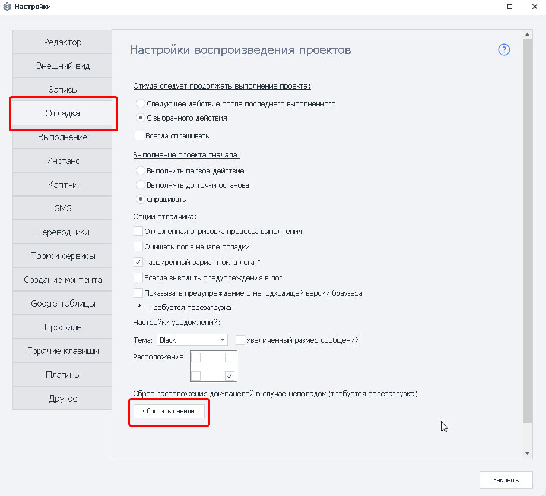

</details>
  

### Внешний вид (Стандартный лог)
#### Окно вывода сообщений
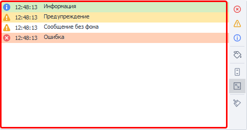

Сначала выводится иконка, соответствующая типу сообщения, потом время сообщения и собственно текст сообщения.

#### Сортировка по типу сообщения и по его цвету
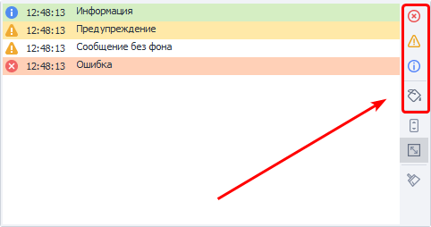


С помощью кнопок в данной секции можно фильтровать выводимые сообщения по их типу и\или цвету.

#### Автопрокрутка


Если включена данная опция, то окно лога будет автоматически прокручиваться тем самым всегда показывая самое последнее сообщение.

:::info **Условия отключения автопрокрутки**
Можно изменить в **Настройках программы → вкладка Другое**.
:::

#### Автоподбор высоты строк
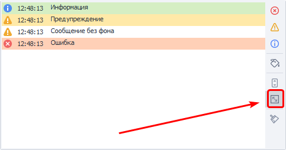

Если сообщение слишком большое, то высота строки будет подобрана таким образом, чтоб полностью его вместить. Если данная опция отключена, то будет отображена только верхняя строка из всего этого сообщения.


#### Очистить лог
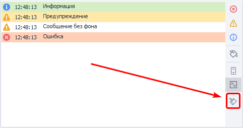

С помощью данной кнопки можно очистить окно от всех сообщений.

#### Двойной клик по записи в логе
Если дважды кликнуть на любой записи в логе, то фокус проекта сместится на экшен, который эту запись оставил.

  

Кнопки, из правого блока окна, сворачиваются, при уменьшении высоты окна лога. Для получения доступа к ним необходимо кликнуть на соответствующую кнопку.

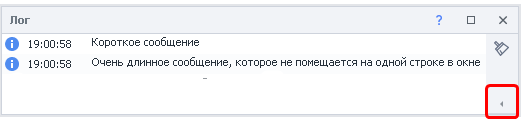

### Контекстное меню лога
При клике правой кнопкой мыши (ПКМ) по записи в логе появится контекстное меню

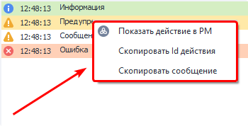

#### Показать действие в PM
Проект, сгенерировавший это сообщение, будет открыт в ProjectMaker и фокус сместится на экшен, который отправил сообщение.

#### Скопировать Id действия
В буфер обмена сохранится уникальный id экшена, отправившего сообщение. Пример id - `3e6988d1-9518-4535-a6d2-f0a33420c730`. Далее Вы можете использовать этот id для поиска по проекту, подробней о поиске по проекту можно прочитать в статье [**Поиск по проекту**](../Tools/Project_Search) 

#### Скопировать сообщение
При выборе данного пункта в буфер обмена сохранится текст сообщения.

_______________________________________________
## Файл лога на компьютере
:::warning Описанные ниже функции предназначены для опытных пользователей
:::

PorjectMaker и ZennoPoster дополнительно сохраняют логи на компьютере в директории с установленной программой, в папке **Logs**. Вот как может выглядеть путь к данной папке: `C:\Program Files\ZennoLab\RU\ZennoPoster Pro V7\7.1.6.1\Progs\Logs`

### Разделение по шаблонам и потокам
По умолчанию все логи со всех шаблонов пишутся в один файл. Это поведение можно изменить с помощью [C#](../Project-editor/Actions-in-ProjectMaker-Actions-Blocks/Custom_code/CSharp_Code), который необходимо разместить в начале шаблона:

```
// Перенаправляем лог для данного шаблона в отдельный файл.
project.LogOptions.LogFile = @"D:\log.txt";
// Для каждого потока будет создан свой лог файл.
// К имени файлов (в нашем случае log) будут приписываться идентификаторы потоков.
project.LogOptions.SplitLogByThread = true;
```

## Расширенный вариант лога
Его можно включить в настройках программы. Для этого в верхнем меню кликаем **Редактирование → Настройки → Отладка → Расширенный вариант окна лога**. Чтоб изменения вступили в силу необходимо перезапустить ProjectMaker.

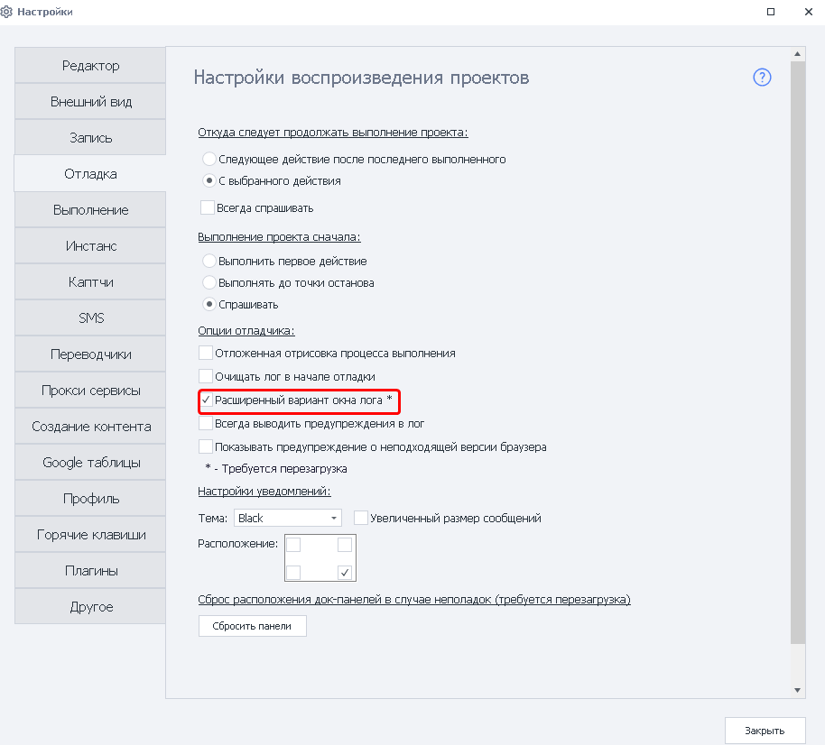

:::info Расширенный лог автоматически включится и в ZennoPoster.
:::

### Внешний вид
Первое, что бросается в глаза - появление заголовков:

- Тип сообщения.
- Время.
- Безымянный заголовок *(ранее он назывался Путь)*.
- Сообщение.

Кликая по любому заголовку, вы можете отсортировать сообщения в логе 

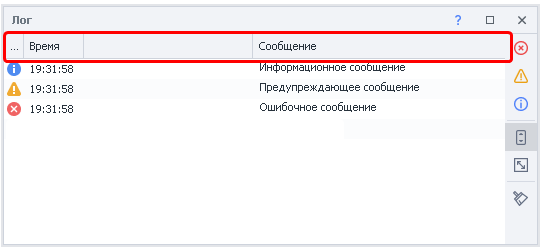

#### Фильтр сообщений

При наведении курсора мыши на любой из заголовков появляется иконка фильтра. 

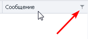

Тип фильтра зависит от колонки в которой был клик: 
- **Время**.  
Доступны фильтры дат. Можно показать сообщения:  
    - *за конкретный день*,  
    - *между двумя датами*,  
    - *до или после заданной даты*, 
    - *или же создать сложный фильтр с несколькими условиями*.  

<details>
<summary>Скриншоты</summary>

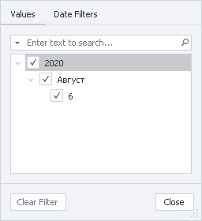

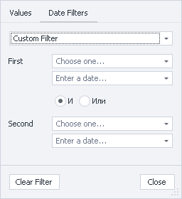

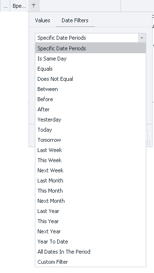

</details>
- **Сообщение** и **Безымянная**.  
Можно настраивать текстовые фильтры.

<details>
<summary>Скриншоты и переводы фильтров</summary>


*Equals* - Строка равна фильтру (точное совпадение)

*Does Not Equal* - НЕ равна фильтру

*Begins With* - Начинается с …

*Ends With* - Заканчивается на …

*Contains* - Содержит

*Does Not Contain* - Не содержит

*Is Blank* - Строка пуста

*Is Not Blank* - НЕ пустая строка

*Custom* - Составной фильтр

</details>

### Авто-фильтр и конструктор фильтра 

Кликнув ПКМ по заголовку откроется контекстное меню с дополнительными функциями:  
- *группировка по выбранной колонке*,  
- *скрытие колонок*,  
- *подбор ширины*.  
  
Среди них нас сейчас больше интересуют **Авто-фильтр** и **Конструктор фильтров**.

#### Авто-фильтр  
С его помощью можно быстро создать простой фильтр сообщений.  

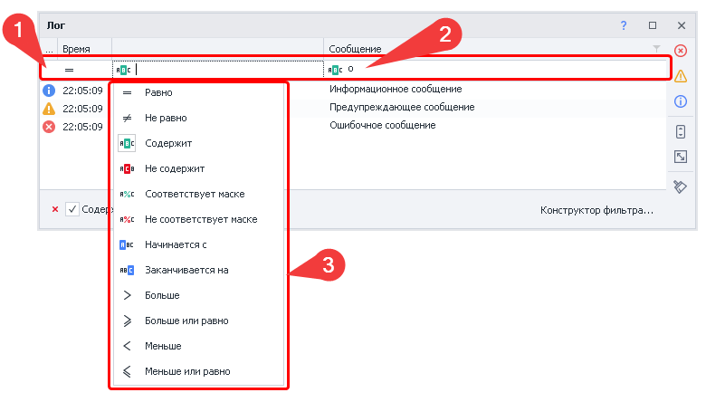

При активации появляется дополнительная строка **(1)** под заголовками. В ней задаётся тип фильтра, а также можно ввести необходимые символы и\или слова, согласно которым будут отбираться выводимые сообщения.  

На скриншоте выше показана появляющаяся строка и создана простая фильтрация **(2)** - выводятся только те строки в которых есть символ `о` *(поиск осуществляется по колонке **Сообщение**)*.  

В каждой строке, слева, есть значок, после клика по которому появляется контекстное меню **(3)** с выбором типа фильтрации. Типы фильтров и вводимые значение зависят от колонки:  
- для колонки **Время** — это *операторы сравнения* и даты;  
> Больше — `>`, меньше — `<`, равно — `=` и т.п.   
- для **Сообщения** — поиск по тексту и операторы сравнения.  
> Содержит, не содержит, начинается с и т.п.


#### Конструктор фильтров  
Похож на авто-фильтр, но позволяет создать гораздо более сложные условия для фильтрации. 

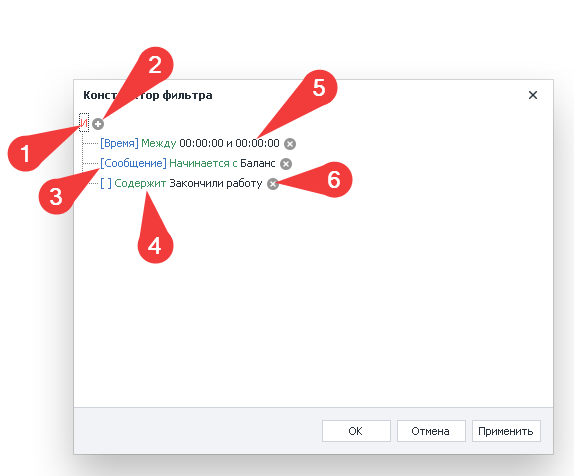

**1.** При клике по данной кнопке можно добавить новое условие, группу условий или вовсе очистить все условия поиска. Так же здесь необходимо определить логическую связь между условиями:
    - **И** — удовлетворяют **ВСЕМ** условиям;
    - **ИЛИ** — удовлетворяют **хотя бы одному** из условий;  
    - **НЕ И** — **НЕ** удовлетворяют **ВСЕМ** условиям;  
    - **НЕ ИЛИ** — **НЕ** удовлетворяют **хотя бы одному** из условий.  

**2.** С помощью данной кнопки можно легко добавить дополнительное условие.  
**3.** Синим цветом в квадратных скобках указана колонка к которой применяется фильтр.  
*На скриншоте в последнем условии пустые скобки — это **Безымянная колонка**. Хоть у неё и нет собственного имени, но фильтровать по ней можно*.  
**4.** Зелёным цветом отображается тип фильтра.  
**5.** Чёрный текст — это данные для фильтра, которые вводит пользователь.  
**6.** Эта кнопка позволяет легко удалить фильтр.  

#### Как и зачем писать в безымянную колонку?

Написать в данную колонку с помощью стандартного экшена [Оповещения](../Project-editor/Actions-in-ProjectMaker-Actions-Blocks/Logic/Notification_Log_Entry), к сожалению, нельзя. Для этого необходимо использовать кубик [Свой C# код](../Project-editor/Actions-in-ProjectMaker-Actions-Blocks/Custom_code/CSharp_Code) и обладать минимальными знаниями по работе с C# кодом. 

Для вывода сообщений в лог существует четыре метода:  
 - `project.SendInfoToLog`,  
 - `project.SendWarningToLog`,  
 - `project.SendErrorToLog`
 - `project.SendToLog` *(с помощью этого метода можно задавать цвет сообщениям)*.  
 
 У каждого из этих методов есть перегрузка. Так как работа в них идентична, далее рассмотрим только `project.SendInfoToLog`.

```
// Первый вариант метода.
// Аргументы:
// 1й - строка, которая выведется в колонке "Сообщение"
// 2й - bool, надо ли выводить это сообщение в лог ZennoPoster
project.SendInfoToLog("Message", true);

// Второй вариант:
// Аргументы:
// 1й - строка, которая выведется в колонке "Сообщение"
// 2й - строка, данная строка появится в безымянной колонке.
// 3й - bool, надо ли выводить это сообщение в лог ZennoPoster
project.SendInfoToLog("Message", "Way", true);
```

| Вот как выглядит вызов этого кода: | 
| ----------- | 
| 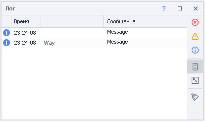  |


**Где это может пригодиться:**
- **При многопоточной работе**.  
В *Безымянную* колонку можно заносить имя аккаунта, а в *Сообщения* - действие, которое этот аккаунт сейчас выполняет.  
Также можно сгруппировать сообщения по этой колонке (через клик ПКМ по заголовку и выбора соответствующей опции) или настроить фильтр.
- **При создании больших шаблонов**.  
Такие за один проход могут выполнять много функций. Например: регистрация, заполнение профиля, поиск товара, парсинг и обработка товаров, публикация обработанных данных (и всё это за одно выполнение шаблона).  
Каждая из описанных частей может содержать в себе много действий. Тогда при логированиии в *Безымянную* колонку можно писать ту часть шаблона, в которой сейчас находится выполнение, а в *Сообщения* писать конкретное действие.

* * *

## Полезные ссылки

- [❗→ Оповещение (Notification/Запись в лог)](/wiki/spaces/RU/pages/534053050 "/wiki/spaces/RU/pages/534053050")
- [❗→ Поиск по проекту](/wiki/spaces/RU/pages/724566074 "/wiki/spaces/RU/pages/724566074")