---
sidebar_position: 8
title: "Окно профиля"
description: ""
date: "2025-07-19"
converted: true
originalFile: "Окно профиля.txt"
targetUrl: "https://zennolab.atlassian.net/wiki/spaces/RU/pages/735903758"
---
import DisclaimerNotice from '@site/src/components/DisclaimerNotice';

<DisclaimerNotice />

> 🔗 **[Оригинальная страница](https://zennolab.atlassian.net/wiki/spaces/RU/pages/735903758)** — Источник данного материала

_______________________________________________  
## Описание
> Окно профиля нужно для отображения информации по текущей личности.

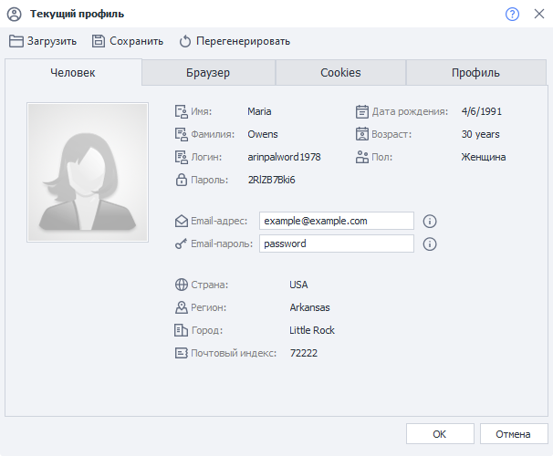

**Профиль** — это виртуальная личность, данные для которой генерирует ProjectMaker. Вы можете произвести [более тонкую настройку](../Project-editor/Static_blocks/Profile) для каждого проекта отдельно — выбрать браузер, ОС, платформу, национальность, пол, возраст, эмулируемые данные и др.

### Как открыть окно?
Необходимо кликнуть по кнопке **Текущий профиль**:

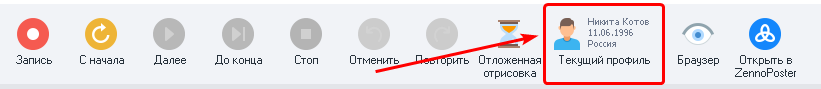

### Для чего это используется?
Очень удобно использовать функционал данного окна во время создания или отладки проекта. Так как есть возможность быстро перегенерировать профиль или загрузить другой, чтоб посмотреть как проект будет выполняться с разными наборами данных профиля.

:::info При сохранении/загрузке профиля подтягиваются куки и кэш браузера.
:::
_______________________________________________ 
# Работа с окном
## Загрузка, сохранение и генерация


1. **Загрузить** — добавление ранее сохранённого профиля. После клика по кнопке откроется стандартное окно выбора файлов.
2. **Сохранить** — сохранение текущего профиля по указанному пути.
3. **Перегенерировать** — полное обновление всех параметров профиля.

:::tip [**Операции над профилем**](../Project-editor/Actions-in-ProjectMaker-Actions-Blocks/Data/Profile_Operations)
С помощью этого экшена можно загружать и сохранять профиль прямо во время выполнения проекта.  

Так же с его помощью можно изменить некоторые из полей *(но не все)*.
:::
_______________________________________________
## Вкладка «Человек»
В данной вкладке отображается базовая информация по текущему профилю.  

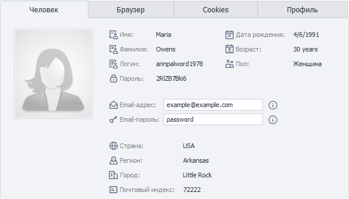

Почти все параметры доступны для чтения и копирования. Изменить можно только email и пароль от него (именно для текущего профиля). 

Для того чтобы скопировать тот или иной параметр дважды кликните на него, а затем нажмите ПКМ по выделению, и появится привычное контекстное меню:

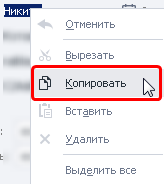

:::info В настройках программы можно установить email по умолчанию для всех профилей.
Там же можно выставить и национальность профилей.
:::
_______________________________________________
## Вкладка «Браузер»
:::warning Если включена *Запись* проекта
То после внесения и применения каких-либо изменений в настройках описанных ниже (кроме раздела «Содержимое») будут созданы соответствующие экшены.
:::

На данной вкладке можно изменить некоторые параметры, которые будут влиять на поведение браузера.

:::tip Многие из этих параметров можно включить\выключить с помощью экшена [**Настройки браузера**](../Project-editor/Actions-in-ProjectMaker-Actions-Blocks/Browser/Browser_settings)
:::

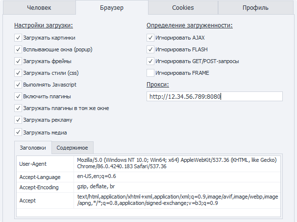

:::warning **При перегенерировании профиля эти настройки не сбрасываются**
:::

### Настройки загрузки
С помощью данных настроек можно отключить\включить загрузку и выполнение тех или иных компонентов веб-страницы. Это поможет увеличить скорость загрузки страницы и уменьшить потребление трафика.  

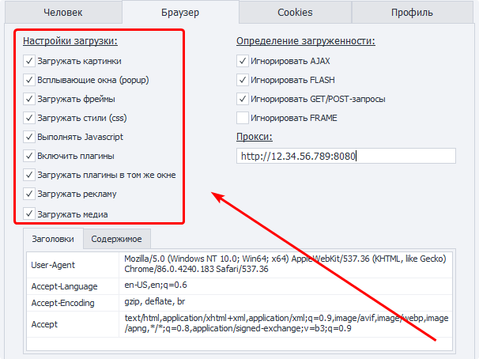 

:::warning **Может повлиять на работоспособность сайтов**
Особенно отключение JavaScript.
:::

#### Загружать картинки. 
Для некоторых сайтов работа проектов возможна без картинок. Их отключение значительно экономит трафик.

#### Всплывающие окна. 
Эта настройка запрещает открывать новые вкладки в браузере.  

> При включении этой настройки перестанут открываться ссылки, перебрасывающие на новую вкладку.

#### Загружать фреймы.  
Если отключено, элементы внутри фреймов (`iframe`) загружаться не будут.

#### Загружать стили.  
Этой опцией можно отключать CSS стили на странице. Данный метод поможет несколько уменьшить потребляемые ресурсы, но также может изменить верстку страницы и привести к ошибкам на ней. Используйте это отключение аккуратно.

#### Выполнять JavaScript. 
Если отключено, скрипты на странице выполняться не будут. Для большинства современных ресурсов это может сказаться на работоспособности функций сайта.

#### Включить плагины. 
Отключение или включение популярных когда-то браузерных плагинов Flash/Java/Silverlight. Поможет в работе со старыми сайтами, уменьшив нагрузку на ресурсы, и объем передаваемого трафика.

#### Загружать плагины в том же окне.
Опция позволяет делать скриншоты flash и других плагинов, если загружать в другом окне, вместо изображения плагина будет выводиться пустой квадрат.

#### Загружать рекламу. 
Оключает рекламные баннеры с целью экономии трафика.

#### Загружать медиа. 
Оключение/выключение медиа контента с HTML элементами:

```xml
<video></video>
```  
  
```xml
<audio></audio>
```  

И другими. Тоже помогает экономить трафик и ресурсы.

### Определение загруженности  
В данных настройках регулируется будет ли браузер игнорировать или ждать загрузки тех или иных компонентов (экшены не выполняются пока браузер ожидает загрузку).  

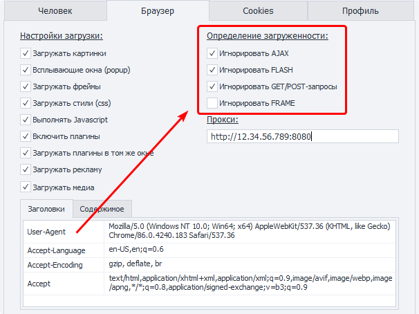

Например, современные ресурсы любят использовать AJAX и догружать данные уже после загрузки сайта. Отключив опцию **Игнорировать AJAX** ProjectMaker будет ждать завершения каждого такого запроса. Использовать данную опцию необходимо аккуратно, так как некоторые сайты <u data-renderer-mark="true">постоянно</u> отправляют AJAX запросы, что может парализовать работу шаблона!

Либо же браузер в течении долгого времени ждёт загрузки фрейма с контентом *упавшего* сайта. В результате тратится время и ресурсы на ожидание.

### Прокси
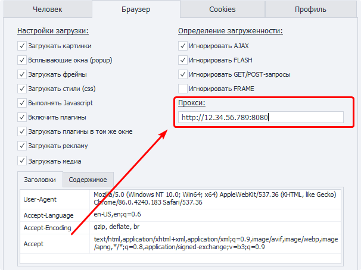

Тут можно указать прокси для данного профиля.  

| Формат с авторизацией      | Без авторизации |
| ----------- | ----------- |
| `protocol://username:password@ip:port`      | `protocol://ip:port`       |

> Если `protocol` не указан, то по умолчанию используется `http://`.

### Заголовки
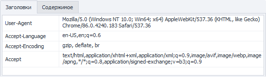

На этой вкладке отображены заголовки (Headers) браузера. Их значения можно менять прямо в этом окне. 

### Содержимое
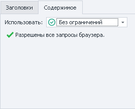

На данной вкладке можно регулировать какие адреса и домены браузер будет игнорировать, а какие загружать.  

:::warning Независимо от того включена *Запись* или нет.
После внесения изменений и нажатия ОК будет создан экшен **Политика содержимого** со всеми внесёнными данными.
:::
_______________________________________________
## Вкладка «Cookies»
:::info Добавлено в версии 7.2.1.1
:::

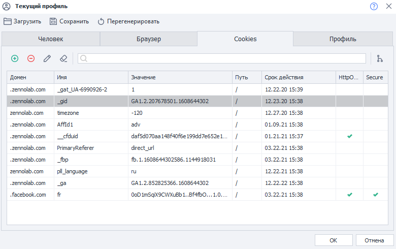

В данной вкладке отображаются все куки, которые есть у текущего профиля.

### Редактирование
Тут вы можете не только просматривать куки, но и редактировать их.

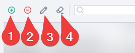

**1.** Добавить новую куку.  
**2.** Удалить выделенную.  
**3.** Редактировать.  
**4.** С помощью кнопки **Очистить** вы можете удалить сразу все куки.  

### Поиск
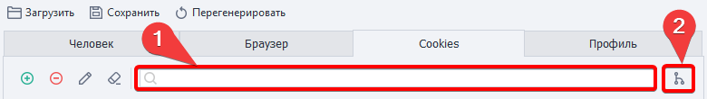

Можно отфильтровать отображаемые куки используя соответствующее поле **(1)**. Или сгруппировать их по домену **(2)**.

:::tip Эти инструменты можно комбинировать
:::
_______________________________________________
## Вкладка «Профиль»
В данной вкладке отображается подробная информация по сгенерированной личности (имя, фамилия, дата рождения, логин и т.д.), а также по браузеру и системе.

## Доступ к профилю через переменные
### Окно переменные
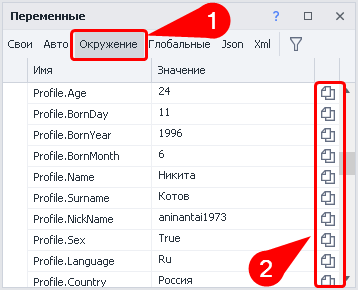

Список доступных для работы переменных можно найти в [Окне переменных](./Variables_Window) на вкладке **Окружение (1)**. Вам понадобятся те, которые начинаются с `Profile`. Там же можно сразу скопировать макрос переменной **(2)**.  

### Вручную
В любом поле, которое поддерживает макросы переменных (например, в действии [Оповещение](../Project-editor/Actions-in-ProjectMaker-Actions-Blocks/Logic/Notification_Log_Entry)) нажимаем комбинацию клавиш **CTRL** + **Пробел** и выбираем из выпадающего списка `Profile`.  

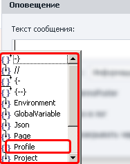

Затем ставим точку, чтобы увидеть ещё один выпадающий список со всеми переменными профиля. Сделайте двойной клик по необходимому полю и макрос автоматически вставится.  

| Выбор нужного поля     | Окончательный вид макроса |
| ----------- | :-----------: |
| 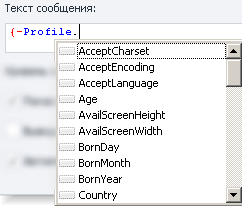      | 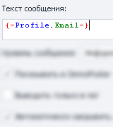       |

:::tip Есть несколько переменных, которые не отображаются на вкладке «Человек»
Но они есть в **Окне переменных** и их можно вставить вручную:  
- `{ -Profile.NickName- }` *(значение этого поля отличается от `{ -Profile.Login- }`)*  
- `{ -Profile.SecretQuestionAnswer1- }`  
- `{ -Profile.SecretQuestionAnswer2- }`
:::

### Пол профиля (`{ -Profile.Sex- }`)

Стоит обратить внимание на то, что пол профиля в ProjectMaker имеет логический тип (Boolean):
- **Мужской** — `True`
- **Женский** — `False` 
_______________________________________________
## Полезные ссылки
- [❗→ Профиль](/wiki/spaces/RU/pages/483426308 "/wiki/spaces/RU/pages/483426308")
- [❗→ Операции над профилем](/wiki/spaces/RU/pages/486539291 "/wiki/spaces/RU/pages/486539291")
- [❗→ Профиль (PM)](/wiki/spaces/RU/pages/735608848 "/wiki/spaces/RU/pages/735608848")
- [❗→ Окно переменных](/wiki/spaces/RU/pages/735608872 "/wiki/spaces/RU/pages/735608872")
- [❗→ Установки браузера](/wiki/spaces/RU/pages/489324572 "/wiki/spaces/RU/pages/489324572")
- [❗→ Использование профиль-папки](/wiki/spaces/RU/pages/1251475485 "/wiki/spaces/RU/pages/1251475485")
