---
sidebar_position: 7
title: "Окно трафика"
description: ""
date: "2025-07-19"
converted: true
originalFile: "Окно трафика.txt"
targetUrl: "https://zennolab.atlassian.net/wiki/spaces/RU/pages/735805465"
---
import DisclaimerNotice from '@site/src/components/DisclaimerNotice';

<DisclaimerNotice />

> 🔗 **[Оригинальная страница](https://zennolab.atlassian.net/wiki/spaces/RU/pages/735805465)** — Источник данного материала

_______________________________________________  
## Описание
В окно трафика попадают все запросы которые делает браузер ProjectMaker’а. 

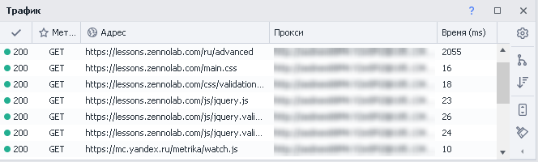

Сюда так же попадут и запросы сделанные с помощью экшенов:  
- [GET-запрос](../Project-editor/Actions-in-ProjectMaker-Actions-Blocks/Http/GET-request)  
- [POST-запрос](../Project-editor/Actions-in-ProjectMaker-Actions-Blocks/Http/POST-request)  
- [HTTP запросы](../Project-editor/Actions-in-ProjectMaker-Actions-Blocks/Http/HTTP-request)
_______________________________________________
## Принцип работы
### Включение
В верхнем меню ищем **Окно → выбираем Трафик**.

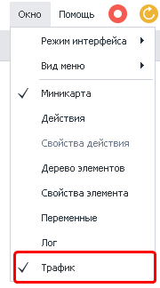

Что делать если окно не отображается

Бывают случаи, когда окно трафика не отображается, хоть возле него в настройках и стоит чекбокс (как показано на скриншоте выше), говорящий о том, что оно включено. Если после нескольких попыток включить окно, оно так и не появилось, то можно произвести общий сброс настроек окон в ProjectMaker. 

:::warning Эти действия приведут к сбросу настроек окон.
Если ранее вы настроили интерфейс программы под себя, расположив её окна удобным для вас способом, то все эти настройки будут удалены и будет установлено значение по умолчанию.
:::

Заходим в *Редактирование → Настройки → Отладка* → и в самом низу окна ищем кнопку *Сбросить панели*. После нажатия данной кнопки и перезагрузки ProjectMaker все настройки окон будут сброшены.  

Трафик при этом должен начать корректно отображаться (данный метод можно использовать и при проблемах с другими окнами программы).  

_______________________________________________
### Внешний вид окна
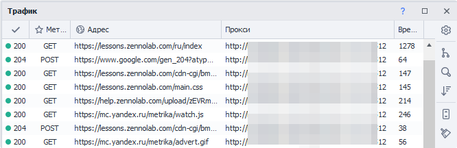

#### Содержит следующие колонки:

- Статус ответа (может быть 200, 403, 404, 407, 503 и др.)
- Метод запроса ([GET-запрос](../Project-editor/Actions-in-ProjectMaker-Actions-Blocks/Http/GET-request), [POST-запрос](../Project-editor/Actions-in-ProjectMaker-Actions-Blocks/Http/POST-request), [PUT, DELETE и др.](../Project-editor/Actions-in-ProjectMaker-Actions-Blocks/Http/HTTP-request))
- URL по которому был запрос
- [Прокси](../Project-editor/Actions-in-ProjectMaker-Actions-Blocks/Proxy_checker/Get_proxy) (если использовался)
- Время - в миллисекундах (ms), затраченное на запрос

| Список сделанных запросов |
| :--: |
| 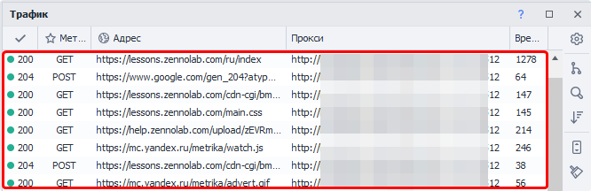 |

#### Настройки политики содержимого
Этот пункт описан ниже в статье.

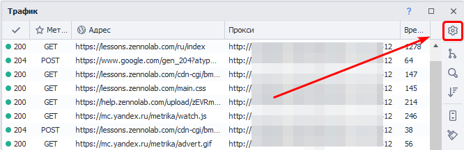

#### Сгруппировать по домену
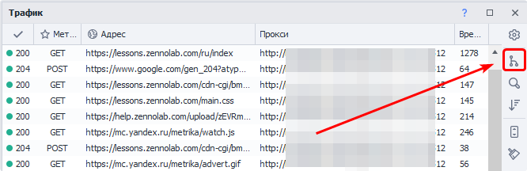

Для каждого домена будет создана вкладка с его запросами:

Для каждого поддомена создаётся собственная вкладка

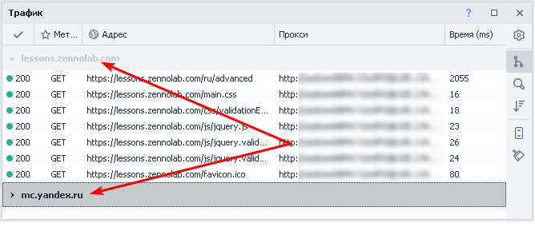

#### Панель поиска
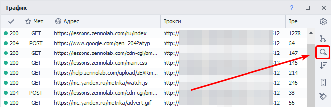

Можно использовать в паре с **Группировкой**.

На скриншоте показан пример поиска загруженных JavaScript файлов для домена http://yandex.ru

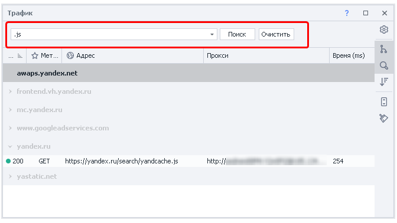

#### Сортировка по умолчанию
Если кликнуть по заголовку любой колонки, то запросы отсортируются в алфавитном порядке.  

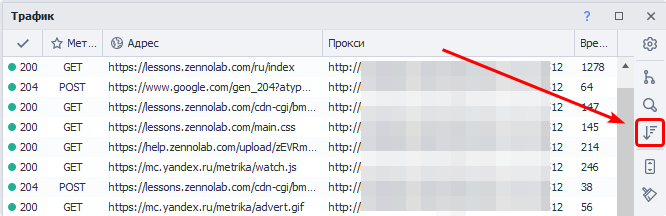

А опция **Сортировка по умолчанию** позволяет восстановить исходный порядок запросов - *по времени их отправки*.

#### Автопрокрутка
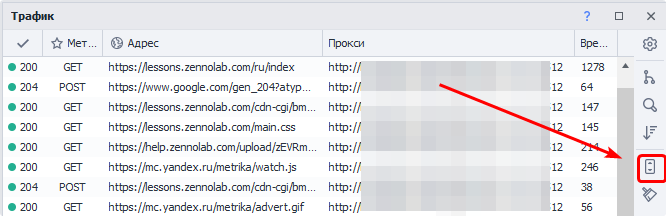

При активной данной опции окно трафика будет автоматически прокручиваться при поступлении новых запросов. Таким образом самый новый запрос всегда будет в поле зрения.

#### Очистка
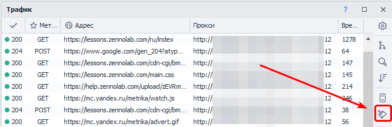

Удаляет все запросы из окна.

#### Включение/отключение колонок

Если кликнуть ПКМ по любому заголовку то появится контекстное меню в котором можно включить/выключить отображаемые колонки

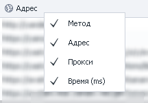
_______________________________________________
### Подробная информация о запросе
При двойном клике по любому запросу в окне трафика откроется подробная информация по данному запросу. Данное окно содержит четыре вкладки. Коротко пройдём по всем:

#### Заголовки
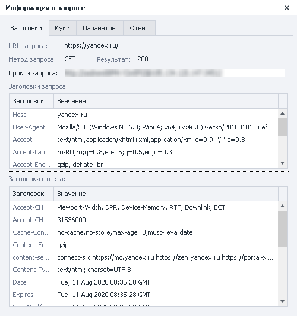

Эта вкладка содержит основную информацию по запросу:

- URL
- Метод
- Статус ответа
- Прокси (если использовался)
- Заголовки запроса и ответа

#### Куки
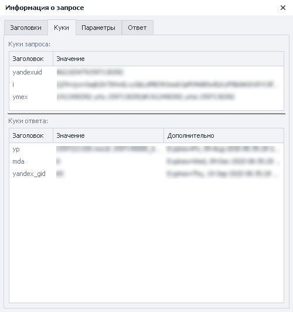

Отправленные и полученные куки

#### Параметры
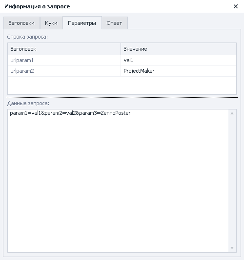

Параметры отправленные в запросе:

- **Строка запроса**.  
Тут отображаются параметры, которые отправлены как часть URL.  
> *На скриншоте — `https://httpbin.org/post?urlparam1=val1&urlparam2=ProjectMaker`*
- **Данные запроса**.  
Параметры отправленные в теле запроса.

#### Ответ
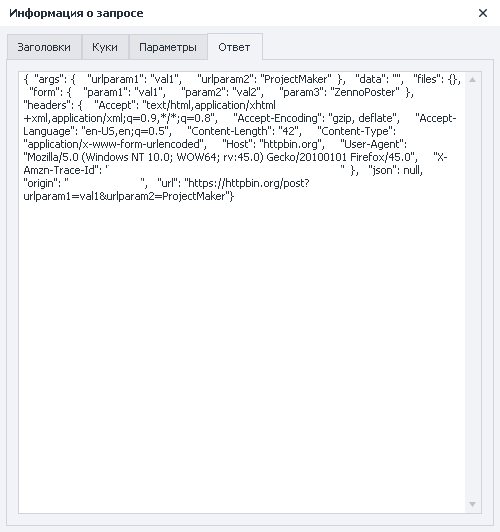

На скриншоте показан ответ сервера после **POST запроса** на https://httpbin.org/post.
_______________________________________________
### Для чего нужно видеть трафик?
- Анализ сделанных браузером запросов;
- Составление собственных запросов;
- Блокировка нежелательных запросов *(с использованием белых или черных списков)*.
_______________________________________________
## Контекстное меню запроса
Кликнув ПКМ по любому запросу в окне трафика появится контекстное меню с дополнительными возможностями.

### Копирование данных запроса
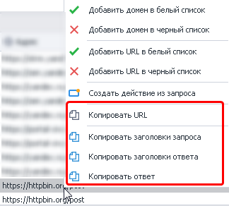

С лёгкостью можно скопировать URL запроса, заголовки (как запроса так и ответа) и ответ от сервера.

### Автоматическое создание запросов
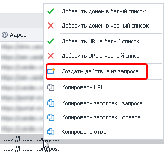

ProjectMaker автоматически создаст экшен с необходимым типом запроса. Подставит заголовки, параметры, прокси (если использовался). 

:::tip Рекомендуем вручную проверить данные, которые попали в экшен.
:::
_______________________________________________
## Белый и чёрный списки
С помощью **Политики содержимого** можно запрещать\разрешать PorjectMaker загружать определённые домены, URL.  

> Для этого так же можно использовать [Регулярные выражения](../Tools/Regular_Expression_Tester).

Существует три возможных состояния:  

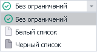  

- **Без ограничений** — будут загружены все адреса без исключений.
- **Белый список** — загружаться смогут *только те* домены и адреса, которые вы тут укажете.
- **Чёрный список** — доступ будет у всех адресов, *кроме тех*, что находятся в этом списке.

:::warning Одновременно можно использовать либо чёрный, либо белый список.
:::

#### Для чего это может понадобится?
ProjectMaker ожидает полной загрузки страницы перед выполнением любого экшена. Однако в некоторых случаях страница может находиться в состоянии бесконечной или чрезмерно долгой загрузки, из-за чего выполнение шаблона значительно замедляется.

Чаще всего причина заключается в попытке браузера загрузить скрипт со стороннего ресурса, который по тем или иным причинам недоступен. В таких ситуациях поможет **Политика содержимого**: добавьте адрес проблемного скрипта в **Чёрный список**. После этого браузер перестанет пытаться загружать данный ресурс, и он больше не будет влиять на скорость работы шаблона.
_______________________________________________
### Как это работает?
Существует несколько способов включения чёрного и белого списков.

#### Способ №1 *(самый простой)*
Клик **ПКМ в Окне трафика** по необходимому запросу. Затем добавление домена или адреса из этого запроса в один из списков.  

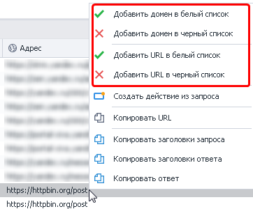

Если до этого в проекте не существовало экшена **Политика содержимого**, то он будет автоматически добавлен.

:::info Режим будет зависеть от того, в какой список вы добавили домен.
:::

Добавленные таким образом элементы затем можно отредактировать вручную в самом экшене.

#### Способ №2 *(через контекстное меню)*
| **Добавить действие → Браузер → Настройки** |
| :--: |
| 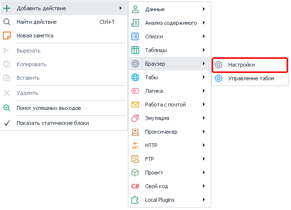 |

Затем в настройках экшена *(в выпадающем меню)* ищем **Политика содержимого**

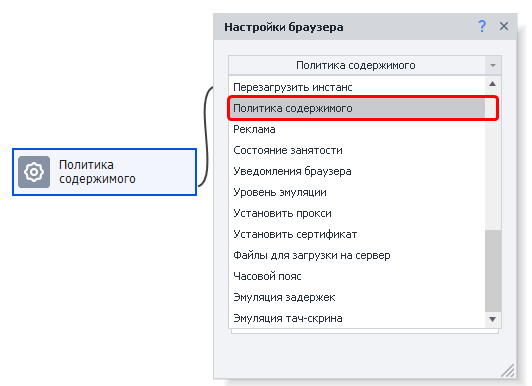

**1.** Выбор режима работы.  
**2.** Адрес для фильтрации (домен или регулярное выражение)  
**3.** Режим обработки для указанного адреса   
**4.** С помощью данной кнопки можно удалить условие  
*Альтернативный вариант: выделить нужное условие и нажать клавишу DELETE на клавиатуре*  

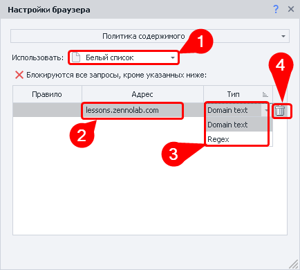

#### Способ №3 *(через [Окно профиля](./Profile_Window))*
**1.** Сначала кликаем по иконке **Профиль** в главном окне ProjectMaker  
**2.** Откроется окно **Текущий профиль** → в нём открываем вкладку **Браузер**  
**3.** В нижней части данной вкладки надо активировать **Содержимое**.  
Тут можно в ручном режиме добавить новые условия для фильтрации запросов.

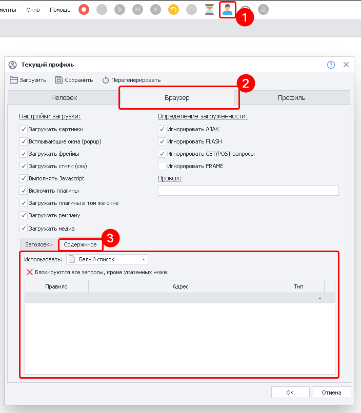
_______________________________________________
### Добавление нового правила
> Начиная с версии 7.1.6.0 в стандартной теме оформления *(Интерфейс - Light, Редактор - Modern2)* может быть не совсем очевидным, как добавлять новые правила в ручном режиме. Это касается как метода через профиль, так и через экшен.

Сразу после добавления экшена и выбора одного из режимов (Белый/Чёрный список) будет выделена верхняя строка.

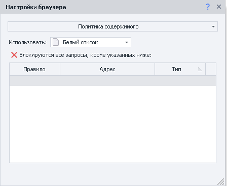

После добавления нового условия и выбора типа обработки курсор не переходит на новую строку, и не появляется кнопка **Добавить**.

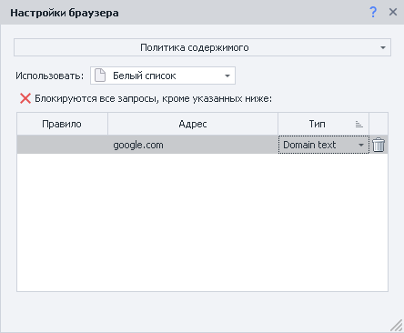

Поэтому для добавления следующего правила необходимо несколько раз кликнуть под только что добавленным условием.

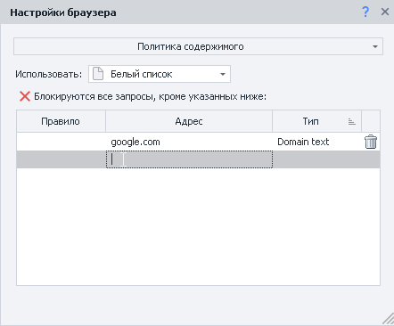

| Вот так это работает наглядно |
| :--: |
| 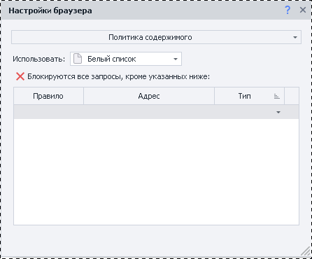|
_______________________________________________
## Пример использования
> Рассмотрим пример на основе форума https://zennolab.com/discussion/

Открыв окно трафика и совершив переход по вышеуказанному URL, вы увидите большое количество запросов, которые делает браузер. Например, к VK, Facebook, Yandex, Google, CloudFlare и другим ресурсам. 

| 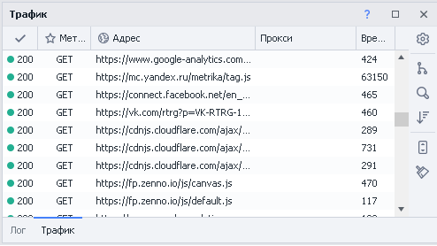 |
| :--: |
| Здесь отображена лишь малая часть запросов. |

Представим, что вы хотите запретить запросы к VK, Facebook и Yandex. Дополнительно вам требуется запретить загрузку адресов в которых встречается слово `analytics` *(в любом месте URL'а)*.  

Вот как может выглядеть экшен **Политика содержимого** для выполнения вышепоставленных задач:

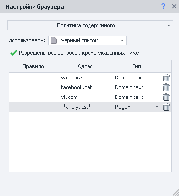

А вот так будет выглядеть **Окно трафика** после применения правил со скриншота выше и повторного захода на https://zennolab.com/discussion/

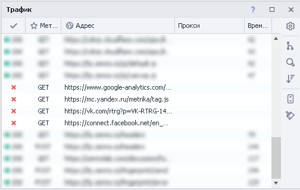
_______________________________________________
## Полезные ссылки
- [❗→ GET-запрос](/wiki/spaces/RU/pages/534315165 "/wiki/spaces/RU/pages/534315165")
- [❗→ POST-запрос](/wiki/spaces/RU/pages/534315180 "/wiki/spaces/RU/pages/534315180")
- [❗→ HTTP запросы](/wiki/spaces/RU/pages/489259052 "/wiki/spaces/RU/pages/489259052")
- [❗→ Тестер регулярных выражений](/wiki/spaces/RU/pages/534086111 "/wiki/spaces/RU/pages/534086111")
- [❗→ Инструменты web-разработчика (DevTools)](/wiki/spaces/RU/pages/1331134465 "/wiki/spaces/RU/pages/1331134465")