---
sidebar_position: 3
title: "Окно переменных"
description: ""
date: "2025-07-19"
converted: true
originalFile: "Окно переменных.txt"
targetUrl: "https://zennolab.atlassian.net/wiki/spaces/RU/pages/735608872"
---
import DisclaimerNotice from '@site/src/components/DisclaimerNotice';

<DisclaimerNotice />

> 🔗 **[Оригинальная страница](https://zennolab.atlassian.net/wiki/spaces/RU/pages/735608872)** — Источник данного материала

_______________________________________________  
## Описание

Окно переменных служит для создания, удаления, переименования переменных проекта и редактирования их значений. По сути это окно представляет собой таблицу с возможностью редактирования и сортировки переменных.

:::tip Данное окно удобно использовать при отладке.
Во время выполнения проекта можно изменять значения переменных с помощью экшена **Обработка переменных**.
:::

### Для чего это используется?

- Различные манипуляции с переменными.
- Отслеживание изменений происходящих с переменными в процессе отладки проекта.

### Как открыть окно?

- Один из способов открыть **Окно переменных** - это нажать на соответствующую кнопку в [панели статических блоков](../Project-editor/Static_blocks/General_Principles_of_Operation).

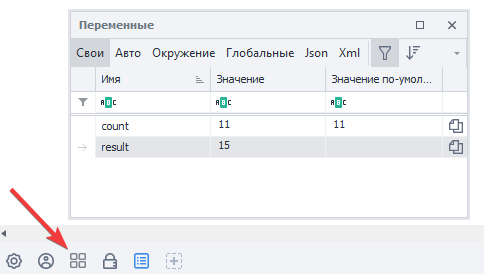

:::warning Если вы не видите панель статических блоков
То кликните правой клавишей мыши на пустом пространстве рабочего окна и установите чекбокс **Показать статические блоки** в контекстном меню.
:::

- Второй способ - через меню **Окно → Переменные**.

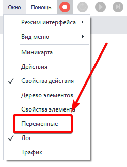
_______________________________________________ 
## Элементы управления
> Рассмотрим каждый элемент окна переменных:

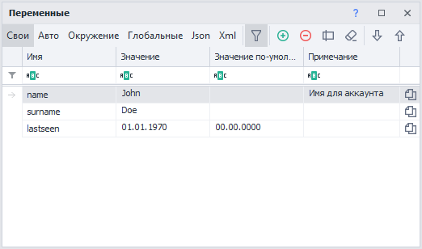

### Типы переменных
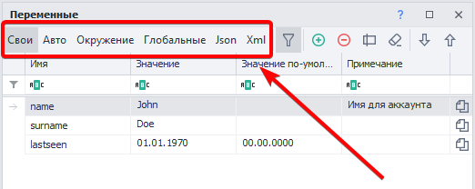

По сути это таб переключающий отображение выбранного типа переменных. Имеет шесть вариантов: 

#### **Свои**
Это переменные, которые пользователь сам создаёт в процессе написания шаблона. Переменные должны быть обязательно на английском языке. Не допускается использование пробелов и других символов, кроме символа нижнего подчеркивания `_`. В названии переменной разрешается использование цифр, но не в начале слова.

#### **Авто**
Такие переменные генерируются автоматически в режиме записи проекта, а также при добавлении некоторых экшенов. Например, при добавлении кубика [Взятие значения](../Project-editor/Actions-in-ProjectMaker-Actions-Blocks/Tabs/Getting_Value).  

Автосгенерированные переменные имеют примерно такие названия - `Variable1`, `RecognitionResult0`. Однако вы всегда можете переместить их в **Свои** и там уже задать им любое желаемое имя.  

Как переместить автоматически созданную переменную в Свои?

Для этого надо перейти во вкладку **Авто**, выделить переменную и нажать кнопку **Переместить в Свои**:

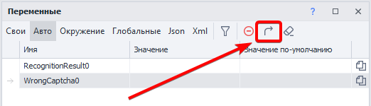

:::tip После перемещения переменной её можно переименовать, дав более понятное имя.
:::

#### Окружение
В этом табе отображаются переменные окружения проекта: различные параметры страницы инстанса (URL, DOM, текст, домен, текст нотификаций и алертов и т. д.), переменные времени и даты, переменные проекта (имя, папка, правила прокси, id последней ошибки и т. д.) , многочисленные переменные профиля (почта, пол, имя, юзерагент и т. д.)

:::info [Переменные окружения](../Recording-and-creating-projects/General-information/ZennoPoster_Environment_Variables)
В этой статье можно ознакомиться с полным списком доступных переменных окружения.
:::

#### Глобальные
Обычные переменные видны только в пределах одного потока проекта (если проект работает в многопоточном режиме, то каждый поток будет иметь свою локальную, независимую переменную)

Глобальные же переменные **доступны для всех проектов и их потоков** в ZennoPoster. 

Для того, чтобы избежать путаницы у глобальных переменных есть дополнительное свойство - **Пространство имён**.

:::warning У ProjectMaker и ZennoPoster раздельные глобальные переменные.
Иными словами изменения внесённые в глобальную переменную в PM не будут видны в ZP, и наоборот.
:::

#### Json
Эти переменные также генерируются автоматически, но в процессе парсинга JSON.  

В режиме *Парсинг* у экшена [Обработка JSON/XML](../Project-editor/Actions-in-ProjectMaker-Actions-Blocks/Data/JSON_and_XML_Processing) можно из JSON текста сразу разложить значения по автоматически созданным переменным с соответствующими узлами.

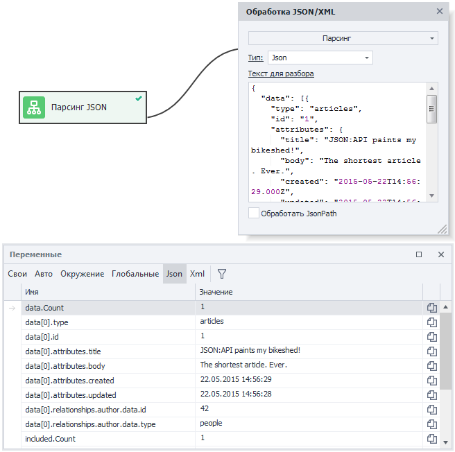

Далее в проекте можно использовать эти переменные через префикс `{ -Json….- }`.  
Либо в [C#](../Project-editor/Actions-in-ProjectMaker-Actions-Blocks/Custom_code/CSharp_Code) посредством объекта `project.Json;` 

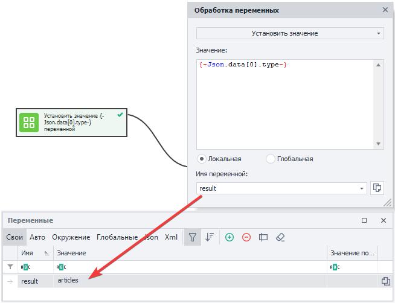

#### Xml
Переменные XML автоматически создаются в соответствующем табе после парсинга XML документа. В режиме **Парсинг** у экшена [Обработка JSON/XML](../Project-editor/Actions-in-ProjectMaker-Actions-Blocks/Data/JSON_and_XML_Processing) разбираем XML, который, в свою очередь, тоже может находиться в переменной.

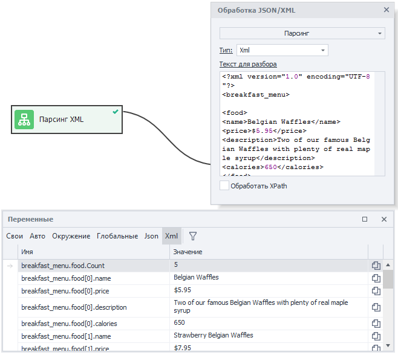

Как и в случае с JSON, переменные XML можно использовать через префикс `{ -XML….- }`.  
Либо в [C#](../Project-editor/Actions-in-ProjectMaker-Actions-Blocks/Custom_code/CSharp_Code) через свойства объекта `project.XML`;

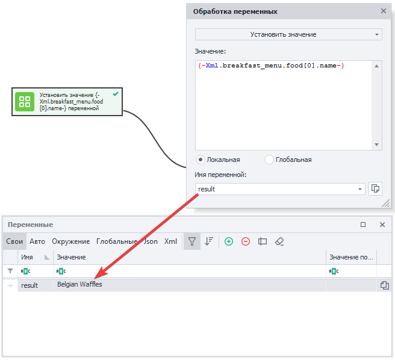

### Фильтр
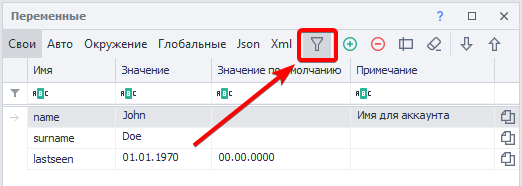

Открывает и закрывает поле фильтрации

#### Поле фильтрации
Если проект имеет большое количество переменных, то поиск нужной переменной может занимать много времени. Поэтому в окне переменных предусмотрена многофункциональная фильтрация. Каждый столбец можно отфильтровать по разному одним из 12-ти способов. 

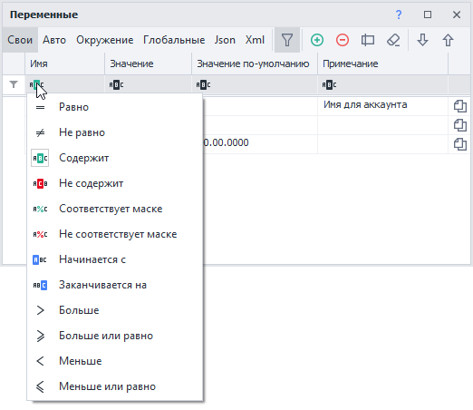

:::info Подробнее о фильтрах можно почитать в статье [Окно лога](./Log_Window).
:::

### Очистка сортировки
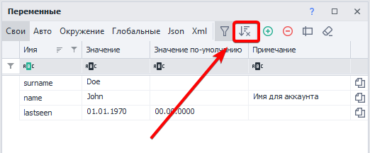

Сбрасывает отсортированные переменные.

:::info Кнопка отображается только в том случае, если переменные отсортированы по одной из колонок.
:::

### Добавить
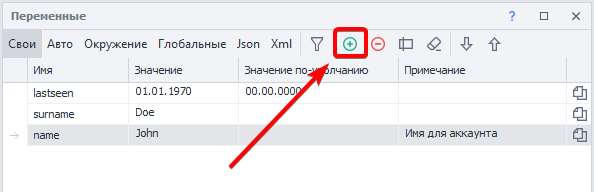

Открывает диалоговое окно в которое можно ввести имя создаваемой переменной. 

:::info Имя переменной может состоять из букв латинского алфавита
А также цифр и символа нижнего подчёркивания. Но **обязательно должно начинаться с буквы**.
:::

### Удалить
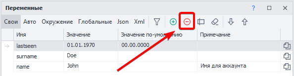

Удаляет выделенную переменную, предварительно выведя подтверждающее окно. Чтобы выделить переменную достаточно кликнуть по любому месту в строке этой переменной.

### Переименовать  
:::tip Быстрый доступ к переименованию
Двойной клик по строке переменной в области столбца **Имя**.
:::

Выводит диалоговое окно с возможностью отредактировать имя переменной.  

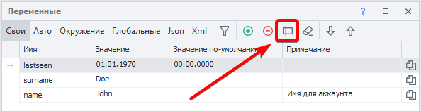

Переименование доступно только для типов **Свои** и **Глобальные**.

:::warning **Имя переменной изменится во всех экшенах, где она используется**
:::

### Очистка неиспользуемых переменных
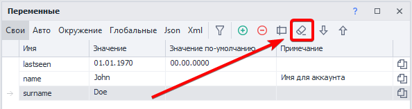

Часто в больших проектах создаются переменные, которые позднее никак не участвуют в работе шаблона. Чтобы не занимать место в памяти и визуально не занимать ценное рабочее пространство, можно периодически удалять такие переменные. ZennoPoster найдёт все неиспользуемые переменные и выведет их список с предложением удалить их. Каждую очистку необходимо делать для каждого типа переменных.

### Ручная сортировка переменных (Drag & Drop)
:::info Добавлено в ZennoPoster 7.2.1.0
:::

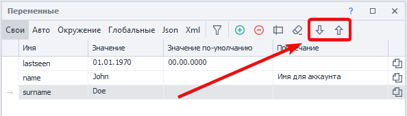

Вы можете расположить переменные так как вам удобно с помощью кнопок **Вверх** и **Вниз**, либо с помощью мыши (Drag & Drop).  

Свой порядок работает тогда, когда выключена *сортировка по столбцам* (для этого нажмите на кнопку **Очистка сортировки**).

Пример

:::tip Для сброса ручной расстановки переменные можно отсортировать по одному из столбцов.
:::
_______________________________________________
### Заголовки столбцов
Одновременно служат как для фильтрации переменных, так и для сортировки. Достаточно кликнуть по заголовку столбца и произойдёт сортировка как по возрастанию имени переменной, так и по убыванию, как по возрастанию значения переменной, так и по убыванию. Повторный клик меняет направление сортировки.

Кликнув ПКМ по заголовку любого столбца появится меню в котором можно выбрать отображаемые колонки.

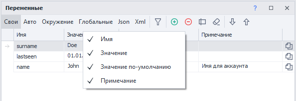

#### Колонка «Имя»
:::info Если дважды кликнуть по имени переменной
То появится диалоговое окно для переименования.
:::

Здесь отображаются имена переменных используемых в проекте

:::warning **Имена переменных регистрозависимы**
`Name`, `NAME`, `name` - три разных переменных.
:::

#### Колонка «Значение»
Выводит текущие значения переменных. Кликнув по значению выбранной переменной можно прямо в поле ввода отредактировать данные.

#### Колонка «Значение по-умолчанию»
Если требуется, чтобы при запуске проекта переменная уже имела какое-то значение *(при старте проекта все переменные пустые)*, то необходимо ввести его в это поле. 

:::info Переменные окружения, Json и Xml не имеют значений по умолчанию.
:::

#### Колонка «Примечание»
> По умолчанию данная колонка скрыта. 

Можно использовать для пометок к переменным. Например, тут можно указать для какой цели используется переменная.

:::info У глобальных переменных есть дополнительный столбец с пространством имён.
:::
_______________________________________________
### Скопировать макрос переменной в буфер обмена
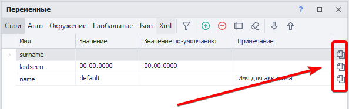

Быстрый способ скопировать макрос типа 
`{ -Variable.value- }` кликнуть по такой иконке в строке переменной.

### Контекстное меню
:::info Доступно для вкладок *Свои*, *Авто* и *Глобальные*.
:::
Кликнув **ПКМ напротив переменной** появится контекстное меню.

| Вкладки *Свои* и *Глобальные*  | Вкладка *Авто* |
| ----------- | ----------- |
| 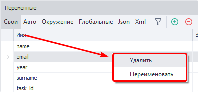     | 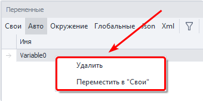      |

_______________________________________________
## Копирование переменных в другой проект
Нередко требуется создать новый проект используя переменные из старого шаблона. Копировать их по одной - крайне неэффективное занятие. Поэтому есть возможность скопировать сразу все переменные одного проекта и вставить их в другом.

- Откройте старый проект.
- Кликните правой клавишей мыши на кнопке **Переменные проекта** в [**Панели Статических блоков**](../Project-editor/Static_blocks/General_Principles_of_Operation) и нажмите **Скопировать переменные**.

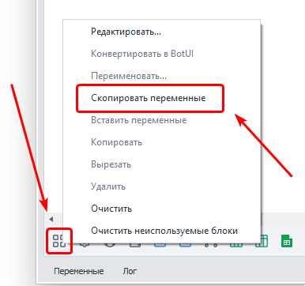

- Затем откройте новый проект и опять кликните **ПКМ → Переменные проекта** в [**Панели Статических блоков**](../Project-editor/Static_blocks/General_Principles_of_Operation) и нажмите **Вставить переменные**.

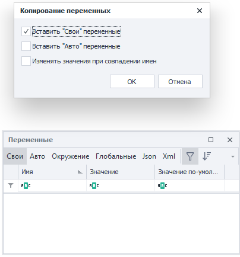

- В появившемся окне выберите чекбоксами переменные, какого типа нужно вставить в проект, и подтвердите их вставку.  
:::info Переменные копируются вместе с их значениями по умолчанию.
:::
_______________________________________________
## Работа с переменными
### Макросы переменных
В ProjectMaker можно использовать переменные посредством макросов, которые имеют вид `{ -Variable.myVariable- }`. Указанный макрос при исполнении проекта передаст значение переменной `myVariable`. Достаточно вставить макрос переменной в любое поле свойств экшена (там где это возможно) и при исполнении экшена в поле подставится значение соответствующей переменной.

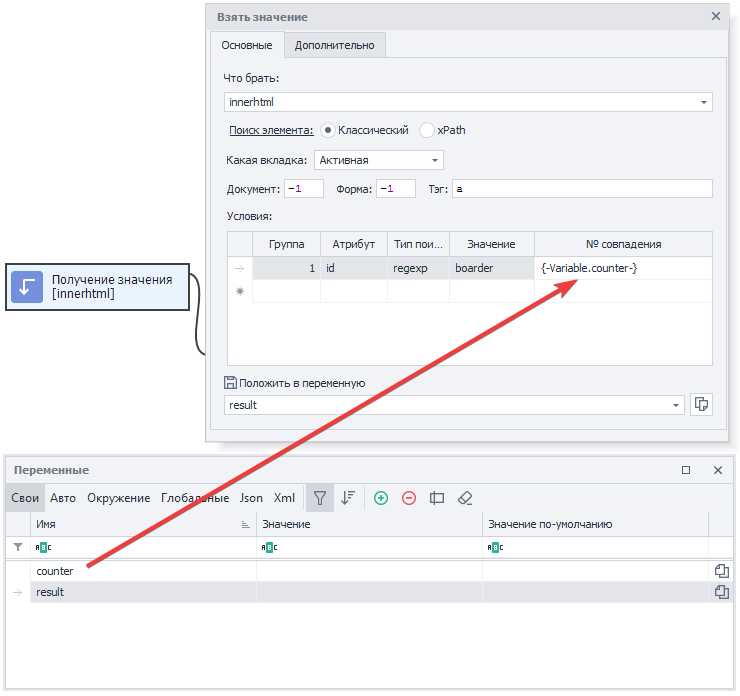

У глобальных переменных нужно указать в макросе область видимости - `{ -GlobalVariable.someNamespace.text- }`

Операции с переменными с помощью C# и JS экшенов

В основном переменные в ZennoPoster бывают трёх типов:

- **Числовые** (
`0, 1, 12.652, 10500`).
- **Текстовые** (`"Hello World"`, `"
Hello World
"`).
- **Логические** (`True`, `False`).

Производить различные операции с переменными можно как в кубике **C#**, так и в кубике **JavaScript**, но нужно иметь в виду, что в **C#** все переменные попадают в текстовом виде и, чтобы их конвертировать в числа или в логические переменные, потребуется конвертация или приведение в нужный тип. 

Например, вот так выглядит приведение строковых переменных в **C#** к целочисленному (**int**) типу двумя разными способами, сложение их и возврат в строковую переменную для дальнейшего использования в проекте:

Для операций со строками в кубике **JavaScript** необходимо текстовые переменные обернуть в кавычки - `'{ -Variable.value1- }'`

### Рекомендации по именованию переменных
Старайтесь давать переменным названия по которым сразу становится понятна задача и область применения переменной. Не нужно называть переменные короткими и бессмысленными именами - 
`f1`, `qwerty` - этим вы значительно усложните исправление и поддержку проекта как для себя, так и для других разработчиков, которые будут иметь доступ к шаблону. 
Если переменная часто используется в проекте, то желательно назвать её коротко, но понятно - `counter`, `username`, `proxy`. 
Для названий имеющих в основе два и более слова старайтесь разделять их либо заглавной буквой (`secondPassword`), либо символом нижнего подчеркивания (`page_html`). 

Это общепринятые практики, которые значительно улучшат читабельность и эффективность работы с вашим проектом. 

### Присвоение значения
Простейший пример использования переменных заключается в комбинации статического текста, своих переменных и переменных окружения с помощью экшена [Обработка переменных](../Project-editor/Actions-in-ProjectMaker-Actions-Blocks/Data/Variable_Processing).

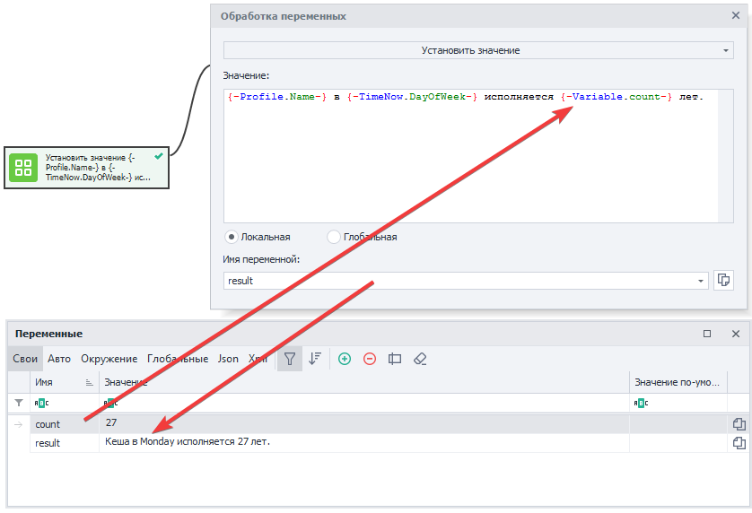

В данном примере имя берется из переменной окружения `{ -Profile.Name- }`, день недели из `{ -TimeNow.DayOfWeek- }`, а возраст из своей переменной `count`. После запуска кубика результат сохраняется в переменной `result`.

### Арифметические операции над числами

Используя синтаксис языка JavaScript и соответствующий кубик можно производить различные математические операции над числами.

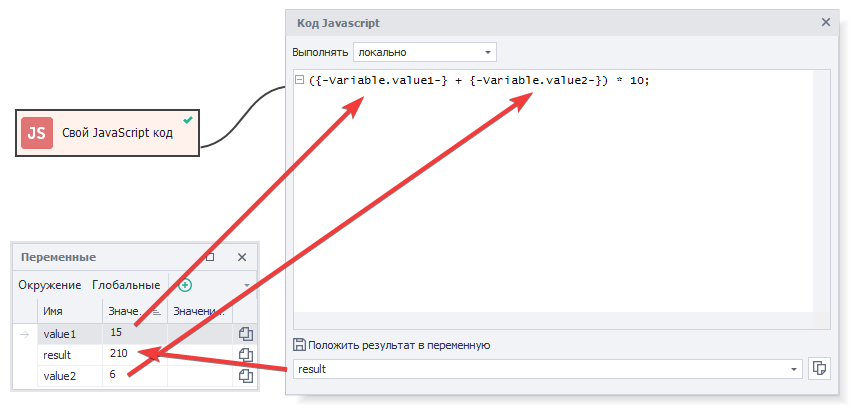

В данном случае в переменных `value1` и `value2` находятся целые числа, которые нужно сложить и потом умножить на 10. Результат вычислений попадает в переменную `result`.

### Использование переменных

Старайтесь использовать переменные вместо жёстко прописанного текста в тех местах, где значение может когда-то измениться.

В качестве примера можно привести пути файлов - на Вашем компьютере путь один, а у клиента он другой. Если необходимый файл находится в одной директории с проектом (или в одной из его поддиректорий) то хорошим решением будет использовать макрос `{ -Project.Directory- }` - путь к директории где сохранён шаблон. Вот как может выглядеть путь - `{ -Project.Directory- }file.txt`

  

## Полезные ссылки

- [❗→ Работа с переменными](/wiki/spaces/RU/pages/486309922 "/wiki/spaces/RU/pages/486309922")
- [❗→ Обработка JSON и XML](/wiki/spaces/RU/pages/488964124 "/wiki/spaces/RU/pages/488964124")