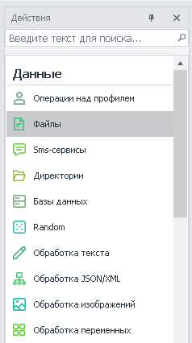
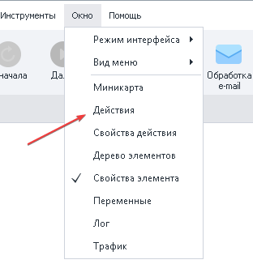
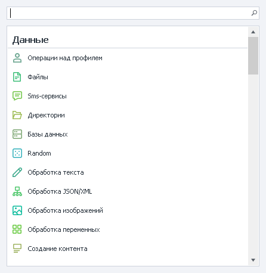
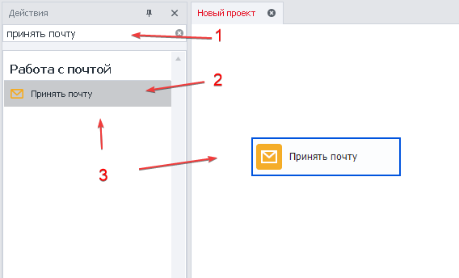
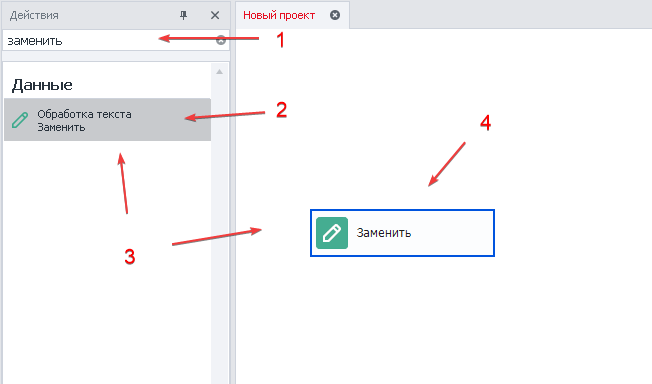
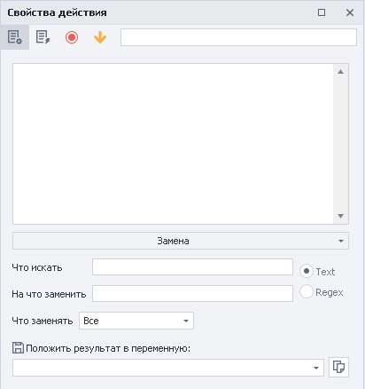
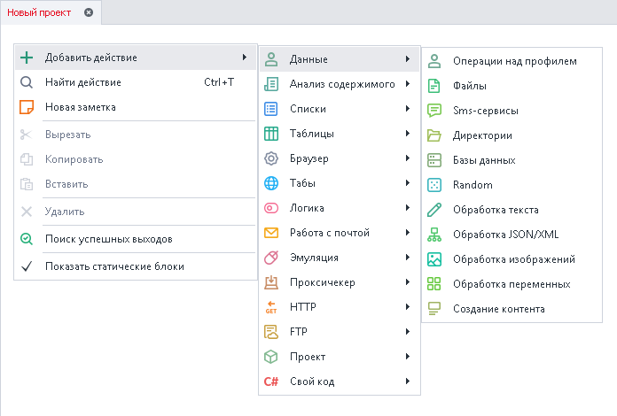

---
sidebar_position: 1
title: "Окно действий"
description: ""
date: "2025-07-19"
converted: true
originalFile: "Окно действий.txt"
targetUrl: "https://zennolab.atlassian.net/wiki/spaces/RU/pages/727777324"
---
:::info **Пожалуйста, ознакомьтесь с [*Правилами использования материалов на данном ресурсе*](../Disclaimer).**
:::

> 🔗 **[Оригинальная страница](https://zennolab.atlassian.net/wiki/spaces/RU/pages/727777324)** — Источник данного материала

_______________________________________________  
# Окно действий

## Описание

Окно навигации позволяющее быстро найти и добавить в проект экшен по названию или функции.

## Как открыть окно в ProjectMaker ?

### Способ 1 :

### Способ 2 :

Вызвать всплывающее окно нажав горячую комбинацию клавиш **Ctrl + T**

## Для чего это используется?

- Поиск экшена по функции или названию
- Добавление действия в проект с выбранной функцией
- Быстрый перенос действий двойным кликом

## Как работать с окном действий?

:::info Информация
При активном окне нажатие комбинации клавиш Ctrl + T установит курсор в строке поиска
:::

### Поиск по названию экшена и добавление в проект.

1. В строке поиска указываем название.
2. Из предложенных вариантов выбираем необходимый экшен.
3. Двойным нажатием левой кнопки мыши или курсором переносим кубик в проект.

:::info Информация
Умный поиск понимает альтернативные названия. пример. - регулярка
:::

  

### Поиск экшена по названию функции и добавление в проект.

1. В строку поиска вносим название.
2. Из предложенных вариантов выбираем необходимый экшен с функцией.
3. Двойным нажатием левой кнопки мыши или зажатым курсором переносим кубик в проект.
4. В проекте появляется кубик с конкретной функцией.

:::info Информация
Действие создаётся сразу с выбранной функцией
:::

  

### Альтернативный способ добавления экшенов.

Открыв [❗→ контекстное меню](/wiki/spaces/RU/pages/486342706 "/wiki/spaces/RU/pages/486342706") правой кнопкой мыши в любой части окна проекта.

  

## Пример использования

Окно позволит быстро находить и добавлять экшены в проект. Если забыли где находится необходимая функция просто введите её в поиске. Таким образом сокращается время на написание проекта.

Окно действий содержит в себе весь огромный функционал программы, это более сотни функций.
Введите ключевые слова для поиска нужной функции:

**📹 Здесь было видео**

Справку по доступным действиям можно найти тут: [❗→ Действия](/wiki/spaces/RU/pages/486342706 "/wiki/spaces/RU/pages/486342706")

## Полезные ссылки

1. [❗→ Действия в ProjectMaker ("Экшены", "Кубики")](https://zennolab.atlassian.net/wiki/spaces/RU/pages/486342706/ProjectMaker "https://zennolab.atlassian.net/wiki/spaces/RU/pages/486342706/ProjectMaker")
2. [❗→ Преимущества интерфейса ProjectMaker 7](https://zennolab.atlassian.net/wiki/spaces/RU/pages/506200090/ProjectMaker+7 "https://zennolab.atlassian.net/wiki/spaces/RU/pages/506200090/ProjectMaker+7")