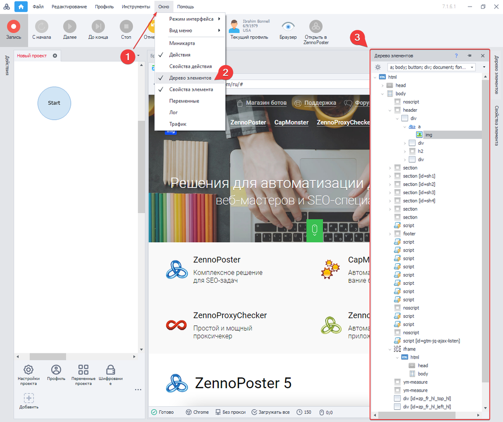
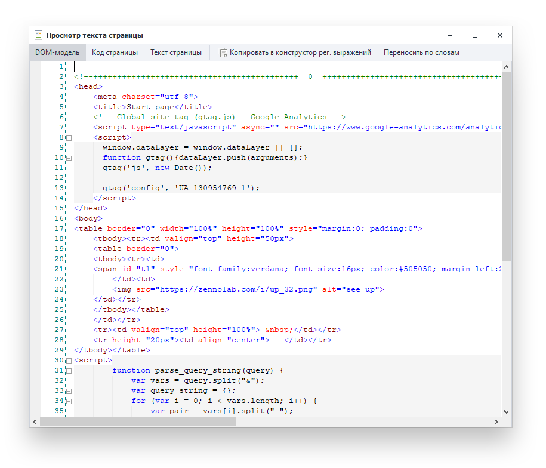

:::info **Пожалуйста, ознакомьтесь с [*Правилами использования материалов на данном ресурсе*](../Disclaimer).**
:::

> 🔗 **[Оригинальная страница](https://zennolab.atlassian.net/wiki/spaces/RU/pages/727777355)** — Источник данного материала

_______________________________________________  
# Окно дерева элементов

Инструмент для визуального анализа HTML кода страницы.

**Кратко о построение страницы**

При запросе страницы сайта, браузер (от англ. browser, веб-обозреватель) в ответ получает исходный HTML-код, но перед началом отрисовки графики, предшествует этап анализа кода и его построение в виде дерева узлов (**render tree**). В рамках браузерного проекта, со структурой HTML, работать приходится постоянно. Для лучшего удобства, в программу ZennoPoster, входит дополнение для визуального анализа дерева элементов.

## Открыть окно в программе

Чтобы вызвать данное окно в программе ProjectMaker, необходимо, в верхнем меню нажать:

Главное меню: “***Окно***” → “***Дерево элементов***“

|  |
| :--: |
| Дерево элементов ZennoPoster |

С его помощью, можно перемещаться по элементам страницы, а в браузере, можно наглядно видеть выделенный объект.

## Фильтр дерева элементов
В окне дерева элементов, можно настроить вывод определенных тегов, освободив себя, тем самым от лишних элементов, что упростит анализ документа и в разы сократит время поиска нужного вам тега.

|  |
| :--: |
| Фильтр окна дерево элементов |

Дополнительно на панели окна, располагаются кнопки:

|  |
| :--: |
| Интерфейс окна дерево элементов |

- **Показать только важные элементы** - автоматически оставит только (важные) часто используемые теги.
- **Добавить или удалить теги** - по умолчанию в программу добавлены часто используемые элементы, но вы можете управлять их списком самостоятельно.

|  |
| :--: |
| Добавить теги в панель дерево элементов |

## Работа с объектом страницы

|  |
| :--: |
| Работа с объектом страницы |

Правой кнопкой мыши (ПКМ) на выбранном элементе, вызвав контекстное меню, можно выбрать раздел для дальнейшей работы с элементом, как с объектом.

- **Исследователь элемент** - вызывает окно “[❗→ Свойства элемента](/wiki/spaces/RU/pages/735608879 "/wiki/spaces/RU/pages/735608879")”, для более детального анализа свойств, у выбранного вами элемента.
- **В конструктор действий** - [❗→ инструмент](/wiki/spaces/RU/pages/483426337 "/wiki/spaces/RU/pages/483426337"), позволяет тонко настроить методы поиска элемента, одновременно тестируя действия над ним.
- **Поиск по XPath** - автоматически строит путь до элемента, в представление XML Path Language, для последующей работы в конструкторе действий.
- **Парсить данные** - [❗→ инструмент](/wiki/spaces/RU/pages/534053279 "/wiki/spaces/RU/pages/534053279"), позволяет с минимальным количеством кликов, настроить условия сбора данных, с предварительным выводом результата, в том же окне.
- **Это каптча** - добавляет в проект [❗→ модуль ввода каптчи в ручную](/wiki/spaces/RU/pages/534053215 "/wiki/spaces/RU/pages/534053215").
- **Поиск по картинке** - [❗→ инструмент](/wiki/spaces/RU/pages/492044304 "/wiki/spaces/RU/pages/492044304"), для определенных действий мышью над выбранным участком.

## Дополнительные инструменты для работы с исходным кодом страницы

Свойства элемента

[❗→ Панель для анализа атрибутов HTML элемента](/wiki/spaces/RU/pages/735608879 "/wiki/spaces/RU/pages/735608879")

|  |
| :--: |
| Панель свойства элемента |

### **Открыть окно “Свойства элемента”**

“Окно” → “Свойства элемента“

Просмотр исходного кода, DOM и текста страницы

Инструмент, для анализа: DOM-модели документа, исходного HTML-код, текстового содержимого страницы.

|  |
| :--: |
| Просмотр исходного кода, DOM и текста страницы |

### **Открыть окно “Просмотра текста страницы”**

“*Браузер” → “*Просмотр исходного кода, DOM и текста страницы“

|  |
| :--: |
| Кнопка просмотр исходного кода, DOM и текста страницы |

### **Область применения**

Помимо анализа исходного кода текущей страницы, можно настроить поиск по регулярному выражению, для этого, необходимо нажать “[❗→ Копировать в конструктор рег. выражений](/wiki/spaces/RU/pages/534086111 "/wiki/spaces/RU/pages/534086111")” и содержимое документа, поместиться в область “Текст для обработки”, для дальнейшего создания /тестирования регулярного выражения.

Инструмент веб-разработчика

Developer tools или сокращённо — DevTools, набор инструментов помогает тестировать, отлаживать, профилировать, проверять код на соответствие тем или иным стандартам и многое другое.

Инструмент веб-разработчика, активен только при работе с браузером Google Chrome.

|  |
| :--: |
| Developer tools от ZennoChromium |

### **Открыть окно “Инструмент веб-разработчика”**

“*Браузер” → “*Инструменты web-разработчика для активной вкладки“

Данная кнопка на панели, активна только при работе с браузером Google Chrome.

|  |
| :--: |
| Инструменты web-разработчика для активной вкладки |

