---
sidebar_position: 4
title: "Окно лога"
description: ""
date: "2025-07-19"
converted: true
originalFile: "Окно лога.txt"
targetUrl: "https://zennolab.atlassian.net/wiki/spaces/RU/pages/725352532"
---
:::info **Пожалуйста, ознакомьтесь с [*Правилами использования материалов на данном ресурсе*](../Disclaimer).**
:::

> 🔗 **[Оригинальная страница](https://zennolab.atlassian.net/wiki/spaces/RU/pages/725352532)** — Источник данного материала

_______________________________________________  
# Окно лога

## Описание

Лог служит для вывода сообщений пользователю. Сообщение может иметь один из трёх типов:

- информационное (“Начинаем работу”, “Приступаем к регистрации”, “Успешно создали аккаунт” и т.п.)
- предупреждающее (любые некритические ошибки в работе шаблона)
- ошибочное (когда нужно сообщить пользователю, что произошла серьёзная ошибка в работе, на которую надо обратить внимание).

Помимо прочего эти три вида сообщений отличаются иконками:

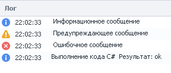


Так же, начиная с ZennoPoster 7.2.1.0, сообщениям можно задавать цвет фона

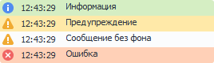


Сообщения в лог выводятся с помощью экшена [❗→ *Оповещение](https://zennolab.atlassian.net/wiki/spaces/RU/pages/534053050/Notification "https://zennolab.atlassian.net/wiki/spaces/RU/pages/534053050/Notification").

  

## Для чего используется?

Представим, что Вы создали шаблон, одно выполнение которого занимает около 8 минут. Вы вообще не используете лог. Вы запустили шаблон и он отлично отрабатывает одно выполнение, два, три, пять, десять. Но на 11-ом выполнении шаблон “зависает” - не завершается с успехом , но и не выходит с ошибкой и так 10, 20, 30 минут. В такой ситуации приходится принудительно завершать программу и перезапускать шаблон, надеясь что данная ситуация никогда не повторится.

С другой стороны можно добавить в шаблон вывод сообщений в лог, чтоб наглядно видеть на каком этапе сейчас находится выполнение. И если шаблон где-то зависнет, то по логу мы сможем понять в каком, примерно, месте ошибка. 

Если Вам кажется, что сообщений в лог ZennoPoster пишется слишком много, а удалять полностью экшены не хотелось бы, то можно сделать так, чтоб они отображались только в ProjectMaker. Для этого в экшене [❗→ *Оповещение](https://zennolab.atlassian.net/wiki/spaces/RU/pages/534053050/Notification "https://zennolab.atlassian.net/wiki/spaces/RU/pages/534053050/Notification") нужно снять отметку с чекбокса “Показывать в ZennoPoster”.

  

## Как работать с окном?

### Включение окна лога

Чтобы включить его надо кликнуть в верхнем меню по пункту *Окно и выбрать пункт *Лог:

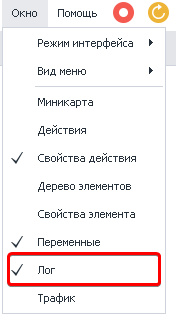


<details>
<summary>Если окно лога не отображается</summary>

Бывают случаи, когда окно лога не отображается, хоть возле него в настройках и стоит чекбокс (как показано на скриншоте выше), говорящий о том, что оно включено. Если после нескольких попыток его включить оно так и не появилось, то можно произвести общий сброс настроек окон в ProjectMaker. 

**ВНИМАНИЕ!** Описанные далее действия приведут к сбросу настроек окон, другими словами если Вы настроили интерфейс программы под себя, расположив её окна удобным для Вас способом, то все эти настройки будут удалены и будет установлено значение по умолчанию.

Заходим в настройки (*Редактирование-Настройки), выбираем вкладку *Отладка ** и в самом низу окна ищем кнопку *Сбросить панели. После нажатия данной кнопки и перезагрузки ProjectMaker все настройки окон будут сброшены, но и включение окна лога должно корректно работать (данный метод можно использовать и при проблемах с отображением других окон программы).

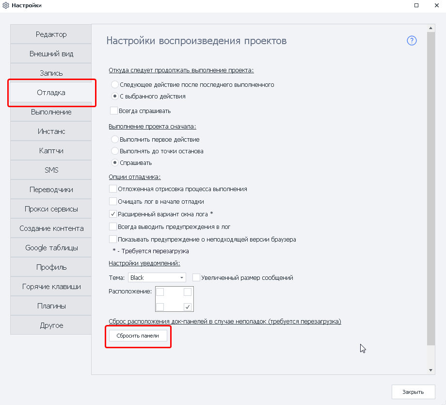


</details>
  

### Внешний вид (Стандартный лог)

#### Окно вывода сообщений


Сначала выводится иконка, соответствующая типу сообщения, потом время сообщения и собственно текст сообщения.

#### Сортировка по типу сообщения и по его цвету

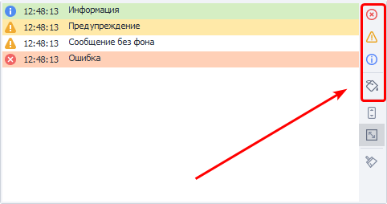


С помощью кнопок в данной секции можно фильтровать выводимые сообщения по их типу и\или цвету.

#### Автопрокрутка

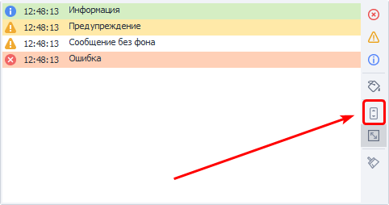


Если включена данная опция, то окно лога будет автоматически прокручиваться тем самым всегда показывая самое последнее сообщение.

:::note На заметку
В настройках программы, на вкладке Другое, можно изменить условия, при которых будет отключаться автопрокрутка.
:::

#### Автоподбор высоты строк

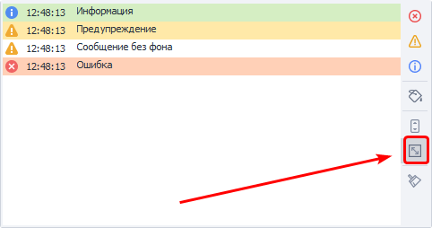


Если сообщение слишком большое, то высота строки будет подобрана таким образом, чтоб полностью его вместить. Если данная опция отключена, то будет отображена только верхняя строка из всего этого сообщения.

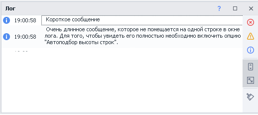


#### Очистить лог

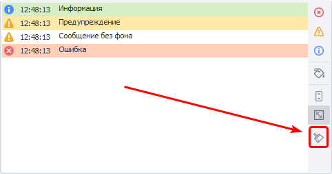


С помощью данной кнопки можно очистить окно от всех сообщений.

#### Двойной клик по записи в логе

Если дважды кликнуть на любой записи в логе, то фокус проекта сместится на экшен, который эту запись оставил.

  

Кнопки, из правого блока окна, сворачиваются, при уменьшении высоты окна лога. Для получения доступа к ним необходимо кликнуть на соответствующую кнопку.


  

### Контекстное меню лога

При клике правой кнопкой мыши (ПКМ) по записи в логе появится контекстное меню

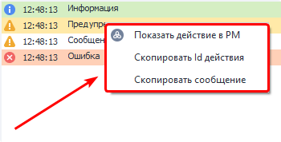


#### Показать действие в PM

Проект, сгенерировавший это сообщение, будет открыт в ProjectMaker и фокус сместится на экшен, который отправил сообщение.

#### Скопировать Id действия

В буфер обмена сохранится уникальный id экшена, отправившего сообщение. Пример id - `3e6988d1-9518-4535-a6d2-f0a33420c730`. Далее Вы можете использовать этот id для поиска по проекту, подробней о поиске по проекту можно прочитать в статье [❗→ Поиск по проекту](/wiki/spaces/RU/pages/724566074 "/wiki/spaces/RU/pages/724566074") 

#### Скопировать сообщение

При выборе данного пункта в буфер обмена сохранится текст сообщения.

  

:::warning Внимание
Описанные ниже функции предназначены для опытных пользователей.
:::

### Файл лога на компьютере

PorjectMaker и ZennoPoster дополнительно сохраняют логи на компьютере в директории с установленной программой, в папке Logs. Вот как может выглядеть путь к данной папке `C:\Program Files\ZennoLab\RU\ZennoPoster Pro V7\7.1.6.1\Progs\Logs`

#### Разделение по шаблонам и потокам

По умолчанию все логи со всех шаблонов пишутся в один файл. Это поведение можно изменить с помощью [❗→ C# кода](/wiki/spaces/RU/pages/492011596 "/wiki/spaces/RU/pages/492011596"), который необходимо разместить в начале шаблона:

```
// Перенаправляем лог для данного шаблона в отдельный файл.
project.LogOptions.LogFile = @"D:\log.txt";
// Для каждого потока будет создан свой лог файл.
// К имени файлов (в нашем случае log) будут приписываться идентификаторы потоков.
project.LogOptions.SplitLogByThread = true;
```

### Расширенный вариант лога

В настройках программы можно включить *Расширенный лог. Для этого в верхнем меню кликаем по *Редактирование затем *Настройки, п*осле выбираем вкладку *Отладка и ищем пункт [❗→ *Расширенный вариант окна лога](https://zennolab.atlassian.net/wiki/spaces/RU/pages/725352498#%D0%A0%D0%B0%D1%81%D1%88%D0%B8%D1%80%D0%B5%D0%BD%D0%BD%D1%8B%D0%B9-%D0%B2%D0%B0%D1%80%D0%B8%D0%B0%D0%BD%D1%82-%D0%BE%D0%BA%D0%BD%D0%B0-%D0%BB%D0%BE%D0%B3%D0%B0 "https://zennolab.atlassian.net/wiki/spaces/RU/pages/725352498#%D0%A0%D0%B0%D1%81%D1%88%D0%B8%D1%80%D0%B5%D0%BD%D0%BD%D1%8B%D0%B9-%D0%B2%D0%B0%D1%80%D0%B8%D0%B0%D0%BD%D1%82-%D0%BE%D0%BA%D0%BD%D0%B0-%D0%BB%D0%BE%D0%B3%D0%B0"). Чтоб изменения вступили в силу необходимо перезапустить ProjectMaker.

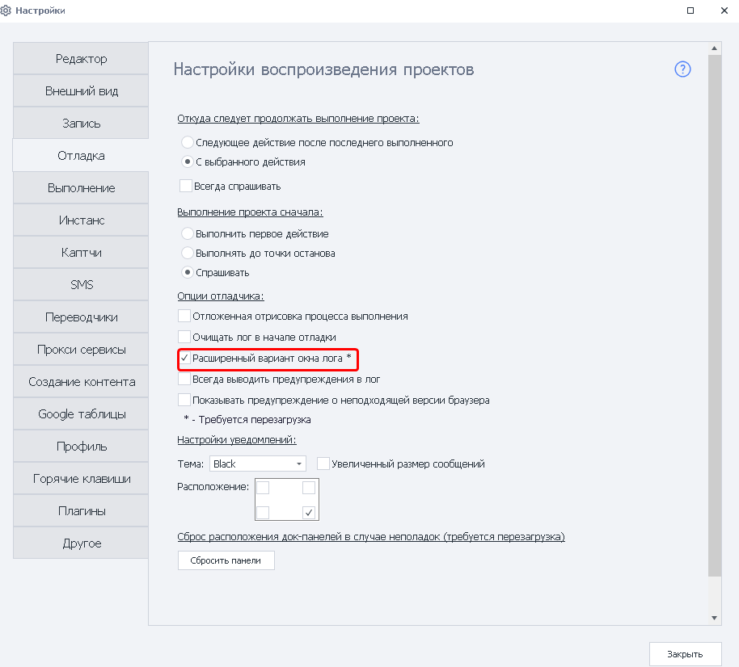


:::note На заметку
При включении расширенного лога в ProjectMaker он автоматически включится и в ZennoPoster.
:::

#### Внешний вида расширенного окна лога

Первое, что бросается в глаза - появление заголовков:

- Тип сообщения.
- Время.
- *Безымянный заголовок (в версии 5.Х.Х.Х он назывался *Путь).
- Сообщение.

Кликая по любому заголовку, Вы можете отсортировать сообщения в логе 

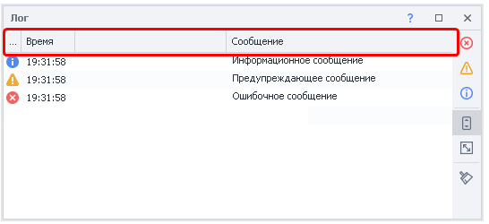


#### Фильтр сообщений

При наведении курсора мыши на любой из заголовков появляется иконка фильтра. 

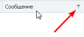


Тип фильтра зависит от колонки в которой был клик: 

- для колонки *Время будут доступны фильтры дат (можно показать сообщения за конкретный день, между двумя датами, до или после заданной даты и многие другие фильтры. Или же можно создать сложный фильтр с несколькими условиями)

<details>
<summary>Скриншоты</summary>

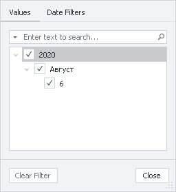


  

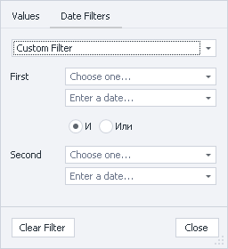


  

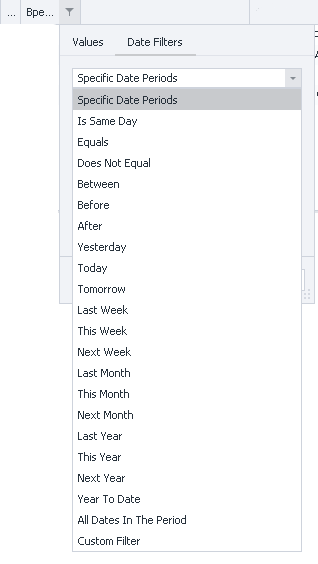


</details>
- для колонки *Сообщения и для *Безымянной будут доступны текстовые фильтры.

<details>
<summary>Скриншоты и переводы фильтров</summary>

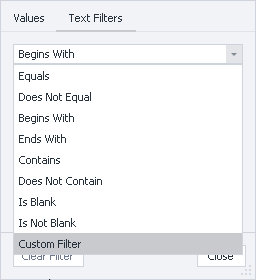


**Equals -** Строка равна фильтру (точное совпадение)

**Does Not Equal -** НЕ равна фильтру

**Begins With -** Начинается с…

**Ends With -** Заканчивается на …

**Contains -** Содержит

**Does Not Contain -** Не содержит

**Is Blank -** Строка пуста

**Is Not Blank -** НЕ пустая строка

**Custom -** Составной фильтр.

</details>
#### Авто-фильтр и конструктор фильтра 

Кликнув ПКМ по заголовку откроется контекстное меню с дополнительными функциями: группировка по выбранной колонке, скрытие колонок. подбор ширины. Среди них нас сейчас больше интересуют *Авто-фильтр и Конструктор фильтров.

**Авто-фильтр -** с его помощью можно быстро создать простой фильтр сообщений. ** При активации появляется дополнительная строка^(1)^ под заголовками, в которой задаётся тип фильтра и можно ввести необходимые символы и\или слова согласно которым будут отбираться выводимые сообщения. На скриншоте ниже показана появляющаяся строка и создана простая фильтрация^(2)^ - выводятся только те строки в которых есть символ “о” (поиск осуществляется по колонке *Сообщение). В каждой строке, слева, есть значок, после клика по которому появляется контекстное меню^(3)^ с выбором типа фильтрации. Типы фильтров и вводимые значение зависят от типа колонки: для колонки *Время - это операторы сравнения (больше - &gt;, меньше - &lt;, равно - = и т.п.) и даты; для *Сообщения - поиск по тексту (Содержит, не содержит, начинается с и т.п.) плюс операторы сравнения.

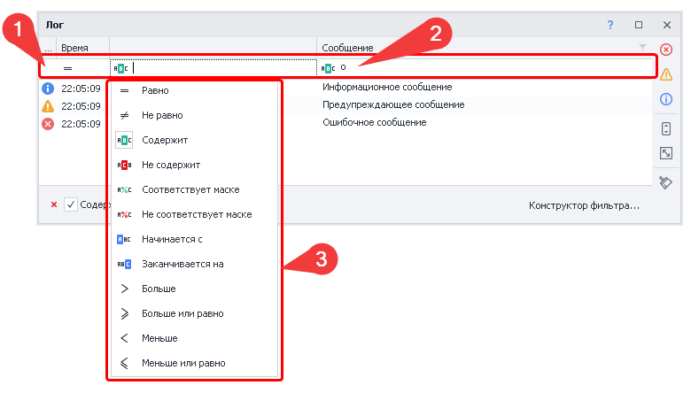


**Конструктор фильтров -** похож на авто-фильтр, но позволяет создать гораздо более сложные условия для фильтрации. 

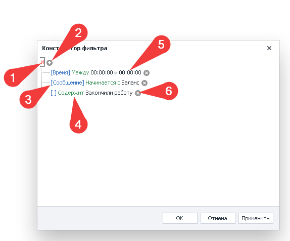


1. При клике по данной кнопке можно добавить новое условие, группу условий или вовсе очистить все условия поиска. Так же здесь необходимо определить логическую связь между условиями:

 1. **И -** удовлетворяют ВСЕМ условиям
 2. **ИЛИ -** удовлетворяют хотя бы одному из условий
 3. **НЕ И** **-** НЕ удовлетворяют ВСЕМ условиям
 4. **НЕ ИЛИ -** НЕ удовлетворяют хотя бы одному из условий
2. С помощью данной кнопки можно легко добавить дополнительное условие.
3. Синим цветом в квадратных скобках указана колонка к которой применяется фильтр (на скриншоте в последнем условии пустые скобки - это *Безымянная колонка. Хоть у неё и нет собственного имени, но фильтровать по ней можно).
4. Зелёным цветом отображается тип фильтра.
5. Чёрный текст - это данные для фильтра, которые вводит пользователь.
6. Эта кнопка позволяет легко удалить фильтр.

#### Как писать в *безымянную колонку (и зачем это может понадобиться)?

Написать в данную колонку с помощью стандартного экшена [❗→ Оповещения](/wiki/spaces/RU/pages/534053050 "/wiki/spaces/RU/pages/534053050"), к сожалению, нельзя (на момент написания данной статьи последняя версия программы 7.4.0.0 ). Для этого необходимо использовать кубик [❗→ Свой C# код](/wiki/spaces/RU/pages/492011596 "/wiki/spaces/RU/pages/492011596") и обладать минимальными знаниями по работе с C# кодом. 

Для вывода сообщений в лог существует четыре метода - 
`project.SendInfoToLog`, `project.SendWarningToLog`, `project.SendErrorToLog` и `project.SendToLog` (с помощью этого метода можно задавать цвет сообщениям). У каждого из этих методов есть перегрузка (работа в методах `project.SendInfoToLog`, `project.SendWarningToLog`, `project.SendErrorToLog` идентична, поэтому тут рассмотрим только `project.SendInfoToLog`)

`// Первый вариант метода.
// Аргументы:
// 1й - строка, которая выведется в колонке "Сообщение"
// 2й - bool, надо ли выводить это сообщение в лог ZennoPoster
project.SendInfoToLog("Message", true);

// Второй вариант:
// Аргументы:
// 1й - строка, которая выведется в колонке "Сообщение"
// 2й - строка, данная строка появится в безымянной колонке.
// 3й - bool, надо ли выводить это сообщение в лог ZennoPoster
project.SendInfoToLog("Message", "Way", true);`

Вот как выглядит вызов этого кода:

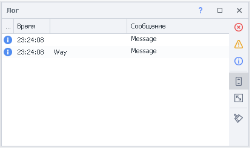


**Где это может пригодиться:**

- при многопоточной работе в *Безымянную* колонку можно заносить имя аккаунта, а в *Сообщения* - действие, которое этот аккаунт сейчас выполняет. Если появится необходимость, то можно будет либо сгруппировать сообщения по этой колонке (делается этот через клик ПКМ по заголовку и выбора соответствующей опции), либо настроить фильтр.
- бывает необходимость писать большие шаблоны, которые за один проход выполняют много функций, например - регистрация, заполнение профиля, поиск товара, парсинг и обработка товаров, публикация обработанных данных (и всё это одно выполнение шаблона). Каждая, из описанных, частей может содержать в себе много действий. Вот и при логированиии в *Безымянную* колонку можно писать ту часть шаблона, в которой сейчас находится выполнение, а в *Сообщения* писать конкретное действие.

* * *

## Полезные ссылки

- [❗→ Оповещение (Notification/Запись в лог)](/wiki/spaces/RU/pages/534053050 "/wiki/spaces/RU/pages/534053050")
- [❗→ Поиск по проекту](/wiki/spaces/RU/pages/724566074 "/wiki/spaces/RU/pages/724566074")